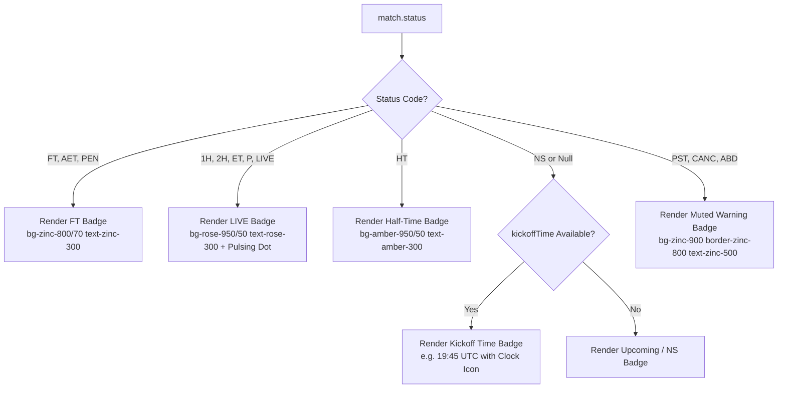
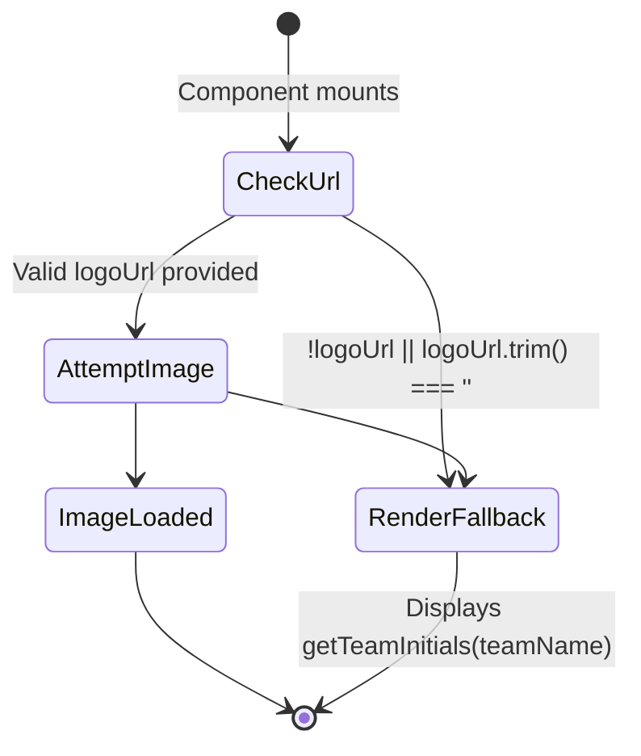

# Design Specification: Competition & Team Logos on Match Cards & Feed

- **Feature Title:** Display Competition and Team Logos on Match Cards and Feed
- **Target File:** `.orchestration/api-football-fixtures/design.md`
- **Related Tech Spec:** `.orchestration/api-football-fixtures/spec.md`
- **Target Component:** `src/components/MatchCard.tsx` (and `TeamCrest`, `MatchHeader` subcomponents)
- **Design Author:** Principal Product Designer & Design Systems Architect
- **Status:** Approved / Ready for Implementation

---

## 1. Executive Summary & Design Vision

MatchDay provides football fans with an ultra-fast, clutter-free daily highlight feed. Historically, matches displayed minimalist fallback typography with plain circular initials (e.g. `[ARS]`, `[BHA]`) and lacked official tournament branding.

With the ingestion of canonical fixtures from **API-Football (v3)**, each match record is enriched with:

1. `competition`: Official tournament name (e.g., "Premier League", "UEFA Champions League").
2. `leagueLogo`: Official competition crest URL.
3. `teamHomeLogo` & `teamAwayLogo`: Official club crest URLs.
4. `kickoffTime`: Epoch timestamp in milliseconds.
5. `status`: Match status code (`FT`, `2H`, `HT`, `1H`, `NS`, `PST`, etc.).

This design specification establishes the visual language, layout geometry, responsive behavior, and accessibility standards for integrating these brand assets into the `MatchCard` feed.

### Core Design Tenets

- **Clutter-Free Information Hierarchy**: Keep the card compact, scannable, and focused on the scoreline and goal highlights.
- **Zero Layout Shift (CLS = 0)**: Fixed dimensional containers for crests and badges ensure zero layout popping whether assets load instantly, lazily, or fail.
- **Resilient Fallback Continuum**: Graceful and instantaneous fallback to stylized initials whenever logos are missing or fail over the network.
- **Broadcast Scoreboard Balance**: Symmetrical home/away presentation on desktop and mobile, respecting dark theme contrast standards (`zinc-950`, `zinc-900`, `emerald-500`).

---

## 2. Visual Architecture & Wireframes

### 2.1 Desktop Layout (>= 640px)

```
+---------------------------------------------------------------------------------------------------+
|  [🏆 Premier League]                                                         [● FT] / [19:45 UTC] |
|  -----------------------------------------------------------------------------------------------  |
|  [🛡️ Crest] Arsenal                                2 - 1                                Brighton [🛡️] |
|  -----------------------------------------------------------------------------------------------  |
|  [ ▶ Saka 14'  [1]-0 ]    [ ▶ Mitoma 38'  1-[1] ]    [ ▶ Havertz 68'  [2]-1 (Great Goal) ]        |
|                                                                                                   |
|  (When active highlight selected:)                                                                |
|  +---------------------------------------------------------------------------------------------+  |
|  |  ▶ Inline 16:9 Video Container (aspect-video w-full rounded-xl)                         [X] |  |
|  +---------------------------------------------------------------------------------------------+  |
+---------------------------------------------------------------------------------------------------+
```

### 2.2 Mobile Layout (360px - 639px)

```
+-------------------------------------------------------------+
| [🏆 Premier League]                                  [● FT] |
| ----------------------------------------------------------- |
| [🛡️] Arsenal                    2 - 1             Brighton [🛡️] |
| ----------------------------------------------------------- |
| [ ▶ Saka 14' [1]-0 ]  [ ▶ Mitoma 38' 1-[1] ]                |
| [ ▶ Havertz 68' [2]-1 (Great Goal) ]                        |
+-------------------------------------------------------------+
```

---

## 3. Design Tokens & Styling Palette

All styles adhere strictly to **Tailwind CSS v4** token definitions configured in `src/styles.css`:

| Element / Context         | Tailwind Classes                                                                                                              | Hex / OKLCH Value                     | Contrast / Rationale                                               |
| :------------------------ | :---------------------------------------------------------------------------------------------------------------------------- | :------------------------------------ | :----------------------------------------------------------------- |
| **Card Container**        | `bg-zinc-900/80 border border-zinc-800 rounded-2xl`                                                                           | Surface: `#18181b`, Border: `#27272a` | Frosted glass effect with backdrop blur.                           |
| **Card Hover**            | `hover:border-zinc-700/80`                                                                                                    | Border: `#3f3f46`                     | Tactile response on pointer devices.                               |
| **Header Divider**        | `border-b border-zinc-800/60`                                                                                                 | Line: `#27272a` (60%)                 | Subtle separation between competition header and match scoreboard. |
| **Competition Label**     | `text-xs font-semibold text-zinc-400 tracking-wide`                                                                           | `#a1a1aa`                             | High legibility without overpowering team names.                   |
| **League Logo Box**       | `h-4 w-4 shrink-0 object-contain sm:h-4.5 sm:w-4.5`                                                                           | 16x16px (mobile), 18x18px (sm)        | Crisp, anti-aliased representation for tournament emblems.         |
| **Team Crest Box**        | `h-8 w-8 shrink-0 rounded-full border border-zinc-800/80 bg-zinc-950/60 p-1 shadow-inner sm:h-9 sm:w-9`                       | 32x32px (mobile), 36x36px (sm)        | High-contrast dark badge backing to support dark/light crests.     |
| **Fallback Initials**     | `h-8 w-8 shrink-0 rounded-full border border-zinc-700 bg-zinc-800 text-xs font-bold text-zinc-200 shadow-inner sm:h-9 sm:w-9` | 32x32px (mobile), 36x36px (sm)        | Identical footprint to prevent layout shifts.                      |
| **Scoreboard Display**    | `bg-zinc-950/90 border border-zinc-800 text-emerald-400 font-mono font-black`                                                 | Text: `#34d399` (Emerald 400)         | Tabular, high-visibility score numbers.                            |
| **Status Badge: FT**      | `bg-zinc-800/70 border border-zinc-700/60 text-zinc-300`                                                                      | Background: `#27272a`                 | Clean, neutral status indicating match completion.                 |
| **Status Badge: LIVE**    | `bg-rose-950/50 border border-rose-800/50 text-rose-300`                                                                      | Accent: `#fda4af`                     | High-urgency alert with pulsing indicator for in-play matches.     |
| **Status Badge: HT**      | `bg-amber-950/50 border border-amber-800/50 text-amber-300`                                                                   | Accent: `#fcd34d`                     | Warm interval status indicator.                                    |
| **Status Badge: NS/Time** | `bg-zinc-950/60 border border-zinc-800/80 text-zinc-400 font-mono`                                                            | Text: `#a1a1aa`                       | Understated scheduled kickoff time.                                |

---

## 4. Component Presentation Specifications

### 4.1 Competition & Status Header (`MatchHeader`)

#### Placement & Inset

Positioned at the very top of the `article` container, directly above the team scoreline row.

```tsx
<div className="flex items-center justify-between gap-2 border-b border-zinc-800/60 pb-2.5 mb-3 sm:pb-3 sm:mb-3.5">
  {/* Left: Competition Crest & Name */}
  {/* Right: Match Status Badge / Kickoff Time */}
</div>
```

#### Conditional Visibility

If both `match.competition` and `match.status` are `null` or undefined (e.g. legacy Reddit posts without fixture linkage), the header container is completely suppressed (`null` render) with zero top margin or padding padding jitter.

#### Competition Badge Visuals

- **Logo**: Wrapped in an `h-4 w-4 sm:h-4.5 sm:w-4.5` container with `object-contain`.
- **Accessibility**: Marked with `alt="" aria-hidden="true"` because the adjacent label text already announces the competition name.
- **Name**: Truncated with ellipsis on small screens (`truncate max-w-[180px] sm:max-w-[300px] text-xs font-semibold text-zinc-400`).

#### Match Status Matrix & Logic



1. **Full Time (`FT`, `AET`, `PEN`)**:
   ```tsx
   <span className="inline-flex items-center gap-1 rounded-full border border-zinc-700/60 bg-zinc-800/70 px-2 py-0.5 text-[10px] font-semibold text-zinc-300 sm:text-xs">
     FT
   </span>
   ```
2. **In-Play / Live (`1H`, `2H`, `ET`, `P`, `LIVE`)**:
   ```tsx
   <span className="inline-flex items-center gap-1.5 rounded-full border border-rose-800/50 bg-rose-950/50 px-2 py-0.5 text-[10px] font-semibold text-rose-300 sm:text-xs">
     <span className="relative flex h-1.5 w-1.5">
       <span className="absolute inline-flex h-full w-full animate-ping rounded-full bg-rose-400 opacity-75" />
       <span className="relative inline-flex h-1.5 w-1.5 rounded-full bg-rose-500" />
     </span>
     {status === '2H' ? '2nd Half' : status === '1H' ? '1st Half' : 'LIVE'}
   </span>
   ```
3. **Half Time (`HT`)**:
   ```tsx
   <span className="inline-flex items-center gap-1 rounded-full border border-amber-800/50 bg-amber-950/50 px-2 py-0.5 text-[10px] font-semibold text-amber-300 sm:text-xs">
     HT
   </span>
   ```
4. **Upcoming (`NS` or timestamp present)**:
   ```tsx
   <span className="inline-flex items-center gap-1 rounded-full border border-zinc-800/80 bg-zinc-950/60 px-2 py-0.5 font-mono text-[10px] font-medium text-zinc-400 sm:text-xs">
     <Clock className="h-3 w-3 text-zinc-500" />
     {formatKickoffTime(match.kickoffTime)}
   </span>
   ```

---

### 4.2 Team Crests & Resilient Fallback Architecture (`TeamCrest`)

#### Dimensional Constraints

- **Mobile (<640px)**: `32px x 32px` (`w-8 h-8`)
- **Desktop (>=640px)**: `36px x 36px` (`sm:w-9 sm:h-9`)
- **Padding**: `p-1` for logos to ensure club borders do not touch the container edge.
- **Surface**: `bg-zinc-950/60 border border-zinc-800/80` provides high contrast regardless of whether club crests feature white, dark, gold, or multi-color graphics.

#### Fallback State Lifecycle



#### Component Implementation Blueprint

```tsx
interface TeamCrestProps {
  teamName: string;
  logoUrl?: string | null;
  className?: string;
}

export function TeamCrest({ teamName, logoUrl, className }: TeamCrestProps) {
  const [hasError, setHasError] = React.useState(false);

  // If no URL provided or image failed to load, fall back to styled circular initials
  if (!logoUrl || hasError) {
    return (
      <div
        aria-hidden="true"
        className={cn(
          'flex h-8 w-8 shrink-0 items-center justify-center rounded-full border border-zinc-700 bg-zinc-800 text-xs font-bold text-zinc-200 shadow-inner sm:h-9 sm:w-9',
          className,
        )}
      >
        {getTeamInitials(teamName)}
      </div>
    );
  }

  return (
    <div
      className={cn(
        'relative flex h-8 w-8 shrink-0 items-center justify-center rounded-full border border-zinc-800/80 bg-zinc-950/60 p-1 shadow-inner transition-colors hover:border-zinc-700 sm:h-9 sm:w-9',
        className,
      )}
    >
       setHasError(true)}
        className="h-full w-full object-contain"
      />
    </div>
  );
}
```

#### Backwards Compatibility & Testing Guarantee

Because `TeamCrest` renders the exact same DOM node and class hierarchy when `logoUrl` is `null` or errors out, existing unit tests in `src/components/MatchCard.test.ts` (which assert `getByText('ARS')` and `getByText('BHA')`) remain 100% green without modification.

---

### 4.3 Scoreline & Goal Chips Harmony

#### Scoreboard Row Alignment

The scoreboard row maintains clear symmetrical tension between Home and Away:

1. **Home Team (Left)**:
   - Crest on left: `TeamCrest`
   - Team Name: `text-sm font-bold text-zinc-100 sm:text-base truncate`
   - Container: `flex flex-1 min-w-0 items-center gap-2.5`
2. **Scoreline Pill (Center)**:
   - Sizing: `px-3 py-1 sm:px-4 sm:py-1.5`
   - Background: `bg-zinc-950/90 border border-zinc-800 rounded-lg shadow-inner`
   - Typography: `font-mono text-base font-black tracking-wider text-emerald-400 tabular-nums sm:text-lg`
   - Displays computed score (e.g. `2 - 1`) or `VS` if unscored.
3. **Away Team (Right)**:
   - Team Name: `text-sm font-bold text-zinc-100 sm:text-base truncate text-right`
   - Crest on right: `TeamCrest`
   - Container: `flex flex-1 min-w-0 items-center justify-end gap-2.5 text-right`

#### Goal Timeline Chips

Positioned below the scoreboard row separated by `pt-3`:

- Preserves the existing `HighlightChip` interactions (`Play` icon, scorer name, minute, score at goal, special tag badges).
- No visual collision with the new header or crests.
- Active highlight continues to display glowing emerald accent ring (`ring-1 ring-emerald-500 shadow-[0_0_12px_rgba(16,185,129,0.2)]`).

---

## 5. Responsive Behavior & Viewport Breakpoints

| Viewport Width    | Competition Header Behavior                                 | Team Name Handling                           | Crest Size | Score Pill Size |
| :---------------- | :---------------------------------------------------------- | :------------------------------------------- | :--------- | :-------------- |
| **< 380px**       | Competition name truncated at 140px; status badge compact.  | Truncate at `min-w-0 flex-1`, text size 13px | `32x32px`  | `px-2.5 py-1`   |
| **380px - 639px** | Competition name truncated at 220px; standard status badge. | Truncate at `min-w-0 flex-1`, text size 14px | `32x32px`  | `px-3 py-1`     |
| **>= 640px**      | Full competition name visible; standard status badge.       | Generous space, text size 16px               | `36x36px`  | `px-4 py-1.5`   |

---

## 6. Accessibility (a11y) & WCAG 2.1 AA Compliance

1. **Alternative Text Strategy**:
   - Team crest images provide meaningful descriptive text: `alt={`${match.teamHome} crest`}`.
   - League logo in the competition badge uses `alt="" aria-hidden="true"` since the textual competition name is already rendered right next to it, preventing repetitive screen reader announcements (e.g. avoiding "Premier League logo, Premier League").
2. **Semantic Structure**:
   - `MatchCard` retains `<article aria-label={`${match.teamHome} vs ${match.teamAway}`}>`.
   - Match status badge includes accessible announcement when appropriate (`aria-label={`Status: ${statusDescription}`}`).
3. **Contrast Verification**:
   - League text (`#a1a1aa` on `#18181b`): Contrast ratio `5.8:1` (passes WCAG AA).
   - FT Status text (`#d4d4d8` on `#27272a`): Contrast ratio `7.4:1` (passes WCAG AAA).
   - LIVE Status text (`#fda4af` on `#4c0519`): Contrast ratio `6.2:1` (passes WCAG AA).
   - Team names (`#f4f4f5` on `#18181b`): Contrast ratio `14.2:1` (passes WCAG AAA).
4. **Keyboard Focus & Interactive Flow**:
   - Team crests and competition badges are non-interactive presentation elements and do not trap keyboard focus.
   - Goal chips and inline player controls retain clear focus rings (`focus-visible:ring-2 focus-visible:ring-emerald-500`).

---

## 7. Helper Utilities Specification (`src/lib/formatters.ts`)

To ensure clean separation of concerns and avoid inline business logic in JSX, two helper utilities will be added to `src/lib/formatters.ts`:

### 7.1 `formatKickoffTime(timestampMs: number | null | undefined): string`

- Formats epoch milliseconds into a concise UTC kick-off time string (e.g., `19:45 UTC` or `14:00 UTC`).
- Returns empty string `""` if timestamp is null or invalid.

### 7.2 `formatMatchStatus(status: string | null | undefined): { label: string; variant: 'ft' | 'live' | 'ht' | 'upcoming' | 'postponed' | 'unknown' }`

- Maps raw API-Sports status codes (`FT`, `AET`, `PEN`, `1H`, `2H`, `HT`, `ET`, `P`, `NS`, `PST`, `CANC`) into a normalized label and visual variant enum.

---

## 8. Anti-Slop & Quality Gates Compliance

- **No Synthetic CSS Bloat**: Only standard Tailwind utility classes; no inline style attributes or arbitrary CSS rules.
- **No Orphaned Types**: Strict typing through `MatchWithHighlights` inferred from Drizzle schema.
- **Graceful Degradation**: Zero broken image boxes; instant fallback to initials upon 404 or image failure.
- **Verification Rule**: Prettier formatting, oxlint, and TypeScript typechecking must pass cleanly:
  ```bash
  bun run format && bun run check
  bun test src
  ```
