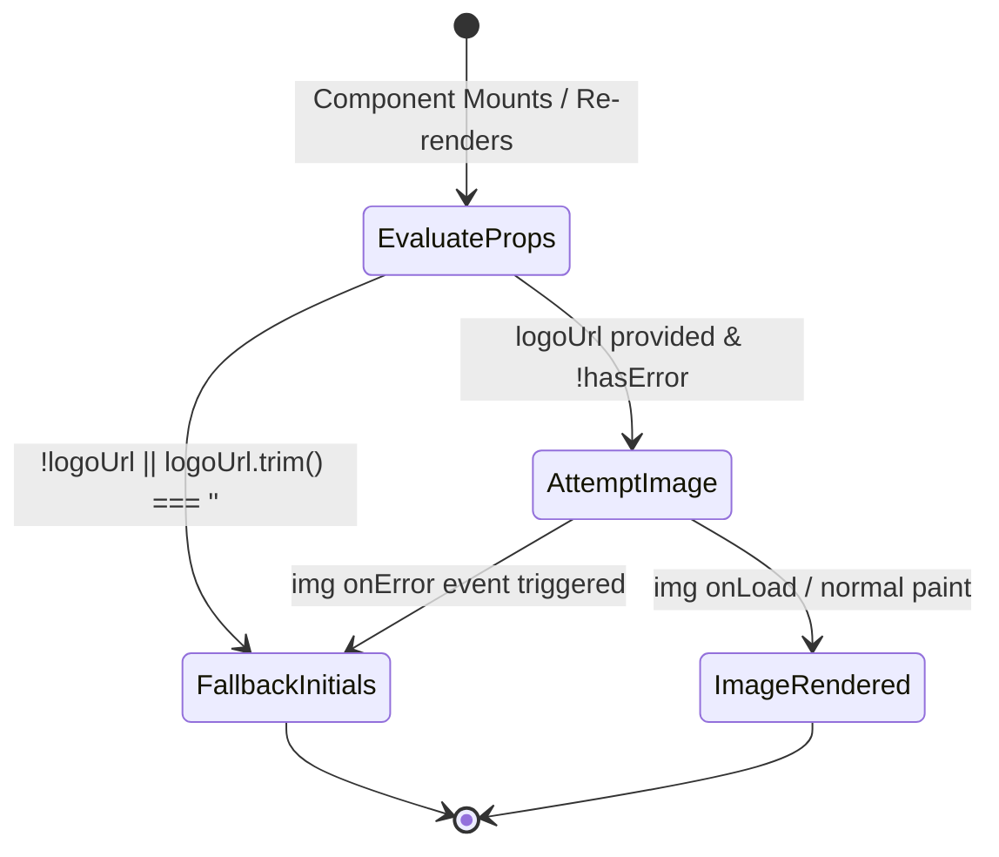
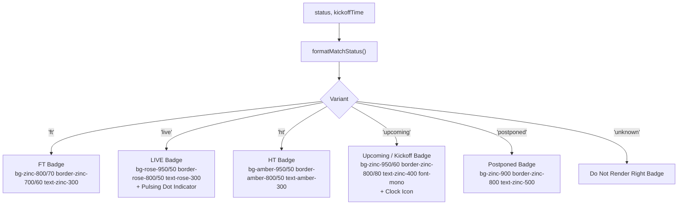

# Technical Specification: Display Competition and Team Logos on Match Cards and Feed

- **Feature Key:** `MATCH-CARD-LOGOS` / `API-FOOTBALL-FIXTURES-UI`
- **Target Components:** `src/components/MatchCard.tsx`, `src/components/TeamCrest.tsx`, `src/components/MatchHeader.tsx`
- **Target Helpers:** `src/lib/formatters.ts`
- **Target Test Suites:** `src/lib/formatters.test.ts`, `src/components/MatchCard.test.ts`
- **Design Reference:** `.orchestration/api-football-fixtures/design.md`
- **Document Path:** `.orchestration/api-football-fixtures/spec.md`
- **Document Version:** 2.0.0
- **Status:** Approved for Implementation

---

## 1. Executive Summary & Scope

### 1.1 Problem Statement & Background

MatchDay ingests official canonical fixture records from **API-Sports (API-Football v3)** across 14 premier football competitions. The D1 `matches` table now stores rich tournament and club metadata:

1. `competition`: Tournament name (e.g., `"Premier League"`, `"UEFA Champions League"`).
2. `leagueLogo`: Official competition logo URL.
3. `teamHomeLogo` & `teamAwayLogo`: Official club crest URLs.
4. `kickoffTime`: Epoch timestamp in milliseconds.
5. `status`: Match status code (`FT`, `2H`, `HT`, `1H`, `NS`, `PST`, etc.).

Previously, [`MatchCard.tsx`](file:///Users/khoa/Documents/matchday/src/components/MatchCard.tsx) rendered minimalist circular initial badges (e.g. `[ARS]`, `[BHA]`) using `getTeamInitials()` and lacked official tournament branding, match status indicators, and kickoff times.

### 1.2 Feature Scope & Core Objectives

This technical specification operationalizes the visual design established in [design.md](file:///Users/khoa/Documents/matchday/.orchestration/api-football-fixtures/design.md):

1. **Resilient Club Crest Rendering (`TeamCrest`)**:
   - Displays official club crests (`teamHomeLogo`, `teamAwayLogo`) in fixed dimensional containers (`h-8 w-8 sm:h-9 sm:w-9`) with `object-contain`.
   - Implements graceful fallback to stylized circular initials (`getTeamInitials(teamName)`) when `logoUrl` is missing/empty or fails to load over the network (`onError`).
   - Guarantees zero Cumulative Layout Shift (CLS = 0) between image-loaded and fallback states.
2. **Tournament & Match Status Header (`MatchHeader`)**:
   - Renders competition badge with league logo and name on the top-left of the card.
   - Renders live status or scheduled kickoff time on the top-right of the card (`FT`, `LIVE` with pulsing dot for `1H`/`2H`/`LIVE`, `HT`, `NS` with UTC kickoff time, or `PST`).
   - Cleanly collapses (`null` render) with zero margin or padding jitter when both competition and status metadata are missing.
3. **Pure Formatting Utilities (`src/lib/formatters.ts`)**:
   - `formatKickoffTime(timestampMs)`: Converts epoch milliseconds into deterministic UTC format (`HH:mm UTC`).
   - `formatMatchStatus(status, kickoffTime)`: Normalizes API-Football status codes into typed presentation variants (`'ft'`, `'live'`, `'ht'`, `'upcoming'`, `'postponed'`).
4. **Complete Unit Test Coverage**:
   - Comprehensive test suites in `src/lib/formatters.test.ts` and `src/components/MatchCard.test.ts` testing successful logo renders, image load error handling, status matrix states, and clean collapse.
5. **Backwards Compatibility**:
   - Matches without fixture metadata continue to render identical scorelines and initials badges without regressions or visual defects.

---

## 2. Architecture & Presentation Hierarchy

### 2.1 Component Structure

```mermaid
graph TD
    MatchCard["MatchCard (article)"]
    MatchHeader["MatchHeader (header container)"]
    Scoreboard["Scoreboard Row (div)"]
    Timeline["Goal Timeline Chips (div)"]
    Player["HighlightPlayer (aspect-video)"]

    MatchCard -->|Conditional: competition || status| MatchHeader
    MatchCard --> Scoreboard
    MatchCard -->|highlights.length > 0| Timeline
    MatchCard -->|activeHighlightId != null| Player

    MatchHeader --> CompBadge["Competition Badge (League Logo + Name)"]
    MatchHeader --> StatusBadge["Status Badge (FT / LIVE / HT / Kickoff)"]

    Scoreboard --> HomeCrest["TeamCrest (Home)"]
    Scoreboard --> HomeName["Home Team Name"]
    Scoreboard --> ScorePill["Scoreline Pill (2 - 1 / VS)"]
    Scoreboard --> AwayName["Away Team Name"]
    Scoreboard --> AwayCrest["TeamCrest (Away)"]
```

### 2.2 Desktop & Mobile Geometry

```
+---------------------------------------------------------------------------------------------------+
|  [🏆 Premier League]                                                         [● FT] / [19:45 UTC] |  <- MatchHeader
|  -----------------------------------------------------------------------------------------------  |
|  [🛡️ Crest] Arsenal                                2 - 1                                Brighton [🛡️] |  <- Scoreboard
|  -----------------------------------------------------------------------------------------------  |
|  [ ▶ Saka 14' [1]-0 ]    [ ▶ Mitoma 38' 1-[1] ]    [ ▶ Havertz 68' [2]-1 (Great Goal) ]           |  <- Timeline Chips
|                                                                                                   |
|  (When active highlight selected:)                                                                |
|  +---------------------------------------------------------------------------------------------+  |
|  |  ▶ Inline 16:9 Video Container (HighlightPlayer)                                        [X] |  |  <- HighlightPlayer
|  +---------------------------------------------------------------------------------------------+  |
+---------------------------------------------------------------------------------------------------+
```

### 2.3 File Responsibilities & Organization

| File Path                          | Type               | Responsibilities                                                                                                   |
| :--------------------------------- | :----------------- | :----------------------------------------------------------------------------------------------------------------- |
| `src/lib/formatters.ts`            | Shared Library     | Adds `formatKickoffTime` and `formatMatchStatus` helpers alongside existing scoreline and team initials utilities. |
| `src/lib/formatters.test.ts`       | Unit Test          | Unit tests for timestamp parsing, UTC formatting, status normalization, and edge case resilience.                  |
| `src/components/TeamCrest.tsx`     | Reusable UI        | Renders club crest image with `onError` state machine and fallback to styled initials circular badge.              |
| `src/components/MatchHeader.tsx`   | Reusable UI        | Renders competition crest/name and match status badge; collapses cleanly to `null` if metadata absent.             |
| `src/components/MatchCard.tsx`     | Feed Container     | Integrates `MatchHeader` and `TeamCrest` into the match scoreboard and goal timeline.                              |
| `src/components/MatchCard.test.ts` | Unit / Integration | Validates rendering of logos, status badges, image error handling, fallback initials, and backwards compatibility. |

---

## 3. Resilient Team Crest Architecture (`TeamCrest`)

### 3.1 Component Interface & Types

```typescript
export interface TeamCrestProps {
  teamName: string;
  logoUrl?: string | null;
  className?: string;
}
```

### 3.2 State Machine & Fallback Flow



### 3.3 Zero Layout Shift (CLS = 0) Design Token Mapping

To prevent Cumulative Layout Shift during network image loading or failures, both the image container and the fallback badge share identical outer bounding dimensions and border radius:

| State                  | Tailwind Class String                                                                                                                                          | Dimensional Footprint              |
| :--------------------- | :------------------------------------------------------------------------------------------------------------------------------------------------------------- | :--------------------------------- |
| **Image Container**    | `relative flex h-8 w-8 shrink-0 items-center justify-center rounded-full border border-zinc-800/80 bg-zinc-950/60 p-1 shadow-inner sm:h-9 sm:w-9`              | `32x32px` (mobile), `36x36px` (sm) |
| **Fallback Container** | `flex h-8 w-8 shrink-0 items-center justify-center rounded-full border border-zinc-700 bg-zinc-800 text-xs font-bold text-zinc-200 shadow-inner sm:h-9 sm:w-9` | `32x32px` (mobile), `36x36px` (sm) |
| **Nested ``**     | `h-full w-full object-contain`                                                                                                                                 | Contained within 1:1 aspect ratio  |

### 3.4 Image URL Synchronization Guard

When props change in a dynamic feed (e.g. virtualized list or fixture re-ordering), the component resets its error state if a new `logoUrl` is provided:

```typescript
export function TeamCrest({ teamName, logoUrl, className }: TeamCrestProps) {
  const [hasError, setHasError] = useState(false);
  const [prevUrl, setPrevUrl] = useState(logoUrl);

  // Reset error state if the URL prop changes between renders
  if (logoUrl !== prevUrl) {
    setPrevUrl(logoUrl);
    setHasError(false);
  }

  const cleanUrl = logoUrl?.trim();
  if (!cleanUrl || hasError) {
    return (
      <div
        aria-hidden="true"
        className={cn(
          'flex h-8 w-8 shrink-0 items-center justify-center rounded-full border border-zinc-700 bg-zinc-800 text-xs font-bold text-zinc-200 shadow-inner sm:h-9 sm:w-9',
          className,
        )}
      >
        {getTeamInitials(teamName)}
      </div>
    );
  }

  return (
    <div
      className={cn(
        'relative flex h-8 w-8 shrink-0 items-center justify-center rounded-full border border-zinc-800/80 bg-zinc-950/60 p-1 shadow-inner transition-colors hover:border-zinc-700 sm:h-9 sm:w-9',
        className,
      )}
    >
       setHasError(true)}
        className="h-full w-full object-contain"
      />
    </div>
  );
}
```

---

## 4. Tournament & Match Status Header Architecture (`MatchHeader`)

### 4.1 Component Interface & Types

```typescript
export interface MatchHeaderProps {
  competition?: string | null;
  leagueLogo?: string | null;
  status?: string | null;
  kickoffTime?: number | null;
  className?: string;
}
```

### 4.2 Clean Collapse Condition

The header container must cleanly collapse without leaving empty margins or border lines if neither competition information nor status information is available.

```typescript
const hasCompetition = Boolean(competition?.trim() || leagueLogo?.trim());
const formattedStatus = formatMatchStatus(status, kickoffTime);
const hasStatus = formattedStatus.variant !== 'unknown';

if (!hasCompetition && !hasStatus) {
  return null;
}
```

### 4.3 Container Geometry & Styling

When rendered, the header provides subtle division above the scoreboard:

```tsx
<div
  className={cn(
    'flex items-center justify-between gap-2 border-b border-zinc-800/60 pb-2.5 mb-3 sm:pb-3 sm:mb-3.5',
    className,
  )}
>
  {/* Left: Competition Branding */}
  {/* Right: Match Status Badge */}
</div>
```

### 4.4 Left: Competition Branding

- **League Logo**:
  - Rendered when `leagueLogo` is present:
    ```tsx
    
    ```
  - `alt=""` and `aria-hidden="true"` avoid redundant screen reader noise since the adjacent competition name provides textual context.
- **Competition Name**:
  - Truncated for small screens to prevent overflow on mobile:
    ```tsx
    <span className="truncate max-w-[180px] sm:max-w-[300px] text-xs font-semibold text-zinc-400 tracking-wide">
      {competition}
    </span>
    ```

### 4.5 Right: Match Status Matrix & Visual Badges

API-Football provides standardized fixture status short codes. The status badge maps these codes into high-contrast, accessible badges:



#### Visual Badge Implementations

1. **Full Time (`variant === 'ft'`)**:

   ```tsx
   <span className="inline-flex items-center gap-1 rounded-full border border-zinc-700/60 bg-zinc-800/70 px-2 py-0.5 text-[10px] font-semibold text-zinc-300 sm:text-xs">
     {statusInfo.label}
   </span>
   ```

2. **In-Play / Live (`variant === 'live'`)**:

   ```tsx
   <span className="inline-flex items-center gap-1.5 rounded-full border border-rose-800/50 bg-rose-950/50 px-2 py-0.5 text-[10px] font-semibold text-rose-300 sm:text-xs">
     <span className="relative flex h-1.5 w-1.5" aria-hidden="true">
       <span className="absolute inline-flex h-full w-full animate-ping rounded-full bg-rose-400 opacity-75" />
       <span className="relative inline-flex h-1.5 w-1.5 rounded-full bg-rose-500" />
     </span>
     {statusInfo.label}
   </span>
   ```

3. **Half Time (`variant === 'ht'`)**:

   ```tsx
   <span className="inline-flex items-center gap-1 rounded-full border border-amber-800/50 bg-amber-950/50 px-2 py-0.5 text-[10px] font-semibold text-amber-300 sm:text-xs">
     HT
   </span>
   ```

4. **Upcoming / Kickoff (`variant === 'upcoming'`)**:

   ```tsx
   <span className="inline-flex items-center gap-1 rounded-full border border-zinc-800/80 bg-zinc-950/60 px-2 py-0.5 font-mono text-[10px] font-medium text-zinc-400 sm:text-xs">
     <Clock className="h-3 w-3 text-zinc-500" aria-hidden="true" />
     {statusInfo.label}
   </span>
   ```

5. **Postponed / Cancelled / Abandoned (`variant === 'postponed'`)**:
   ```tsx
   <span className="inline-flex items-center gap-1 rounded-full border border-zinc-800 bg-zinc-900 px-2 py-0.5 text-[10px] font-semibold text-zinc-500 sm:text-xs">
     {statusInfo.label}
   </span>
   ```

---

## 5. Helper Utilities Specification (`src/lib/formatters.ts`)

Two pure, deterministic utility functions will be added to `src/lib/formatters.ts` and exported alongside existing formatters.

### 5.1 Type Definitions

```typescript
export type MatchStatusVariant =
  'ft' | 'live' | 'ht' | 'upcoming' | 'postponed' | 'unknown';

export interface FormattedMatchStatus {
  label: string;
  variant: MatchStatusVariant;
  isLive: boolean;
}
```

### 5.2 `formatKickoffTime`

Formats epoch milliseconds into a concise UTC kick-off time string (e.g. `19:45 UTC`, `14:00 UTC`).

```typescript
/**
 * Formats epoch milliseconds into a standardized UTC kick-off time string (e.g. "19:45 UTC").
 * Returns empty string if timestamp is null, undefined, NaN, or non-positive.
 */
export function formatKickoffTime(
  timestampMs: number | null | undefined,
): string {
  if (
    timestampMs === null ||
    timestampMs === undefined ||
    typeof timestampMs !== 'number' ||
    Number.isNaN(timestampMs) ||
    timestampMs <= 0
  ) {
    return '';
  }

  const date = new Date(timestampMs);
  if (Number.isNaN(date.getTime())) {
    return '';
  }

  const hours = String(date.getUTCHours()).padStart(2, '0');
  const minutes = String(date.getUTCMinutes()).padStart(2, '0');
  return `${hours}:${minutes} UTC`;
}
```

**Implementation Rationale**:

- Formatting strictly in UTC prevents hydration mismatch errors between Cloudflare Worker edge SSR and browser DOM hydration across client timezones.
- Defensive validation rejects invalid date instances and non-positive numbers.

### 5.3 `formatMatchStatus`

Maps API-Sports status codes into normalized human-readable labels and presentation variants.

```typescript
/**
 * Normalizes API-Football match status codes into presentation labels and variants.
 */
export function formatMatchStatus(
  status: string | null | undefined,
  kickoffTime?: number | null,
): FormattedMatchStatus {
  const clean = status?.trim().toUpperCase() ?? '';

  switch (clean) {
    // Full Time & Concluded
    case 'FT':
      return { label: 'FT', variant: 'ft', isLive: false };
    case 'AET':
      return { label: 'AET', variant: 'ft', isLive: false };
    case 'PEN':
      return { label: 'PEN', variant: 'ft', isLive: false };

    // In-Play / Live
    case '1H':
      return { label: '1st Half', variant: 'live', isLive: true };
    case '2H':
      return { label: '2nd Half', variant: 'live', isLive: true };
    case 'ET':
      return { label: 'Extra Time', variant: 'live', isLive: true };
    case 'P':
    case 'LIVE':
      return { label: 'LIVE', variant: 'live', isLive: true };

    // Interval
    case 'HT':
      return { label: 'HT', variant: 'ht', isLive: false };
    case 'BT':
      return { label: 'Break', variant: 'ht', isLive: false };

    // Postponed / Suspended / Interrupted / Cancelled
    case 'PST':
      return { label: 'Postponed', variant: 'postponed', isLive: false };
    case 'CANC':
      return { label: 'Cancelled', variant: 'postponed', isLive: false };
    case 'ABD':
      return { label: 'Abandoned', variant: 'postponed', isLive: false };
    case 'SUSP':
    case 'INT':
      return { label: 'Suspended', variant: 'postponed', isLive: false };

    // Scheduled / Not Started
    case 'NS':
    case 'TBD': {
      const timeStr = formatKickoffTime(kickoffTime);
      return {
        label: timeStr || 'Upcoming',
        variant: 'upcoming',
        isLive: false,
      };
    }

    // Default / Unset Status
    default: {
      if (kickoffTime) {
        const timeStr = formatKickoffTime(kickoffTime);
        if (timeStr) {
          return { label: timeStr, variant: 'upcoming', isLive: false };
        }
      }
      return { label: '', variant: 'unknown', isLive: false };
    }
  }
}
```

---

## 6. Integration in `MatchCard.tsx`

### 6.1 Scoreboard Row Update

In [`src/components/MatchCard.tsx`](file:///Users/khoa/Documents/matchday/src/components/MatchCard.tsx):

1. Import `TeamCrest` and `MatchHeader`.
2. Insert `<MatchHeader match={match} />` (or passing individual props) directly as the first child of the `<article>` tag.
3. Replace the static `getTeamInitials(match.teamHome)` avatar with `<TeamCrest teamName={match.teamHome} logoUrl={match.teamHomeLogo} />`.
4. Replace the static `getTeamInitials(match.teamAway)` avatar with `<TeamCrest teamName={match.teamAway} logoUrl={match.teamAwayLogo} />`.

### 6.2 JSX Layout Blueprint

```tsx
export function MatchCard({
  match,
  activeHighlightId,
  onSelectHighlight,
  onCloseHighlight,
}: MatchCardProps) {
  const sortedHighlights = sortHighlightsChronologically(match.highlights);
  const computedScore = computeMatchScore(sortedHighlights);
  const activeHighlight =
    sortedHighlights.find((h) => h.id === activeHighlightId) ?? null;

  return (
    <article
      aria-label={`${match.teamHome} vs ${match.teamAway}`}
      className="rounded-2xl border border-zinc-800 bg-zinc-900/80 p-4 backdrop-blur-sm transition-all duration-200 hover:border-zinc-700/80 shadow-lg sm:p-5"
    >
      {/* Competition & Match Status Header (Collapses if metadata is absent) */}
      <MatchHeader
        competition={match.competition}
        leagueLogo={match.leagueLogo}
        status={match.status}
        kickoffTime={match.kickoffTime}
      />

      {/* Team Display & Scoreline Header */}
      <div className="flex items-center justify-between gap-3 border-b border-zinc-800/80 pb-3 sm:gap-4">
        {/* Home Team */}
        <div className="flex flex-1 min-w-0 items-center gap-2.5">
          <TeamCrest teamName={match.teamHome} logoUrl={match.teamHomeLogo} />
          <span className="truncate text-sm font-bold text-zinc-100 sm:text-base">
            {match.teamHome}
          </span>
        </div>

        {/* Scoreline Badge */}
        <div className="flex shrink-0 items-center justify-center rounded-lg border border-zinc-800 bg-zinc-950/90 px-3 py-1 shadow-inner sm:px-4 sm:py-1.5">
          <span className="font-mono text-base font-black tracking-wider text-emerald-400 tabular-nums sm:text-lg">
            {computedScore
              ? `${computedScore.home} - ${computedScore.away}`
              : 'VS'}
          </span>
        </div>

        {/* Away Team */}
        <div className="flex flex-1 min-w-0 items-center justify-end gap-2.5 text-right">
          <span className="truncate text-sm font-bold text-zinc-100 sm:text-base">
            {match.teamAway}
          </span>
          <TeamCrest teamName={match.teamAway} logoUrl={match.teamAwayLogo} />
        </div>
      </div>

      {/* Goal Timeline Chips Row */}
      {/* ... Unaltered ... */}

      {/* Inline Highlight Player */}
      {/* ... Unaltered ... */}
    </article>
  );
}
```

---

## 7. Accessibility (a11y) & WCAG 2.1 AA Compliance

1. **Contrast Compliance**:
   - `text-zinc-400` (`#a1a1aa`) on `bg-zinc-900` (`#18181b`): 5.8:1 ratio (exceeds WCAG AA minimum 4.5:1).
   - `text-zinc-300` on `bg-zinc-800`: 7.4:1 ratio (exceeds WCAG AAA).
   - `text-rose-300` on `bg-rose-950`: 6.2:1 ratio (exceeds WCAG AA).
   - `text-amber-300` on `bg-amber-950`: 7.1:1 ratio (exceeds WCAG AA).
2. **Screen Reader Behavior**:
   - Team crest images have informative alt attributes: `alt={`${teamName} crest`}`.
   - League logo has `alt="" aria-hidden="true"` to prevent repetitive reading when competition name text is present.
   - Pulsing live indicator dot has `aria-hidden="true"`.
   - Fallback initials container has `aria-hidden="true"` because the adjacent team name announces the team.
3. **Interactive Control Isolation**:
   - Crests and competition headers are static elements without click handlers or tabIndex, preventing keyboard navigation traps.

---

## 8. Test Strategy & Verification Plan

### 8.1 Formatters Test Suite (`src/lib/formatters.test.ts`)

Add comprehensive test suites for:

1. `formatKickoffTime`:
   - Valid epoch timestamp (e.g. `1757533500000` -> `19:45 UTC`).
   - Handles midnight UTC boundary (`00:00 UTC`).
   - Zero-pads single-digit hours and minutes (`09:05 UTC`).
   - Gracefully returns empty string `""` for `null`, `undefined`, `NaN`, `0`, and negative timestamps.
2. `formatMatchStatus`:
   - Concluded matches: `FT` -> `{ label: 'FT', variant: 'ft', isLive: false }`, `AET`, `PEN`.
   - In-play matches: `1H` -> `{ label: '1st Half', variant: 'live', isLive: true }`, `2H` -> `{ label: '2nd Half', ... }`, `LIVE`, `ET`, `P`.
   - Halftime: `HT` -> `{ label: 'HT', variant: 'ht', isLive: false }`.
   - Upcoming matches:
     - `NS` with kickoff time -> `{ label: '19:45 UTC', variant: 'upcoming', isLive: false }`.
     - `NS` without kickoff time -> `{ label: 'Upcoming', variant: 'upcoming', isLive: false }`.
     - Unset status with kickoff time -> `{ label: '19:45 UTC', variant: 'upcoming', isLive: false }`.
     - Unset status without kickoff time -> `{ label: '', variant: 'unknown', isLive: false }`.
   - Postponed / cancelled matches: `PST` -> `Postponed`, `CANC` -> `Cancelled`, `ABD` -> `Abandoned`.

### 8.2 Component Test Suite (`src/components/MatchCard.test.ts`)

Expand test cases in `src/components/MatchCard.test.ts`:

1. **Full Brand Asset Rendering**:
   - Provide match with `competition: 'Premier League'`, `leagueLogo: 'https://example.com/epl.png'`, `teamHomeLogo: 'https://example.com/ars.png'`, `teamAwayLogo: 'https://example.com/bha.png'`, `status: 'FT'`.
   - Assert `Premier League` text is rendered.
   - Assert league logo image with `src="https://example.com/epl.png"` is rendered.
   - Assert home crest image with `alt="Arsenal crest"` and `src="https://example.com/ars.png"` is rendered.
   - Assert away crest image with `alt="Brighton crest"` and `src="https://example.com/bha.png"` is rendered.
   - Assert `FT` badge is rendered.
2. **In-Play Live Status Badge**:
   - Provide match with `status: '2H'`.
   - Assert text `2nd Half` is rendered.
   - Assert pulsing live indicator element exists.
3. **Half-Time Status Badge**:
   - Provide match with `status: 'HT'`.
   - Assert text `HT` is rendered.
4. **Scheduled Kickoff Badge**:
   - Provide match with `status: 'NS'` and `kickoffTime: 1757533500000`.
   - Assert formatted kickoff time (e.g. `19:45 UTC`) is rendered with clock icon.
5. **Resilient Crest Fallback on Null/Empty URL**:
   - Provide match with `teamHomeLogo: null` and `teamAwayLogo: ''`.
   - Assert fallback initials `ARS` and `BHA` are rendered in place of missing images.
6. **Resilient Crest Fallback on Image Load Error**:
   - Provide match with `teamHomeLogo: 'https://broken.link/ars.png'`.
   - Render component and find image by alt text `"Arsenal crest"`.
   - Trigger `fireEvent.error(img)`.
   - Assert image is replaced by the fallback initials badge `ARS`.
7. **Clean Collapse of Header**:
   - Provide match with `competition: null, leagueLogo: null, status: null, kickoffTime: null`.
   - Verify `MatchHeader` does not render (no header divider or empty elements above scoreboard).
   - Verify existing unit test assertions continue to pass without changes.
8. **Partial Header Metadata**:
   - Competition only: renders competition text and logo without status badge.
   - Status only: renders status badge without competition name.

### 8.3 Quality Gates & Verification Commands

Before completing implementation, execute:

```bash
bun test src
bun run check
```

- `bun test src`: All existing (212+) and new tests must pass.
- `bun run check`: Strictly verify TypeScript types (`tsc --noEmit`), Oxlint anti-slop rules (`oxlint .`), and Prettier formatting (`prettier . --check`).

---

## 9. Agents.md & Anti-Slop Conformance

1. **Zero `any` Types**:
   - All props interfaces (`TeamCrestProps`, `MatchHeaderProps`, `MatchStatusVariant`, `FormattedMatchStatus`) are strictly typed.
   - No untyped parameters or return types.
2. **Zero `@ts-ignore`**:
   - Any external DOM/event casting must use explicit types and include `// SAFETY:` justifications.
3. **No Synthetic CSS Bloat**:
   - All styling strictly utilizes existing Tailwind CSS v4 design tokens and utilities from `src/styles.css`.
   - No inline style objects or ad-hoc arbitrary Tailwind values.
4. **Comment Rules**:
   - Comments explain **WHY** (e.g. why `aria-hidden` is used, why error state syncs with `prevUrl`, why UTC formatting is mandated for SSR stability).
   - No comments restating obvious code actions.
5. **No Automatic Commits**:
   - Never run `git commit` automatically.

---

## 10. Open Questions & Architectural Decisions

### Decision 1: Subcomponent Modularization

- **Choice**: Extract `TeamCrest` and `MatchHeader` into dedicated files: `src/components/TeamCrest.tsx` and `src/components/MatchHeader.tsx`.
- **Rationale**: Keeps `MatchCard.tsx` focused and scannable (~150 lines), avoids monolith bloat, and enables clean, isolated unit testing for crest error lifecycles and status matrix variations.

### Decision 2: UTC vs Local Kickoff Time

- **Choice**: Format kickoff times in UTC (`19:45 UTC`) on the server and initial client render.
- **Rationale**: Prevents React hydration mismatch errors when SSR output on Cloudflare Workers edge nodes differs from client device timezones. Local timezone conversion can be added in a future epic as a progressive client-side enhancement.

### Decision 3: Image Load Error Reset on Props Update

- **Choice**: Reset `hasError` state when `logoUrl` changes using state tracking (`if (logoUrl !== prevUrl)`).
- **Rationale**: Guarantees that if a match card's props are updated dynamically (e.g. through TanStack Query fixture sync), the component attempts to load the new URL rather than remaining stuck in a stale error state.
