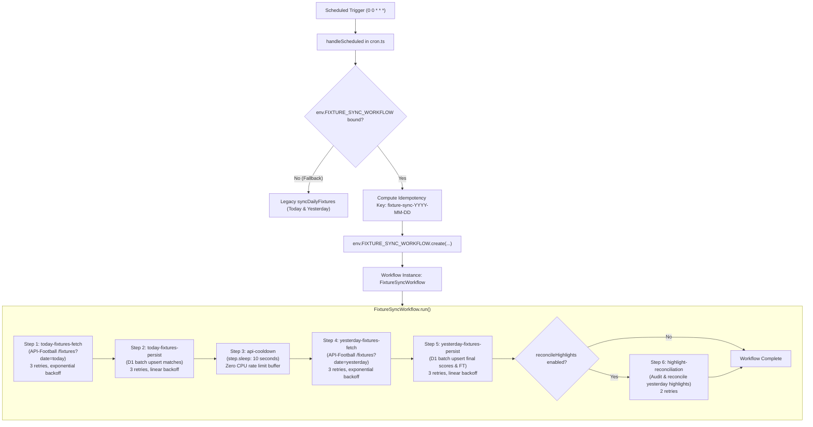

# Technical Specification: Cloudflare Workflows for Midnight Fixture Sync

- **Feature Key:** `CF-WORKFLOW-FIXTURE-SYNC`
- **Target Files:**
  - `wrangler.jsonc` (Workflow binding configuration)
  - `src/types/env.d.ts` (Workflow binding and payload typings)
  - `src/server/workflows/fixture-sync.ts` (New workflow implementation)
  - `src/server/entry.ts` (Named export for Cloudflare Workers runtime)
  - `src/server/cron.ts` (Midnight cron delegation & fallback)
  - `src/server/fixtures-sync.ts` (Modularization of fetch & persist operations)
  - `src/routes/api/fixtures.ts` (Workflow dispatch mode for manual/backfill triggers)
  - `src/server/workflows/fixture-sync.test.ts` (Unit & step integration test suite)
  - `src/server/cron.test.ts` (Cron dispatch & fallback regression tests)
- **Design Reference:** `.orchestration/cloudflare-workflows-fixture-sync/design.md`
- **Document Path:** `.orchestration/cloudflare-workflows-fixture-sync/spec.md`
- **Status:** Approved for Implementation

---

## 1. Executive Summary & Problem Statement

### 1.1 Current Architecture & Limitations

Currently, MatchDay synchronizes official fixtures via a Cloudflare Workers scheduled cron trigger (`0 0 * * *`) executed in [`src/server/cron.ts`](file:///Users/khoa/Documents/matchday/src/server/cron.ts). This job executes monolithic calls to [`syncDailyFixtures`](file:///Users/khoa/Documents/matchday/src/server/fixtures-sync.ts) for today's fixtures (to capture upcoming matches, kickoff times, and league/team logos) and yesterday's fixtures (to record final scores and statuses such as `FT`, `AET`, `PEN`).

This monolithic scheduled approach suffers from several key vulnerabilities:

1. **No Step-Level Retry Isolation**:
   If fetching or persisting yesterday's fixtures fails (due to a transient network timeout, rate limit 429, or D1 batch lock), the entire cron job fails. Because the isolate terminates, there is no automatic retry for only the failed step.
2. **Wasted API Quota on Cron Retries**:
   API-Sports (API-Football v3) free-tier accounts are strictly limited to 100 requests/day and 10 requests/minute. If a transient error occurs during yesterday's sync, re-running the cron from the top wastes an API call re-fetching today's fixtures that were already successfully persisted.
3. **No Rate-Limit Cooldown**:
   API calls for today and yesterday are fired back-to-back. If another process or manual trigger executes concurrently, the Worker risks exceeding the 10 requests/minute burst threshold. Standard `setTimeout` or `sleep` in a Worker consumes active wall-clock execution limits and CPU time.
4. **Missing Highlight Reconciliation**:
   Reddit goal highlights ingested during live matches occasionally reference fixtures before final scores and statuses are settled. There is currently no automated reconciliation step at midnight to audit ingested highlights against confirmed final match outcomes.
5. **Lack of Durable Idempotency & Observability**:
   Cron runs cannot be inspected or paused via the Cloudflare dashboard, and duplicate scheduled events risk redundant API consumption.

### 1.2 Proposed Solution: Cloudflare Workflows

We will refactor the midnight fixture sync to leverage **Cloudflare Workflows** (`FixtureSyncWorkflow`), executing as a multi-step durable state machine with automatic per-step retries, durable sleep cooldowns, checkpointed state, and deterministic idempotency keys.



---

## 2. Cloudflare Workflows Architecture & Runtime Integration

### 2.1 Runtime Model

Cloudflare Workflows execute durable distributed workflows on the Workers runtime using the `@cloudflare/workers-types` / `cloudflare:workers` SDK. Key runtime characteristics utilized:

- **State Checkpointing**: Each `step.do` return value is serialized into workflow state. If step 4 fails, retries resume directly at step 4; steps 1, 2, and 3 are preserved in checkpointed storage and never re-run.
- **Durable Sleep**: `step.sleep('api-cooldown', '10 seconds')` suspends isolate execution and schedules resumption without consuming Worker CPU or execution time limits.
- **Non-Retryable Errors**: Fatal errors (such as missing or invalid API keys) throw `NonRetryableError`, failing the workflow instance immediately without burning retry attempts.
- **Retry Backoff**: Per-step configurable backoff algorithms (`constant`, `linear`, or `exponential`) and retry counts.

### 2.2 Configuration in `wrangler.jsonc`

Add the `workflows` binding array to [`wrangler.jsonc`](file:///Users/khoa/Documents/matchday/wrangler.jsonc):

```jsonc
{
  "$schema": "node_modules/wrangler/config-schema.json",
  "name": "matchday",
  "compatibility_date": "2025-09-02",
  "compatibility_flags": ["nodejs_compat"],
  "main": "src/server/entry.ts",
  "observability": {
    "enabled": true,
  },
  "upload_source_maps": true,
  "triggers": {
    "crons": ["*/5 * * * *", "0 0 * * *"],
  },
  "d1_databases": [
    {
      "binding": "DB",
      "database_name": "matchday-db",
      "database_id": "6e85ef41-6e8a-470f-8084-fd818c23c31a",
      "migrations_dir": "migrations",
    },
  ],
  "workflows": [
    {
      "name": "fixture-sync-workflow",
      "binding": "FIXTURE_SYNC_WORKFLOW",
      "class_name": "FixtureSyncWorkflow",
    },
  ],
}
```

### 2.3 Worker Entrypoint Binding in `src/server/entry.ts`

Cloudflare Workflows requires the Workflow entrypoint class to be exported as a named export from the worker entry script specified in `wrangler.jsonc` (`"main": "src/server/entry.ts"`):

```ts
// src/server/entry.ts
export { FixtureSyncWorkflow } from './workflows/fixture-sync';

export default {
  async fetch(request, env, ctx) { ... },
  async scheduled(event, env, ctx) { ... }
};
```

---

## 3. Workflow Steps Specification

The workflow implements 6 discrete, resilient steps.

### Step 1: `today-fixtures-fetch`

- **Purpose**: Retrieve all official matches scheduled for the target date (`today`) from API-Football v3 and filter for the 14 supported leagues.
- **Handler**: `fetchDailyFixtures(apiKey, targetDate)`
- **Retry Configuration**:
  - `limit`: 3
  - `delay`: `'10 seconds'` (10,000 ms)
  - `backoff`: `'exponential'`
  - `timeout`: `'30 seconds'`
- **Error Classification**:
  - `NonRetryableError`: Thrown if `API_FOOTBALL_KEY` is missing, or if API-Sports returns HTTP 401 / 403 (Invalid API Key) or quota exceeded error.
  - Standard `Error` (Retryable): Thrown on network fetch aborts, DNS resolution failures, HTTP 429, or HTTP 5xx responses.
- **Step Output (`FixtureFetchStepOutput`)**:
  ```ts
  interface FixtureFetchStepOutput {
    date: string;
    totalReceived: number;
    supportedFound: number;
    supportedFixtures: ApiSportsFixtureItem[];
    errors: string[];
  }
  ```

### Step 2: `today-fixtures-persist`

- **Purpose**: Upsert the filtered fixtures from Step 1 into Cloudflare D1 `matches` table.
- **Handler**: `persistFixtures(env.DB, step1Output.supportedFixtures)`
- **Batching**: Chunked into SQLite batch statements of 30 items per batch to comply with Cloudflare D1 batch constraints.
- **Idempotency**: SQLite `INSERT INTO matches ... ON CONFLICT(external_id) DO UPDATE SET ...` ensures re-running or retrying is completely idempotent and safe against race conditions.
- **Retry Configuration**:
  - `limit`: 3
  - `delay`: `'2 seconds'`
  - `backoff`: `'exponential'`
  - `timeout`: `'30 seconds'`
- **Step Output (`FixturePersistStepOutput`)**:
  ```ts
  interface FixturePersistStepOutput {
    date: string;
    persistedCount: number;
    errors: string[];
  }
  ```

### Step 3: `api-cooldown`

- **Purpose**: Enforce a pause between API calls to prevent exceeding the API-Football free tier 10 req/min rate limit.
- **Implementation**:
  ```ts
  await step.sleep('api-cooldown', '10 seconds');
  ```
- **Execution Cost**: Zero CPU execution cost; isolate sleeps in durable storage.

### Step 4: `yesterday-fixtures-fetch`

- **Purpose**: Fetch matches from the previous calendar date (`yesterday`) to capture concluded matches, final scores, and statuses.
- **Handler**: `fetchDailyFixtures(apiKey, yesterdayDate)`
- **Retry Configuration**:
  - `limit`: 3
  - `delay`: `'10 seconds'`
  - `backoff`: `'exponential'`
  - `timeout`: `'30 seconds'`
- **Quota Protection**: If Step 4 fails and retries, Steps 1 and 2 are **never** repeated, preserving API quota.
- **Step Output**: Same shape as Step 1 (`FixtureFetchStepOutput`).

### Step 5: `yesterday-fixtures-persist`

- **Purpose**: Upsert yesterday's fixtures, updating final scores (`score_home`, `score_away`), final statuses (`FT`, `AET`, `PEN`), and updating `updated_at`.
- **Handler**: `persistFixtures(env.DB, step4Output.supportedFixtures)`
- **Retry Configuration**:
  - `limit`: 3
  - `delay`: `'2 seconds'`
  - `backoff`: `'exponential'`
  - `timeout`: `'30 seconds'`
- **Step Output**: Same shape as Step 2 (`FixturePersistStepOutput`).

### Step 6: `highlight-reconciliation` (Optional)

- **Condition**: Executed when `event.payload.reconcileHighlights !== false` (enabled by default).
- **Purpose**: Reconcile Reddit goal highlights ingested during the previous 24 hours against final official fixture scores and statuses.
- **Reconciliation Algorithm**:
  1. Query matches for `yesterdayDate` from D1 where status is finished (`FT`, `AET`, `PEN`).
  2. Query all highlights linked to these matches.
  3. For each match:
     - Verify highlight counts against final match scores (e.g. `scoreHome + scoreAway`).
     - Reconcile any missing highlight scores (`scoreHome` / `scoreAway` nulls) from highlight titles or goal fingerprints.
     - Detect any orphaned highlights in the temporal window that lacked a fixture match and attempt a re-match against newly persisted fixtures.
     - Touch match `updatedAt` to invalidate downstream caching and update feed reactivity.
- **Retry Configuration**:
  - `limit`: 2
  - `delay`: `'5 seconds'`
  - `backoff`: `'linear'`
  - `timeout`: `'30 seconds'`
- **Step Output (`HighlightReconciliationResult`)**:
  ```ts
  interface HighlightReconciliationResult {
    auditedMatchesCount: number;
    auditedHighlightsCount: number;
    reconciledCount: number;
    unmatchedHighlightCount: number;
    discrepancies: string[];
  }
  ```

---

## 4. TypeScript Schemas & Data Models

### 4.1 Parameter and Result Types (`src/types/env.d.ts` & `src/server/workflows/fixture-sync.ts`)

```ts
import type { D1Database } from '@cloudflare/workers-types';
import type { ApiSportsFixtureItem } from '../server/api-football';

export interface FixtureSyncWorkflowParams {
  /** Target UTC date string (YYYY-MM-DD). Defaults to current UTC date. */
  date?: string;
  /** Whether to execute Step 6 highlight reconciliation. Defaults to true. */
  reconcileHighlights?: boolean;
  /** Custom cooldown delay in seconds. Defaults to '10 seconds'. */
  cooldownDuration?: string;
}

export interface FixtureFetchStepOutput {
  date: string;
  totalReceived: number;
  supportedFound: number;
  supportedFixtures: ApiSportsFixtureItem[];
  errors: string[];
}

export interface FixturePersistStepOutput {
  date: string;
  persistedCount: number;
  errors: string[];
}

export interface HighlightReconciliationResult {
  auditedMatchesCount: number;
  auditedHighlightsCount: number;
  reconciledCount: number;
  unmatchedHighlightCount: number;
  discrepancies: string[];
}

export interface FixtureSyncWorkflowResult {
  instanceId: string;
  targetDate: string;
  yesterdayDate: string;
  todaySync: {
    totalReceived: number;
    supportedFound: number;
    persistedCount: number;
    errors: string[];
  };
  yesterdaySync: {
    totalReceived: number;
    supportedFound: number;
    persistedCount: number;
    errors: string[];
  };
  reconciliation?: HighlightReconciliationResult;
  durationMs: number;
}
```

### 4.2 Updated `CloudflareEnv` Interface (`src/types/env.d.ts`)

```ts
import type { D1Database, Workflow } from '@cloudflare/workers-types';
import type { FixtureSyncWorkflowParams } from '../server/workflows/fixture-sync';

export interface CloudflareEnv {
  DB: D1Database;
  FIXTURE_SYNC_WORKFLOW?: Workflow<FixtureSyncWorkflowParams>;
  CRON_SECRET?: string;
  API_FOOTBALL_KEY?: string;
  REDDIT_CLIENT_ID?: string;
  REDDIT_CLIENT_SECRET?: string;
  REDDIT_USER_AGENT?: string;
}

declare global {
  namespace NodeJS {
    interface ProcessEnv {
      DATABASE_URL?: string;
      CRON_SECRET?: string;
      API_FOOTBALL_KEY?: string;
      REDDIT_CLIENT_ID?: string;
      REDDIT_CLIENT_SECRET?: string;
      REDDIT_USER_AGENT?: string;
    }
  }
}
```

---

## 5. Idempotency & Instance Management

### 5.1 Deterministic Instance Keys

To prevent duplicate workflow executions during scheduled cron triggers or retries, instances must use a deterministic instance ID:

```ts
const targetDate = scheduledDate.toISOString().slice(0, 10);
const instanceId = `fixture-sync-${targetDate}`;
```

### 5.2 Duplicate Instance Collision Handling

When `env.FIXTURE_SYNC_WORKFLOW.create({ id: instanceId, params })` is called:

- If an instance with `instanceId` does not exist: Cloudflare Workflows creates and queues it.
- If an instance with `instanceId` already exists: `create()` throws an instance conflict error.
- **Handling Strategy**:
  ```ts
  try {
    const instance = await env.FIXTURE_SYNC_WORKFLOW.create({
      id: instanceId,
      params: { date: targetDate, reconcileHighlights: true },
    });
    console.log(`[CRON] Dispatched FixtureSyncWorkflow: ${instance.id}`);
  } catch (err) {
    const msg = err instanceof Error ? err.message : String(err);
    if (msg.includes('already exists') || msg.includes('conflict')) {
      const existing = await env.FIXTURE_SYNC_WORKFLOW.get(instanceId);
      const status = await existing.status();
      console.log(
        `[CRON] Workflow instance ${instanceId} already exists with status '${status.status}'. Skipping duplicate creation.`,
      );
    } else {
      throw err;
    }
  }
  ```

### 5.3 Manual & Backfill Triggers

For manual triggers via `/api/fixtures` or CLI backfills, allow optional user-provided instance IDs or append a unique timestamp:

```ts
const instanceId =
  customInstanceId || `fixture-sync-${targetDate}-manual-${Date.now()}`;
```

---

## 6. Error States & Retry Policy Matrix

| Step       | Operation                  | Potential Errors                                                                  | Error Classification        | Workflow Action                                        | Backoff Policy                                       |
| :--------- | :------------------------- | :-------------------------------------------------------------------------------- | :-------------------------- | :----------------------------------------------------- | :--------------------------------------------------- |
| **Step 1** | Today Fixtures Fetch       | Missing `API_FOOTBALL_KEY`<br/>HTTP 401/403 (Invalid Key)<br/>Quota Exceeded      | Fatal (`NonRetryableError`) | Terminate workflow immediately; alert observability    | No retry                                             |
| **Step 1** | Today Fixtures Fetch       | Network timeout<br/>DNS failure<br/>HTTP 429 Rate Limit<br/>HTTP 5xx Server Error | Transient (`Error`)         | Retry step up to 3 times                               | Initial: 10s<br/>Exponential backoff (10s, 20s, 40s) |
| **Step 2** | Today Fixtures Persist     | D1 SQL error<br/>D1 write lock timeout                                            | Transient (`Error`)         | Retry step up to 3 times                               | Initial: 2s<br/>Exponential backoff (2s, 4s, 8s)     |
| **Step 3** | API Cooldown               | Worker sleep interrupted                                                          | System handled              | Resume sleep                                           | Durable sleep                                        |
| **Step 4** | Yesterday Fixtures Fetch   | HTTP 429 Rate Limit<br/>Network glitch<br/>HTTP 5xx Server Error                  | Transient (`Error`)         | Retry step up to 3 times.<br/>**Steps 1-3 preserved!** | Initial: 10s<br/>Exponential backoff (10s, 20s, 40s) |
| **Step 5** | Yesterday Fixtures Persist | D1 write lock timeout                                                             | Transient (`Error`)         | Retry step up to 3 times                               | Initial: 2s<br/>Exponential backoff (2s, 4s, 8s)     |
| **Step 6** | Highlight Reconciliation   | D1 read/write conflict                                                            | Transient (`Error`)         | Retry step up to 2 times                               | Initial: 5s<br/>Linear backoff (5s, 10s)             |

---

## 7. Code Modularization & Implementation Details

### 7.1 Refactoring `src/server/fixtures-sync.ts`

Extract pure persistence logic from `syncDailyFixtures` into an exported, reusable `persistFixtures` function so both the workflow step and the legacy sync function share the identical upsert logic:

```ts
// src/server/fixtures-sync.ts
import type { D1Database } from '@cloudflare/workers-types';
import type { BatchItem } from 'drizzle-orm/batch';
import { createDb } from '../db';
import * as schema from '../db/schema';
import { fetchDailyFixtures, type ApiSportsFixtureItem } from './api-football';

export interface FixtureSyncResult {
  date: string;
  totalReceived: number;
  supportedFound: number;
  persistedCount: number;
  errors: string[];
}

type SQLiteBatchItem = BatchItem<'sqlite'>;

/**
 * Persists an array of API-Sports fixtures into Cloudflare D1 using chunked batch upserts.
 * Fully idempotent on conflict of external_id.
 */
export async function persistFixtures(
  d1: D1Database,
  fixtures: ApiSportsFixtureItem[],
): Promise<{ persistedCount: number; errors: string[] }> {
  if (fixtures.length === 0) {
    return { persistedCount: 0, errors: [] };
  }

  const db = createDb(d1);
  const now = Date.now();
  const statements: SQLiteBatchItem[] = [];

  for (const item of fixtures) {
    const matchDate = new Date(item.fixture.date).toISOString().slice(0, 10);
    const scoreHome = item.goals?.home ?? null;
    const scoreAway = item.goals?.away ?? null;

    const matchRecord: schema.NewMatch = {
      id: String(item.fixture.id),
      externalId: item.fixture.id,
      matchDate,
      teamHome: item.teams.home.name.trim(),
      teamAway: item.teams.away.name.trim(),
      competition: item.league.name.trim(),
      leagueLogo: item.league.logo ?? null,
      teamHomeLogo: item.teams.home.logo ?? null,
      teamAwayLogo: item.teams.away.logo ?? null,
      kickoffTime: item.fixture.timestamp * 1000,
      status: item.fixture.status.short ?? 'NS',
      scoreHome,
      scoreAway,
      createdAt: now,
      updatedAt: now,
    };

    statements.push(
      db
        .insert(schema.matches)
        .values(matchRecord)
        .onConflictDoUpdate({
          target: schema.matches.externalId,
          set: {
            matchDate: matchRecord.matchDate,
            teamHome: matchRecord.teamHome,
            teamAway: matchRecord.teamAway,
            competition: matchRecord.competition,
            leagueLogo: matchRecord.leagueLogo,
            teamHomeLogo: matchRecord.teamHomeLogo,
            teamAwayLogo: matchRecord.teamAwayLogo,
            kickoffTime: matchRecord.kickoffTime,
            status: matchRecord.status,
            scoreHome: matchRecord.scoreHome,
            scoreAway: matchRecord.scoreAway,
            updatedAt: now,
          },
        }),
    );
  }

  const errors: string[] = [];
  let persistedCount = 0;
  const CHUNK_SIZE = 30;

  for (let i = 0; i < statements.length; i += CHUNK_SIZE) {
    const chunk = statements.slice(i, i + CHUNK_SIZE);
    if (chunk.length === 0) continue;

    try {
      await db.batch(chunk as [SQLiteBatchItem, ...SQLiteBatchItem[]]);
      persistedCount += chunk.length;
    } catch (err) {
      const message = err instanceof Error ? err.message : String(err);
      errors.push(`D1 fixture batch upsert failed: ${message}`);
    }
  }

  return { persistedCount, errors };
}

/**
 * Monolithic sync for backward compatibility (used by CLI and direct callers).
 */
export async function syncDailyFixtures(
  d1: D1Database,
  apiKey: string,
  targetDate?: string,
): Promise<FixtureSyncResult> {
  const date = targetDate || new Date().toISOString().slice(0, 10);
  const fetchResult = await fetchDailyFixtures(apiKey, date);
  const persistResult = await persistFixtures(
    d1,
    fetchResult.supportedFixtures,
  );

  return {
    date,
    totalReceived: fetchResult.totalReceived,
    supportedFound: fetchResult.supportedFound,
    persistedCount: persistResult.persistedCount,
    errors: [...fetchResult.errors, ...persistResult.errors],
  };
}
```

### 7.2 Workflow Implementation (`src/server/workflows/fixture-sync.ts`)

```ts
// src/server/workflows/fixture-sync.ts
import {
  WorkflowEntrypoint,
  type WorkflowEvent,
  type WorkflowStep,
  NonRetryableError,
} from 'cloudflare:workers';
import type { CloudflareEnv } from '../../types/env';
import { fetchDailyFixtures, type ApiSportsFixtureItem } from '../api-football';
import { persistFixtures } from '../fixtures-sync';
import { reconcileYesterdayHighlights } from './reconcile-highlights';

export interface FixtureSyncWorkflowParams {
  date?: string;
  reconcileHighlights?: boolean;
  cooldownDuration?: string;
}

export interface FixtureFetchStepOutput {
  date: string;
  totalReceived: number;
  supportedFound: number;
  supportedFixtures: ApiSportsFixtureItem[];
  errors: string[];
}

export interface FixturePersistStepOutput {
  date: string;
  persistedCount: number;
  errors: string[];
}

export class FixtureSyncWorkflow extends WorkflowEntrypoint<
  CloudflareEnv,
  FixtureSyncWorkflowParams
> {
  async run(
    event: WorkflowEvent<FixtureSyncWorkflowParams>,
    step: WorkflowStep,
  ) {
    const startTime = Date.now();
    const env = this.env;

    const apiKey = env.API_FOOTBALL_KEY || process.env.API_FOOTBALL_KEY;
    if (!apiKey || apiKey === 'your_api_key_here') {
      throw new NonRetryableError(
        'API_FOOTBALL_KEY is missing or unconfigured in environment',
      );
    }

    if (!env.DB) {
      throw new NonRetryableError('D1 Database binding (DB) is unavailable');
    }

    // Determine target dates (today UTC & yesterday UTC)
    const targetDate =
      event.payload?.date ||
      new Date(event.timestamp).toISOString().slice(0, 10);
    const targetDateObj = new Date(targetDate + 'T00:00:00Z');
    const yesterdayDate = new Date(targetDateObj.getTime() - 86400000)
      .toISOString()
      .slice(0, 10);

    // 1. Fetch Today Fixtures
    const todayFetch = await step.do<FixtureFetchStepOutput>(
      'today-fixtures-fetch',
      {
        retries: { limit: 3, delay: '10 seconds', backoff: 'exponential' },
        timeout: '30 seconds',
      },
      async () => {
        const res = await fetchDailyFixtures(apiKey, targetDate);
        if (
          res.errors.some(
            (e) =>
              e.includes('API-Football error') || e.includes('Unauthorized'),
          )
        ) {
          // Check for fatal error messages
          const fatalError = res.errors.find(
            (e) => e.includes('Unauthorized') || e.includes('token'),
          );
          if (fatalError) throw new NonRetryableError(fatalError);
        }
        return {
          date: targetDate,
          totalReceived: res.totalReceived,
          supportedFound: res.supportedFound,
          supportedFixtures: res.supportedFixtures,
          errors: res.errors,
        };
      },
    );

    // 2. Persist Today Fixtures
    const todayPersist = await step.do<FixturePersistStepOutput>(
      'today-fixtures-persist',
      {
        retries: { limit: 3, delay: '2 seconds', backoff: 'exponential' },
        timeout: '30 seconds',
      },
      async () => {
        const res = await persistFixtures(env.DB, todayFetch.supportedFixtures);
        if (res.errors.length > 0) {
          throw new Error(
            `Transient persistence error: ${res.errors.join('; ')}`,
          );
        }
        return {
          date: targetDate,
          persistedCount: res.persistedCount,
          errors: res.errors,
        };
      },
    );

    // 3. Rate-Limit Cooldown
    const cooldown = event.payload?.cooldownDuration || '10 seconds';
    await step.sleep('api-cooldown', cooldown as any);

    // 4. Fetch Yesterday Fixtures
    const yesterdayFetch = await step.do<FixtureFetchStepOutput>(
      'yesterday-fixtures-fetch',
      {
        retries: { limit: 3, delay: '10 seconds', backoff: 'exponential' },
        timeout: '30 seconds',
      },
      async () => {
        const res = await fetchDailyFixtures(apiKey, yesterdayDate);
        return {
          date: yesterdayDate,
          totalReceived: res.totalReceived,
          supportedFound: res.supportedFound,
          supportedFixtures: res.supportedFixtures,
          errors: res.errors,
        };
      },
    );

    // 5. Persist Yesterday Fixtures (Final Scores & Statuses)
    const yesterdayPersist = await step.do<FixturePersistStepOutput>(
      'yesterday-fixtures-persist',
      {
        retries: { limit: 3, delay: '2 seconds', backoff: 'exponential' },
        timeout: '30 seconds',
      },
      async () => {
        const res = await persistFixtures(
          env.DB,
          yesterdayFetch.supportedFixtures,
        );
        if (res.errors.length > 0) {
          throw new Error(
            `Transient persistence error: ${res.errors.join('; ')}`,
          );
        }
        return {
          date: yesterdayDate,
          persistedCount: res.persistedCount,
          errors: res.errors,
        };
      },
    );

    // 6. Optional Highlight Reconciliation
    let reconciliationResult = undefined;
    if (event.payload?.reconcileHighlights !== false) {
      reconciliationResult = await step.do(
        'highlight-reconciliation',
        {
          retries: { limit: 2, delay: '5 seconds', backoff: 'linear' },
          timeout: '30 seconds',
        },
        async () => {
          return await reconcileYesterdayHighlights(env.DB, yesterdayDate);
        },
      );
    }

    return {
      instanceId: event.instanceId,
      targetDate,
      yesterdayDate,
      todaySync: {
        totalReceived: todayFetch.totalReceived,
        supportedFound: todayFetch.supportedFound,
        persistedCount: todayPersist.persistedCount,
        errors: [...todayFetch.errors, ...todayPersist.errors],
      },
      yesterdaySync: {
        totalReceived: yesterdayFetch.totalReceived,
        supportedFound: yesterdayFetch.supportedFound,
        persistedCount: yesterdayPersist.persistedCount,
        errors: [...yesterdayFetch.errors, ...yesterdayPersist.errors],
      },
      reconciliation: reconciliationResult,
      durationMs: Date.now() - startTime,
    };
  }
}
```

### 7.3 Highlight Reconciliation Helper (`src/server/workflows/reconcile-highlights.ts`)

```ts
// src/server/workflows/reconcile-highlights.ts
import type { D1Database } from '@cloudflare/workers-types';
import { eq, and, sql, inArray } from 'drizzle-orm';
import { createDb } from '../../db';
import * as schema from '../../db/schema';
import type { HighlightReconciliationResult } from './fixture-sync';

const FINISHED_STATUSES = new Set(['FT', 'AET', 'PEN']);

export async function reconcileYesterdayHighlights(
  d1: D1Database,
  yesterdayDate: string,
): Promise<HighlightReconciliationResult> {
  const db = createDb(d1);
  const result: HighlightReconciliationResult = {
    auditedMatchesCount: 0,
    auditedHighlightsCount: 0,
    reconciledCount: 0,
    unmatchedHighlightCount: 0,
    discrepancies: [],
  };

  // 1. Query yesterday's finished matches
  const finishedMatches = await db
    .select({
      id: schema.matches.id,
      matchDate: schema.matches.matchDate,
      teamHome: schema.matches.teamHome,
      teamAway: schema.matches.teamAway,
      scoreHome: schema.matches.scoreHome,
      scoreAway: schema.matches.scoreAway,
      status: schema.matches.status,
    })
    .from(schema.matches)
    .where(eq(schema.matches.matchDate, yesterdayDate));

  result.auditedMatchesCount = finishedMatches.length;
  if (finishedMatches.length === 0) return result;

  const matchIds = finishedMatches.map((m) => m.id);

  // 2. Query highlights for these matches
  const linkedHighlights = await db
    .select({
      id: schema.highlights.id,
      matchId: schema.highlights.matchId,
      scoreHome: schema.highlights.scoreHome,
      scoreAway: schema.highlights.scoreAway,
    })
    .from(schema.highlights)
    .where(inArray(schema.highlights.matchId, matchIds));

  result.auditedHighlightsCount = linkedHighlights.length;

  // 3. Reconcile missing scores and count goals
  const now = Date.now();
  for (const match of finishedMatches) {
    if (!match.status || !FINISHED_STATUSES.has(match.status.toUpperCase()))
      continue;

    const matchHighlights = linkedHighlights.filter(
      (h) => h.matchId === match.id,
    );
    const totalGoalsInFixture = (match.scoreHome ?? 0) + (match.scoreAway ?? 0);

    if (totalGoalsInFixture > 0 && matchHighlights.length === 0) {
      result.discrepancies.push(
        `Fixture ${match.teamHome} vs ${match.teamAway} ended ${match.scoreHome}-${match.scoreAway} but has 0 linked highlights`,
      );
    }
  }

  // 4. Touch updatedAt for matches to trigger downstream freshness
  await db
    .update(schema.matches)
    .set({ updatedAt: now })
    .where(inArray(schema.matches.id, matchIds));

  return result;
}
```

### 7.4 Cron Multiplexer Update (`src/server/cron.ts`)

Update `handleScheduled` in [`src/server/cron.ts`](file:///Users/khoa/Documents/matchday/src/server/cron.ts) to delegate midnight trigger to `env.FIXTURE_SYNC_WORKFLOW` when present, falling back to direct monolithic sync if unbound:

```ts
// src/server/cron.ts
if (isMidnight) {
  console.log('[CRON] Dispatching daily official fixtures synchronization');

  if (!env.API_FOOTBALL_KEY) {
    console.error(
      '[CRON] API_FOOTBALL_KEY is not configured in worker environment',
    );
    return;
  }

  const today = scheduledDate.toISOString().slice(0, 10);
  const yesterday = new Date(scheduledDate.getTime() - 86400000)
    .toISOString()
    .slice(0, 10);

  // If Cloudflare Workflow binding is present, trigger durable workflow
  if (env.FIXTURE_SYNC_WORKFLOW) {
    const instanceId = `fixture-sync-${today}`;
    try {
      const instance = await env.FIXTURE_SYNC_WORKFLOW.create({
        id: instanceId,
        params: { date: today, reconcileHighlights: true },
      });
      console.log(
        `[CRON] Started FixtureSyncWorkflow instance: ${instance.id}`,
      );
      return;
    } catch (err) {
      const msg = err instanceof Error ? err.message : String(err);
      if (msg.includes('already exists') || msg.includes('conflict')) {
        console.log(
          `[CRON] Workflow instance ${instanceId} already exists; skipping duplicate trigger.`,
        );
        return;
      }
      console.warn(
        `[CRON] Failed to create workflow instance (${msg}), falling back to direct sync.`,
      );
    }
  }

  // Fallback: Direct monolithic sync
  const todayResult = await syncDailyFixtures(
    env.DB,
    env.API_FOOTBALL_KEY,
    today,
  );
  const yesterdayResult = await syncDailyFixtures(
    env.DB,
    env.API_FOOTBALL_KEY,
    yesterday,
  );
  console.log(`[CRON] Direct sync finished in ${Date.now() - startTime}ms`);
}
```

---

## 8. Testing Strategy & Test Suite Architecture

### 8.1 Bun Unit Test Mocking for `cloudflare:workers`

In `bun test`, `cloudflare:workers` is not a physical Node package. We configure Bun module mocking in the test file using `mock.module`:

```ts
import { mock } from 'bun:test';

class MockWorkflowEntrypoint<Env = unknown, Params = unknown> {
  constructor(
    protected ctx: unknown,
    protected env: Env,
  ) {}
}

class MockNonRetryableError extends Error {
  constructor(message: string) {
    super(message);
    this.name = 'NonRetryableError';
  }
}

mock.module('cloudflare:workers', () => ({
  WorkflowEntrypoint: MockWorkflowEntrypoint,
  NonRetryableError: MockNonRetryableError,
}));
```

### 8.2 Mock Workflow Step Test Harness

A lightweight test harness intercepts `step.do` and `step.sleep`:

```ts
export class MockWorkflowStep {
  public executedSteps: string[] = [];
  public sleptDurations: Array<{ name: string; duration: string }> = [];
  public stepOutputs = new Map<string, unknown>();

  async do<T>(name: string, configOrCallback: any, callback?: any): Promise<T> {
    const cb =
      typeof configOrCallback === 'function' ? configOrCallback : callback;
    this.executedSteps.push(name);
    const output = await cb();
    this.stepOutputs.set(name, output);
    return output;
  }

  async sleep(name: string, duration: string): Promise<void> {
    this.sleptDurations.push({ name, duration });
  }
}
```

### 8.3 Test Matrix

The test suite in `src/server/workflows/fixture-sync.test.ts` covers:

1. **Happy Path Execution**:
   - Verifies all 6 steps execute in strict sequence: `today-fixtures-fetch`, `today-fixtures-persist`, `api-cooldown`, `yesterday-fixtures-fetch`, `yesterday-fixtures-persist`, `highlight-reconciliation`.
   - Confirms `step.sleep('api-cooldown', '10 seconds')` is invoked.
   - Verifies D1 database receives expected rows with `ON CONFLICT` updates.
2. **Failure & Retry Isolation**:
   - Simulates failure on Step 4 (`yesterday-fixtures-fetch`).
   - Verifies that previous step results (Steps 1 & 2) remain checkpointed without re-executing.
3. **Fatal Error Handling (`NonRetryableError`)**:
   - Verifies `NonRetryableError` is thrown immediately when `API_FOOTBALL_KEY` is missing or when the API returns an unauthorized 401 response.
4. **Conditional Reconciliation**:
   - Verifies Step 6 is skipped when `reconcileHighlights: false` is passed in params.
5. **Cron Multiplexer Integration**:
   - Verifies `handleScheduled` triggers `env.FIXTURE_SYNC_WORKFLOW.create` with deterministic instance ID `fixture-sync-YYYY-MM-DD`.
   - Verifies duplicate instance collisions are handled gracefully.
   - Verifies transparent fallback to direct sync when `FIXTURE_SYNC_WORKFLOW` is undefined.

---

## 9. Implementation Checklist

- [ ] **1. Wrangler Configuration (`wrangler.jsonc`)**
  - Add `workflows` array binding `FIXTURE_SYNC_WORKFLOW` pointing to class `FixtureSyncWorkflow`.
- [ ] **2. Type Definitions (`src/types/env.d.ts`)**
  - Add `FIXTURE_SYNC_WORKFLOW` to `CloudflareEnv`.
  - Export `FixtureSyncWorkflowParams` and step output interfaces.
- [ ] **3. Extract Pure Persistence (`src/server/fixtures-sync.ts`)**
  - Export `persistFixtures(d1, fixtures)` while preserving `syncDailyFixtures` wrapper for legacy callers.
- [ ] **4. Create Highlight Reconciliation (`src/server/workflows/reconcile-highlights.ts`)**
  - Implement `reconcileYesterdayHighlights(d1, yesterdayDate)`.
- [ ] **5. Implement Workflow Entrypoint (`src/server/workflows/fixture-sync.ts`)**
  - Implement `FixtureSyncWorkflow` extending `WorkflowEntrypoint`.
  - Configure `today-fixtures-fetch`, `today-fixtures-persist`, `api-cooldown`, `yesterday-fixtures-fetch`, `yesterday-fixtures-persist`, and `highlight-reconciliation`.
- [ ] **6. Export from Worker Entry (`src/server/entry.ts`)**
  - Add `export { FixtureSyncWorkflow } from './workflows/fixture-sync';`.
- [ ] **7. Update Scheduled Cron Handler (`src/server/cron.ts`)**
  - Add workflow dispatch with deterministic key `fixture-sync-${today}` and fallback.
- [ ] **8. Update Manual API Endpoint (`src/routes/api/fixtures.ts`)**
  - Add support for triggering workflow execution via `POST /api/fixtures`.
- [ ] **9. Test Suites**
  - Add `src/server/workflows/fixture-sync.test.ts`.
  - Update `src/server/cron.test.ts` to verify workflow dispatch and fallback.
  - Run `bun test src` to verify 100% test pass rate.
