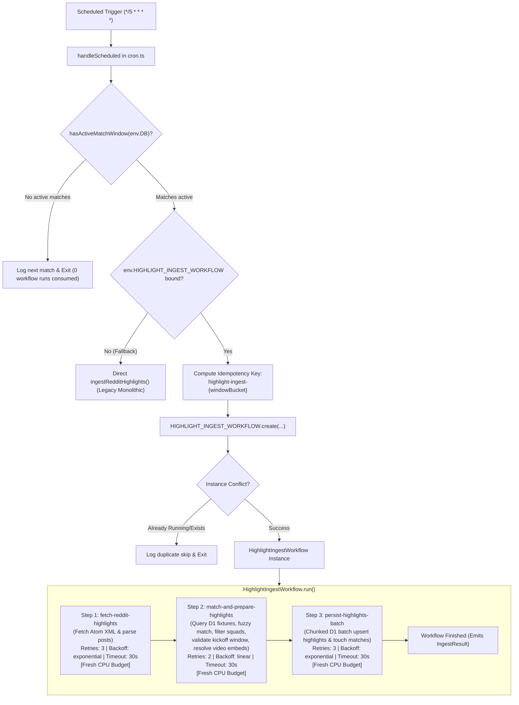

# Technical Specification: Cloudflare Workflows for 5-Minute Reddit Highlight Ingestion

- **Feature Key:** `CF-WORKFLOW-HIGHLIGHT-INGEST`
- **Target Files:**
  - `wrangler.jsonc` (Add `HIGHLIGHT_INGEST_WORKFLOW` binding)
  - `src/types/env.d.ts` (Add `HighlightIngestWorkflowParams` and workflow binding typing)
  - `src/server/workflows/highlight-ingest.ts` (New workflow implementation class `HighlightIngestWorkflow`)
  - `src/server/entry.ts` (Named export for Cloudflare Workers runtime)
  - `src/server/cron.ts` (5-minute cron delegation, active game window pre-check & fallback)
  - `src/server/ingest.ts` (Refactor/extract core matching and persistence helpers if needed for workflow steps)
  - `src/routes/api/cron.ts` (Support manual workflow dispatch and direct execution modes)
  - `src/server/workflows/highlight-ingest.test.ts` (Comprehensive step-level unit and integration test suite)
  - `src/server/cron.test.ts` (Cron dispatch, game hours pre-check, duplicate suppression, and fallback tests)
  - `src/routes/api/cron.test.ts` (API route dispatch and fallback regression tests)
- **Design Reference:** `.orchestration/cloudflare-workflows-highlight-ingest/design.md`
- **Document Path:** `.orchestration/cloudflare-workflows-highlight-ingest/spec.md`
- **Status:** Approved for Implementation

---

## 1. Executive Summary & Problem Statement

### 1.1 Current Architecture & Limitations

MatchDay periodically ingests goal highlight videos from Reddit (`r/soccer`) using a 5-minute scheduled cron trigger (`*/5 * * * *`) routed through [`src/server/cron.ts`](file:///Users/khoa/Documents/matchday/src/server/cron.ts) and executed inside [`src/server/ingest.ts`](file:///Users/khoa/Documents/matchday/src/server/ingest.ts).

Currently, this ingestion executes as a monolithic function inside `ctx.waitUntil(...)`:

1. Checks active game hours via [`hasActiveMatchWindow`](file:///Users/khoa/Documents/matchday/src/server/ingest.ts#L304-L387).
2. Performs an HTTP GET request to Reddit's Atom RSS search feed (`fetchRedditPosts` in [`src/server/reddit.ts`](file:///Users/khoa/Documents/matchday/src/server/reddit.ts#L124-L151)).
3. Regex-parses XML Atom entries in-memory into `HighlightPost[]`.
4. Computes a multi-day temporal search window (`minDate - 1 day` to `maxDate + 1 day`).
5. Queries candidate fixtures from Cloudflare D1 across that date window.
6. Queries existing goal fingerprints from D1 to prevent duplicate records.
7. Parses Reddit post titles with regex, filters youth/reserve squads, executes fuzzy team matching (`matchPostToFixture`), validates kickoff time windows, normalizes inverted scorelines, and computes MD5 goal fingerprints.
8. Resolves video embed URLs (Dubz, Streamin, Streamff, Streamable, Imgur, etc.).
9. Prepares and executes chunked D1 batch queries (`highlights` upsert and `matches` `updatedAt` touch).

This monolithic design presents several critical production risks on Cloudflare Workers:

1. **CPU Budget Exhaustion (`exceededCpu`)**:
   - On the Workers Free plan, scheduled cron jobs and standard requests have a strict CPU time limit of **10ms** (up to 50ms on Paid Workers).
   - Under heavy matchday traffic (e.g. Saturday afternoon with 20+ concurrent European matches), the combined CPU burden of XML parsing, regex title scanning, fuzzy string distance calculations, and SQL batch serialization routinely approaches or exceeds this quota, resulting in unrecoverable `exceededCpu` runtime terminations.
2. **Lack of Step-Level Retry Isolation**:
   - If Step 1 (Reddit RSS fetch) suffers transient network lag or Step 3 (D1 batch execution) encounters a temporary SQLite lock, the entire cron execution fails. There is no fine-grained checkpointing to retry only the failed subtask.
3. **No Durable Observability**:
   - Failures inside `ctx.waitUntil` only emit console logs. They cannot be monitored, inspected, replayed, or tracked in the Cloudflare Workflows dashboard.
4. **Wasted Execution Outside Active Windows**:
   - The cron runs 288 times a day. When no matches are active, running the full Worker isolate and initiating database queries wastes invocation quotas.

### 1.2 Proposed Solution: Cloudflare Workflows (`HighlightIngestWorkflow`)

We will migrate the 5-minute highlight ingestion to **Cloudflare Workflows** by introducing `HighlightIngestWorkflow`.

Cloudflare Workflows execute durable distributed state machines on Cloudflare's edge runtime with:

- **Fresh CPU Budget Per Step**: Each workflow step (`step.do`) runs in its own freshly initialized isolate with a **full CPU budget** (10ms free / 50ms paid), completely preventing cumulative `exceededCpu` crashes.
- **Granular Retries & Exponential Backoff**: Each step isolates failure domains (e.g. network fetch vs. D1 database locks) with tailored retry counts and backoff curves.
- **Deterministic Checkpointed Payloads**: Step outputs are serialized and persisted. If Step 3 fails, Steps 1 and 2 are never re-executed.
- **Active Game Window Gatekeeper**: The cron handler performs a fast pre-check before instantiating a workflow instance, preserving workflow run quotas (free tier: 1,000 executions/month).
- **Graceful Fallback**: If the workflow binding is unavailable or instance creation fails unexpectedly, the system falls back to direct monolithic ingestion.



---

## 2. Cloudflare Workflows Architecture & Configuration

### 2.1 Configuration in `wrangler.jsonc`

Add `HIGHLIGHT_INGEST_WORKFLOW` to the existing `workflows` array in [`wrangler.jsonc`](file:///Users/khoa/Documents/matchday/wrangler.jsonc):

```jsonc
{
  "$schema": "node_modules/wrangler/config-schema.json",
  "name": "matchday",
  "compatibility_date": "2025-09-02",
  "compatibility_flags": ["nodejs_compat"],
  "main": "src/server/entry.ts",
  "observability": {
    "enabled": true,
  },
  "upload_source_maps": true,
  "triggers": {
    "crons": ["*/5 * * * *", "0 0 * * *"],
  },
  "d1_databases": [
    {
      "binding": "DB",
      "database_name": "matchday-db",
      "database_id": "6e85ef41-6e8a-470f-8084-fd818c23c31a",
      "migrations_dir": "migrations",
    },
  ],
  "workflows": [
    {
      "name": "fixture-sync-workflow",
      "binding": "FIXTURE_SYNC_WORKFLOW",
      "class_name": "FixtureSyncWorkflow",
    },
    {
      "name": "highlight-ingest-workflow",
      "binding": "HIGHLIGHT_INGEST_WORKFLOW",
      "class_name": "HighlightIngestWorkflow",
    },
  ],
}
```

### 2.2 Environment Type Definitions (`src/types/env.d.ts`)

Export workflow parameter interfaces and bind `HIGHLIGHT_INGEST_WORKFLOW` to `CloudflareEnv`:

```ts
import type { D1Database, Workflow } from '@cloudflare/workers-types';
import type { FixtureSyncWorkflowParams } from '../server/workflows/fixture-sync';
import type { HighlightIngestWorkflowParams } from '../server/workflows/highlight-ingest';

export type { FixtureSyncWorkflowParams, HighlightIngestWorkflowParams };

export interface CloudflareEnv {
  DB: D1Database;
  FIXTURE_SYNC_WORKFLOW?: Workflow<FixtureSyncWorkflowParams>;
  HIGHLIGHT_INGEST_WORKFLOW?: Workflow<HighlightIngestWorkflowParams>;
  CRON_SECRET?: string;
  API_FOOTBALL_KEY?: string;
  REDDIT_CLIENT_ID?: string;
  REDDIT_CLIENT_SECRET?: string;
  REDDIT_USER_AGENT?: string;
}

declare global {
  namespace NodeJS {
    interface ProcessEnv {
      DATABASE_URL?: string;
      CRON_SECRET?: string;
      API_FOOTBALL_KEY?: string;
      REDDIT_CLIENT_ID?: string;
      REDDIT_CLIENT_SECRET?: string;
      REDDIT_USER_AGENT?: string;
    }
  }
}
```

### 2.3 Worker Runtime Entrypoint (`src/server/entry.ts`)

Export `HighlightIngestWorkflow` alongside `FixtureSyncWorkflow` from [`src/server/entry.ts`](file:///Users/khoa/Documents/matchday/src/server/entry.ts):

```ts
import {
  createStartHandler,
  defaultStreamHandler,
} from '@tanstack/react-start/server';
import type {
  ScheduledEvent,
  ExecutionContext,
} from '@cloudflare/workers-types';
import { handleScheduled } from './cron';
import type { CloudflareEnv } from '../types/env';

export { FixtureSyncWorkflow } from './workflows/fixture-sync';
export { HighlightIngestWorkflow } from './workflows/highlight-ingest';

// ... default fetch and scheduled exports
```

---

## 3. Data Models & Step Contracts

All data passing between workflow steps must be strictly JSON-serializable (no `Map`, `Set`, circular references, or unhandled `Date` instances).

### 3.1 Workflow Parameters & Result

```ts
/**
 * Input parameters passed when triggering HighlightIngestWorkflow.
 */
export interface HighlightIngestWorkflowParams {
  /** Reference timestamp in milliseconds for time-based calculations. Defaults to event.timestamp. */
  referenceTimeMs?: number;
  /** Custom Reddit search RSS feed URL (used for testing or targeted backfills). */
  feedUrl?: string;
  /** Custom Reddit User-Agent string. */
  userAgent?: string;
  /** When true, bypasses the active match window check inside the workflow. */
  force?: boolean;
}

/**
 * Final return structure emitted upon workflow completion.
 */
export interface HighlightIngestWorkflowResult {
  instanceId: string;
  totalFetched: number;
  parsedCount: number;
  matchedCount: number;
  persistedCount: number;
  skippedCount: number;
  durationMs: number;
  errors: string[];
}
```

### 3.2 Step 1: `fetch-reddit-highlights`

- **Purpose**: Fetch Reddit's search Atom RSS feed (`r/soccer` with flairs "Goal Clip" or "Great Goal") and parse raw XML into strongly-typed `HighlightPost` records using the existing lightweight regex scanner.
- **Handler**: Calls `fetchRedditPosts(config)` in [`src/server/reddit.ts`](file:///Users/khoa/Documents/matchday/src/server/reddit.ts#L124-L151).
- **CPU Budget Rationale**: Network I/O and Atom feed parsing execute in Step 1. In standard crons, XML parsing consumes 3-5ms of the 10ms CPU limit. Running it in Step 1 isolates this CPU cost completely.
- **Retry Configuration**:
  - `limit`: 3
  - `delay`: `'5 seconds'`
  - `backoff`: `'exponential'`
  - `timeout`: `'30 seconds'`
- **Error Classification**:
  - `NonRetryableError`: Thrown if Reddit client configuration is invalid or if a fatal error occurs.
  - `Error` (Retryable): Thrown on network fetch timeouts, DNS errors, or HTTP 5xx responses from Reddit.
  - Note on HTTP 429: If Reddit returns 429 Rate Limit, `fetchRedditPosts` currently logs a warning and returns `[]`. In Step 1, if empty results are due to rate limiting or fetch errors, an error may be thrown to trigger the exponential backoff if desired, or return `posts: []` gracefully.
- **Serializable Output Contract**:
  ```ts
  export interface FetchRedditHighlightsStepOutput {
    posts: HighlightPost[];
    totalFetched: number;
    fetchedAt: number;
  }
  ```

### 3.3 Step 2: `match-and-prepare-highlights`

- **Purpose**:
  1. Determine the temporal search window: `[minPostCreatedUtc - 1 day, maxPostCreatedUtc + 1 day]`.
  2. Query candidate fixtures from D1 (`matches` table) within this window.
  3. Query existing goal fingerprints (`highlights.goalFingerprint`) for candidate matches from D1.
  4. Process each post:
     - Parse title with `parseRedditTitle`.
     - Reject youth/reserve squad matches (`isNonSeniorSquad`).
     - Match team names against candidate fixtures (`matchPostToFixture`).
     - Enforce match kickoff window: post time must be between `kickoffTime - 15 minutes` and `kickoffTime + 4 hours`.
     - Invert scoreline if fixture orientation was reversed (`matchResult.inverted`).
     - Generate MD5 goal fingerprint (`generateGoalFingerprint`). Skip if already in D1 or in current batch.
     - Resolve video embed URL (`resolveVideoEmbed`).
  5. Assemble list of prepared highlight records and touched match IDs.
- **CPU Budget Rationale**: String matching (fuzzy token distance in `matcher.ts`), regex title parsing, and MD5 fingerprinting represent the most CPU-heavy operations. In live matchdays with 25+ posts, this step takes 6-9ms of CPU. Executing it in Step 2 ensures it has its own dedicated 10ms budget without competing with database writes.
- **Retry Configuration**:
  - `limit`: 2
  - `delay`: `'2 seconds'`
  - `backoff`: `'linear'`
  - `timeout`: `'30 seconds'`
- **Error Classification**:
  - `NonRetryableError`: Missing D1 database binding (`!env.DB`).
  - `Error` (Retryable): Transient D1 query errors or connection resets.
- **Serializable Output Contract**:
  ```ts
  export interface PreparedHighlightItem {
    id: string; // e.g. "t3_1wc7ce0"
    matchId: string; // e.g. "m_12345"
    title: string;
    scoreHome: number | null;
    scoreAway: number | null;
    scorer: string | null;
    minute: number | null;
    tag: string | null;
    embedUrl: string | null;
    sourceUrl: string;
    redditUrl: string;
    goalFingerprint: string | null;
    postedAt: number;
  }

  export interface MatchAndPrepareStepOutput {
    preparedHighlights: PreparedHighlightItem[];
    touchedMatchIds: string[];
    parsedCount: number;
    matchedCount: number;
    skippedCount: number;
  }
  ```

### 3.4 Step 3: `persist-highlights-batch`

- **Purpose**:
  1. Receive `preparedHighlights` and `touchedMatchIds` from Step 2.
  2. If empty, return immediately with `persistedCount: 0`.
  3. Build SQLite D1 statements:
     - Upsert highlights with `onConflictDoUpdate` (updating `embedUrl` if non-null via `coalesce`).
     - Update `updatedAt = Date.now()` for all `touchedMatchIds`.
  4. Chunk all statements into slices of `CHUNK_SIZE = 30` to strictly comply with Cloudflare D1 batch limits.
  5. Execute each chunk via `db.batch(...)`.
- **CPU Budget Rationale**: D1 query serialization and batch transaction parsing across 30+ statements consumes substantial isolate CPU. Executing persistence in Step 3 provides a fresh CPU budget.
- **Retry Configuration**:
  - `limit`: 3
  - `delay`: `'2 seconds'`
  - `backoff`: `'exponential'`
  - `timeout`: `'30 seconds'`
- **Error Classification**:
  - `NonRetryableError`: Syntax errors or schema mismatches that cannot succeed on retry.
  - `Error` (Retryable): `D1_ERROR: database is locked`, SQLite busy, or network disconnects between Worker isolate and D1 storage plane.
- **Serializable Output Contract**:
  ```ts
  export interface PersistHighlightsStepOutput {
    persistedCount: number;
    touchedMatchesCount: number;
    errors: string[];
  }
  ```

---

## 4. Ingestion Workflow Implementation (`src/server/workflows/highlight-ingest.ts`)

### 4.1 Modular Helper Extraction

To maintain high testability and clean separation of concerns, the core matching and persistence logic currently in [`src/server/ingest.ts`](file:///Users/khoa/Documents/matchday/src/server/ingest.ts) will be organized into reusable exported functions:

- `matchAndPrepareHighlights(d1: D1Database, posts: HighlightPost[]): Promise<MatchAndPrepareStepOutput>`
- `persistHighlightsBatch(d1: D1Database, highlights: PreparedHighlightItem[], touchedMatchIds: string[]): Promise<PersistHighlightsStepOutput>`

This preserves backward compatibility: the legacy `ingestRedditHighlights(d1, config)` function can simply call these modular steps sequentially for direct execution/fallback.

### 4.2 Complete Workflow Class Implementation

```ts
import {
  WorkflowEntrypoint,
  type WorkflowEvent,
  type WorkflowStep,
} from 'cloudflare:workers';
import { NonRetryableError } from 'cloudflare:workflows';
import type { CloudflareEnv } from '../../types/env';
import { fetchRedditPosts, type HighlightPost } from '../reddit';
import {
  matchAndPrepareHighlights,
  persistHighlightsBatch,
  hasActiveMatchWindow,
  type PreparedHighlightItem,
} from '../ingest';

export interface HighlightIngestWorkflowParams {
  referenceTimeMs?: number;
  feedUrl?: string;
  userAgent?: string;
  force?: boolean;
}

export interface FetchRedditHighlightsStepOutput {
  posts: HighlightPost[];
  totalFetched: number;
  fetchedAt: number;
}

export interface MatchAndPrepareStepOutput {
  preparedHighlights: PreparedHighlightItem[];
  touchedMatchIds: string[];
  parsedCount: number;
  matchedCount: number;
  skippedCount: number;
}

export interface PersistHighlightsStepOutput {
  persistedCount: number;
  touchedMatchesCount: number;
  errors: string[];
}

export interface HighlightIngestWorkflowResult {
  instanceId: string;
  totalFetched: number;
  parsedCount: number;
  matchedCount: number;
  persistedCount: number;
  skippedCount: number;
  durationMs: number;
  errors: string[];
}

export class HighlightIngestWorkflow extends WorkflowEntrypoint<
  CloudflareEnv,
  HighlightIngestWorkflowParams
> {
  async run(
    event: WorkflowEvent<HighlightIngestWorkflowParams>,
    step: WorkflowStep,
  ): Promise<HighlightIngestWorkflowResult> {
    const startTime = Date.now();
    const env = this.env;

    if (!env.DB) {
      throw new NonRetryableError('D1 Database binding (DB) is unavailable');
    }

    const referenceTimeMs =
      event.payload?.referenceTimeMs ?? event.timestamp ?? Date.now();

    // Defensive active game window check inside workflow (unless bypassed via force: true)
    if (!event.payload?.force) {
      const windowCheck = await hasActiveMatchWindow(env.DB, referenceTimeMs);
      if (!windowCheck.hasActiveMatches) {
        return {
          instanceId: event.instanceId,
          totalFetched: 0,
          parsedCount: 0,
          matchedCount: 0,
          persistedCount: 0,
          skippedCount: 0,
          durationMs: Date.now() - startTime,
          errors: ['Skipped: outside active match window'],
        };
      }
    }

    const redditConfig = {
      feedUrl: event.payload?.feedUrl,
      userAgent: event.payload?.userAgent || env.REDDIT_USER_AGENT,
    };

    // Step 1: Fetch Reddit highlights RSS
    const fetchOutput = await step.do<FetchRedditHighlightsStepOutput>(
      'fetch-reddit-highlights',
      {
        retries: { limit: 3, delay: '5 seconds', backoff: 'exponential' },
        timeout: '30 seconds',
      },
      async () => {
        try {
          const posts = await fetchRedditPosts(redditConfig);
          return {
            posts,
            totalFetched: posts.length,
            fetchedAt: Date.now(),
          };
        } catch (err) {
          const msg = err instanceof Error ? err.message : String(err);
          // Distinguish fatal config from retryable network errors
          if (msg.includes('Invalid URL') || msg.includes('unsupported')) {
            throw new NonRetryableError(`Fatal Reddit fetch error: ${msg}`);
          }
          throw new Error(`Transient Reddit fetch error: ${msg}`);
        }
      },
    );

    // Fast-path: If no posts retrieved, complete early
    if (fetchOutput.posts.length === 0) {
      return {
        instanceId: event.instanceId,
        totalFetched: 0,
        parsedCount: 0,
        matchedCount: 0,
        persistedCount: 0,
        skippedCount: 0,
        durationMs: Date.now() - startTime,
        errors: [],
      };
    }

    // Step 2: Query candidate fixtures, fuzzy match, filter squads, and prepare highlights
    const matchOutput = await step.do<MatchAndPrepareStepOutput>(
      'match-and-prepare-highlights',
      {
        retries: { limit: 2, delay: '2 seconds', backoff: 'linear' },
        timeout: '30 seconds',
      },
      async () => {
        return await matchAndPrepareHighlights(env.DB, fetchOutput.posts);
      },
    );

    // Fast-path: If nothing matched to official fixtures, complete early
    if (
      matchOutput.preparedHighlights.length === 0 &&
      matchOutput.touchedMatchIds.length === 0
    ) {
      return {
        instanceId: event.instanceId,
        totalFetched: fetchOutput.totalFetched,
        parsedCount: matchOutput.parsedCount,
        matchedCount: matchOutput.matchedCount,
        persistedCount: 0,
        skippedCount: matchOutput.skippedCount,
        durationMs: Date.now() - startTime,
        errors: [],
      };
    }

    // Step 3: Chunked D1 batch persistence
    const persistOutput = await step.do<PersistHighlightsStepOutput>(
      'persist-highlights-batch',
      {
        retries: { limit: 3, delay: '2 seconds', backoff: 'exponential' },
        timeout: '30 seconds',
      },
      async () => {
        const res = await persistHighlightsBatch(
          env.DB,
          matchOutput.preparedHighlights,
          matchOutput.touchedMatchIds,
        );
        if (res.errors.length > 0) {
          throw new Error(`D1 persistence failed: ${res.errors.join('; ')}`);
        }
        return res;
      },
    );

    return {
      instanceId: event.instanceId,
      totalFetched: fetchOutput.totalFetched,
      parsedCount: matchOutput.parsedCount,
      matchedCount: matchOutput.matchedCount,
      persistedCount: persistOutput.persistedCount,
      skippedCount: matchOutput.skippedCount,
      durationMs: Date.now() - startTime,
      errors: persistOutput.errors,
    };
  }
}
```

---

## 5. Cron Trigger, Window Check & Fallback Specification

### 5.1 Active Match Window Pre-Check & Quota Optimization

To prevent burning Cloudflare Workflow executions (1,000/month free tier = ~33 runs/day) during non-match hours, [`handleScheduled`](file:///Users/khoa/Documents/matchday/src/server/cron.ts#L132-L164) will execute `hasActiveMatchWindow(env.DB, nowMs)` **prior to workflow dispatch**.

If `hasActiveMatches` is `false`:

- The cron logs the next scheduled match kickoff time.
- The handler terminates without calling `env.HIGHLIGHT_INGEST_WORKFLOW.create(...)`.
- **Zero workflow execution units are consumed.**

### 5.2 Idempotency Key Generation & Deduplication Strategy

When active matches are present, the handler generates a deterministic instance ID aligned to the 5-minute cron interval:

```ts
const FIVE_MIN_MS = 5 * 60 * 1000;
const bucketTimeMs = Math.floor(nowMs / FIVE_MIN_MS) * FIVE_MIN_MS;
const bucketIso = new Date(bucketTimeMs).toISOString().replace(/[:.]/g, '-');
const instanceId = `highlight-ingest-${bucketIso}`;
```

If Cloudflare Workflows throws an error containing `already exists` or `conflict`:

- The cron handler catches it, logs: `[CRON] Highlight ingestion workflow instance ${instanceId} already exists; skipping duplicate trigger.`
- Exits cleanly without re-running or triggering fallback.

### 5.3 Fallback to Direct Ingestion

If:

1. `env.HIGHLIGHT_INGEST_WORKFLOW` is missing/undefined in the environment, OR
2. `env.HIGHLIGHT_INGEST_WORKFLOW.create(...)` throws an unexpected error (not a duplicate conflict),
   Then:

- Log warning: `[CRON] Failed to create workflow instance (${msg}), falling back to direct ingestion.`
- Execute monolithic `ingestRedditHighlights(env.DB, config)` synchronously within `ctx.waitUntil`.

### 5.4 Updated `src/server/cron.ts`

```ts
// Default / 5-minute trigger ("*/5 * * * *"): Ingest Reddit highlights
const nowMs = event.scheduledTime || Date.now();
const windowCheck = await hasActiveMatchWindow(env.DB, nowMs);

if (!windowCheck.hasActiveMatches) {
  const nextInfo = windowCheck.nextMatch
    ? ` Next match: ${windowCheck.nextMatch.teamHome} vs ${windowCheck.nextMatch.teamAway} at ${new Date(windowCheck.nextMatch.kickoffTime ?? 0).toISOString()}.`
    : ' No upcoming matches scheduled.';
  console.log(
    `[CRON] Outside of active game hours.${nextInfo} Skipping Reddit ingestion.`,
  );
  return;
}

console.log(
  `[CRON] Dispatching 5-minute Reddit highlight ingestion (${windowCheck.activeMatchCount} active match(es))`,
);

const config = {
  userAgent: env.REDDIT_USER_AGENT,
};

// Dispatch durable workflow if binding is present
if (env.HIGHLIGHT_INGEST_WORKFLOW) {
  const FIVE_MIN_MS = 5 * 60 * 1000;
  const bucketTimeMs = Math.floor(nowMs / FIVE_MIN_MS) * FIVE_MIN_MS;
  const bucketIso = new Date(bucketTimeMs).toISOString().replace(/[:.]/g, '-');
  const instanceId = `highlight-ingest-${bucketIso}`;

  try {
    const instance = await env.HIGHLIGHT_INGEST_WORKFLOW.create({
      id: instanceId,
      params: {
        referenceTimeMs: nowMs,
        userAgent: env.REDDIT_USER_AGENT,
      },
    });
    console.log(
      `[CRON] Started HighlightIngestWorkflow instance: ${instance.id}`,
    );
    return;
  } catch (err) {
    const msg = err instanceof Error ? err.message : String(err);
    if (msg.includes('already exists') || msg.includes('conflict')) {
      console.log(
        `[CRON] Workflow instance ${instanceId} already exists; skipping duplicate trigger.`,
      );
      return;
    }
    console.warn(
      `[CRON] Failed to create workflow instance (${msg}), falling back to direct ingestion.`,
    );
  }
}

// Fallback: Direct monolithic ingestion
const result = await ingestRedditHighlights(env.DB, config);
console.log(
  `[CRON] Ingestion completed in ${Date.now() - startTime}ms: fetched=${result.totalFetched}, persisted=${result.persistedCount}, skipped=${result.skippedCount}`,
);
```

---

## 6. Manual API Route Integration (`src/routes/api/cron.ts`)

The manual trigger endpoint `/api/cron` will be enhanced to support triggering the workflow or running direct ingestion based on client request parameters:

- **Query Parameters**:
  - `mode=workflow` (default if `env.HIGHLIGHT_INGEST_WORKFLOW` exists) vs `mode=direct` (force synchronous legacy run).
  - `skipOutsideGameHours=true` (optional pre-check).
  - `force=true` (bypass game hours check).
- **Responses**:
  - Workflow dispatch: `{ success: true, mode: "workflow", instanceId: "...", durationMs: 42 }`
  - Direct execution: `{ success: true, mode: "direct", summary: { ... }, durationMs: 250 }`
  - Skipped: `{ success: true, skipped: true, reason: "outside_game_hours", nextMatch: { ... }, durationMs: 12 }`

---

## 7. Testing Plan & Test Harness

### 7.1 Unit Tests for `HighlightIngestWorkflow` (`src/server/workflows/highlight-ingest.test.ts`)

Following the battle-tested mocking pattern established in [`fixture-sync.test.ts`](file:///Users/khoa/Documents/matchday/src/server/workflows/fixture-sync.test.ts):

1. **Module Mocks**:
   - Mock `cloudflare:workers` and `cloudflare:workflows` to provide a mock `WorkflowEntrypoint` and `NonRetryableError`.
2. **Step Mock Harness**:
   - `MockWorkflowStep`: captures step names, retry configs, timeouts, and runs the step closures.
3. **Step 1 Tests (`fetch-reddit-highlights`)**:
   - Verifies successful XML fetch and parsing into `HighlightPost[]`.
   - Handles empty RSS feed response gracefully.
   - Throws retryable error on network fetch failure.
   - Throws `NonRetryableError` on malformed URL or invalid config.
4. **Step 2 Tests (`match-and-prepare-highlights`)**:
   - Correctly matches parsed posts against candidate D1 fixtures within the date window.
   - Rejects non-senior squad posts (women, youth, U21).
   - Inverts scorelines for reverse-ordered titles.
   - Filters out posts outside the kickoff window (`kickoffTime - 15m` to `kickoffTime + 4h`).
   - Deduplicates identical goals via `goalFingerprint`.
   - Resolves video embeds into clean embed URLs.
5. **Step 3 Tests (`persist-highlights-batch`)**:
   - Executes D1 upsert queries with `onConflictDoUpdate`.
   - Batches queries in chunks of 30 statements.
   - Throws retryable error if D1 batch execution fails.
6. **Workflow Level Tests**:
   - Throws `NonRetryableError` if `env.DB` is undefined.
   - Respects `force: true` to bypass match window checks.
   - Returns full `HighlightIngestWorkflowResult` on complete execution.

### 7.2 Cron Regression Tests (`src/server/cron.test.ts`)

1. **Workflow Dispatch**:
   - Verifies that when `*/5 * * * *` fires and active matches exist, `env.HIGHLIGHT_INGEST_WORKFLOW.create()` is invoked with the deterministic bucketed instance ID.
2. **Active Game Window Pre-Check**:
   - Verifies that when no matches are active, neither workflow creation nor direct fetch is dispatched.
3. **Duplicate Suppression**:
   - Verifies that instance creation errors with "already exists" do not throw and do not trigger fallback.
4. **Fallback Handling**:
   - Verifies that when `HIGHLIGHT_INGEST_WORKFLOW` is undefined or throws an unexpected RPC error, direct `ingestRedditHighlights` executes seamlessly.

---

## 8. Rollout, Verification & Migration Safety

1. **Zero Downtime Migration**:
   - Because the workflow binding and direct fallback coexist, deploying the code immediately activates the workflow without breaking existing crons if the binding is missing.
2. **Observability**:
   - Every step execution appears in Cloudflare Dashboard under **Workers & Pages > Workflows > highlight-ingest-workflow**, displaying exact duration, inputs, outputs, and any step retry occurrences.
3. **D1 Safety**:
   - D1 writes remain identical in schema and semantics, utilizing existing unique constraints (`highlights.id`, `highlights.goalFingerprint`).
