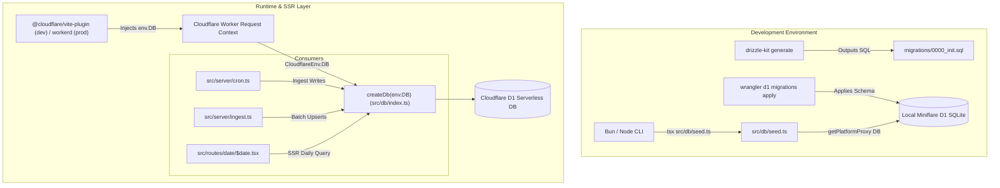

# Technical Specification: MD-EPIC-1 Database Layer & Cloudflare D1 Architecture

- **Epic Key:** `MD-EPIC-1`
- **Target Sprint:** Sprint 1
- **Estimated Points:** 8 SP
- **Status:** Approved for Implementation
- **Target File:** `.orchestration/epic-1-database-layer/spec.md`
- **Document Version:** 1.0.0

---

## 1. Executive Summary & Scope

### 1.1 Overview

The objective of **MD-EPIC-1** is to establish the persistence foundation for MatchDay on Cloudflare Workers and TanStack Start using **Cloudflare D1** (Serverless SQLite) and **Drizzle ORM** (`drizzle-orm`, `drizzle-kit`).

The database layer serves as the central data backbone across all downstream epics:

1. **MD-EPIC-2 & MD-EPIC-3**: Reddit ingestion pipeline and automated cron triggers persist structured match and highlight records.
2. **MD-EPIC-4**: TanStack Start route loaders query matches and highlights by date to power SSR views.
3. **MD-EPIC-5 & MD-EPIC-6**: UI components render scores, goal video embeds, and team metadata.

### 1.2 User Story Scope

This specification governs three user stories:

- **[MD-101]**: Configure Cloudflare D1 database binding (`DB`) in `wrangler.jsonc` and expose ambient environment typings in `src/types/env.d.ts`.
- **[MD-102]**: Define normalized Drizzle schema (`src/db/schema.ts`) for `matches` and `highlights`, enforce foreign key cascade deletes, configure indexes, define Drizzle table relations, and export strict TypeScript interfaces (zero `any` types).
- **[MD-103]**: Configure `drizzle.config.ts`, generate initial migration SQL (`migrations/0000_init.sql`), configure local/remote migration execution via Wrangler, and implement an idempotent database seeder (`src/db/seed.ts`) using `@faker-js/faker` executed via `wrangler`'s `getPlatformProxy`.

### 1.3 Out of Scope

- Reddit JSON fetching and scraping logic (covered in MD-EPIC-2).
- Scheduled worker cron execution and manual HTTP ingest routes (covered in MD-EPIC-3).
- UI components, route components, and visual players (covered in MD-EPIC-4, 5, 6).

---

## 2. System Architecture & Component Interactions

### 2.1 Architecture Diagram



### 2.2 Client Lifecycle & Edge Runtime Constraints

- **Stateless Edge Execution**: Unlike traditional Node.js persistent pool connections (e.g., PostgreSQL or long-lived SQLite handles), Cloudflare D1 provides a request-bound `D1Database` binding via the Cloudflare Worker environment (`env.DB`).
- **Factory Pattern**: `src/db/index.ts` must export a factory function `createDb(d1: D1Database)` returning a Drizzle client instance bound to that specific D1 handle.
- **Local Dev vs. Prod Uniformity**: Development uses `@cloudflare/vite-plugin` which spins up Miniflare under Vite. Local script runs (such as `seed.ts`) use `wrangler`'s `getPlatformProxy<{ DB: D1Database }>()` to connect to the exact same Miniflare SQLite storage.

---

## 3. Configuration Specifications

### 3.1 Wrangler Configuration (`wrangler.jsonc`)

File: `wrangler.jsonc`

Configure the D1 database binding `DB` pointing to database name `matchday-db` with migration tracking:

```jsonc
{
  "$schema": "node_modules/wrangler/config-schema.json",
  "name": "matchday",
  "compatibility_date": "2025-09-02",
  "compatibility_flags": ["nodejs_compat"],
  "main": "@tanstack/react-start/server-entry",
  "observability": {
    "enabled": true,
  },
  "upload_source_maps": true,
  "d1_databases": [
    {
      "binding": "DB",
      "database_name": "matchday-db",
      "database_id": "local-matchday-db",
      "migrations_dir": "migrations",
    },
  ],
}
```

> [!NOTE]
> `database_id: "local-matchday-db"` acts as a placeholder for local Miniflare development. In production deployment (MD-EPIC-7), the production UUID generated by `wrangler d1 create matchday-db` will be specified.

### 3.2 TypeScript Environment Declarations (`src/types/env.d.ts`)

File: `src/types/env.d.ts`

Define strongly typed Cloudflare Worker environment bindings to eliminate `any` casts when retrieving bindings from loaders, cron handlers, and server functions:

```typescript
import type { D1Database } from '@cloudflare/workers-types';

export interface CloudflareEnv {
  DB: D1Database;
  CRON_SECRET?: string;
  REDDIT_USER_AGENT?: string;
}

declare global {
  namespace NodeJS {
    interface ProcessEnv {
      DATABASE_URL?: string;
      CRON_SECRET?: string;
      REDDIT_USER_AGENT?: string;
    }
  }
}
```

### 3.3 Drizzle Kit Configuration (`drizzle.config.ts`)

File: `drizzle.config.ts`

Update configuration to target `./migrations` output and SQLite dialect:

```typescript
import { defineConfig } from 'drizzle-kit';

export default defineConfig({
  out: './migrations',
  schema: './src/db/schema.ts',
  dialect: 'sqlite',
});
```

### 3.4 Package Scripts (`package.json`)

File: `package.json`

Add standardized scripts for D1 migration generation, local application, production deployment, and mock seeding:

```json
{
  "scripts": {
    "db:generate": "drizzle-kit generate",
    "db:migrate:local": "wrangler d1 migrations apply matchday-db --local",
    "db:migrate:prod": "wrangler d1 migrations apply matchday-db --remote",
    "db:seed": "tsx src/db/seed.ts",
    "cf-typegen": "wrangler types"
  }
}
```

---

## 4. Database Schema Specification (`src/db/schema.ts`)

### 4.1 Table: `matches`

Represents a unique soccer fixture identified deterministically by its date and competing teams.

| Column      | Drizzle Type                                | SQL Type  | Modifiers     | Description                                                               |
| :---------- | :------------------------------------------ | :-------- | :------------ | :------------------------------------------------------------------------ |
| `id`        | `text('id')`                                | `TEXT`    | `PRIMARY KEY` | Deterministic ID format: `YYYY-MM-DD_teama_teamb` (slugified, lowercase). |
| `matchDate` | `text('match_date')`                        | `TEXT`    | `NOT NULL`    | Calendar date format: `YYYY-MM-DD` (Indexed).                             |
| `teamHome`  | `text('team_home')`                         | `TEXT`    | `NOT NULL`    | Home team display name (e.g., "Arsenal").                                 |
| `teamAway`  | `text('team_away')`                         | `TEXT`    | `NOT NULL`    | Away team display name (e.g., "Chelsea").                                 |
| `createdAt` | `integer('created_at', { mode: 'number' })` | `INTEGER` | `NOT NULL`    | Epoch millisecond creation timestamp.                                     |
| `updatedAt` | `integer('updated_at', { mode: 'number' })` | `INTEGER` | `NOT NULL`    | Epoch millisecond last modification timestamp.                            |

**Indexes**:

- `matches_match_date_idx` on column `matchDate` (`match_date`) for constant-time daily queries in MD-EPIC-4.

### 4.2 Table: `highlights`

Represents an individual video clip/goal event scraped from a Reddit post.

| Column        | Drizzle Type                               | SQL Type  | Modifiers                                            | Description                                                    |
| :------------ | :----------------------------------------- | :-------- | :--------------------------------------------------- | :------------------------------------------------------------- |
| `id`          | `text('id')`                               | `TEXT`    | `PRIMARY KEY`                                        | Reddit submission ID (e.g., `t3_1abcxyz`).                     |
| `matchId`     | `text('match_id')`                         | `TEXT`    | `NOT NULL, REFERENCES matches(id) ON DELETE CASCADE` | Foreign key linking to parent fixture (Indexed).               |
| `title`       | `text('title')`                            | `TEXT`    | `NOT NULL`                                           | Raw Reddit post title.                                         |
| `scoreHome`   | `integer('score_home')`                    | `INTEGER` | `NULL`                                               | Home score at the time of the event.                           |
| `scoreAway`   | `integer('score_away')`                    | `INTEGER` | `NULL`                                               | Away score at the time of the event.                           |
| `scorer`      | `text('scorer')`                           | `TEXT`    | `NULL`                                               | Extracted goalscorer name (e.g., "Bukayo Saka").               |
| `minute`      | `text('minute')`                           | `TEXT`    | `NULL`                                               | Match minute string (e.g., `"14'"`, `"45+2'"`).                |
| `tag`         | `text('tag')`                              | `TEXT`    | `NULL`                                               | Flairs or post attributes (e.g., `"Great Goal"`, `"Penalty"`). |
| `embedUrl`    | `text('embed_url')`                        | `TEXT`    | `NULL`                                               | Clean embed URL resolved from video provider.                  |
| `sourceUrl`   | `text('source_url')`                       | `TEXT`    | `NOT NULL`                                           | External video clip destination (e.g., `dubz.co/...`).         |
| `redditUrl`   | `text('reddit_url')`                       | `TEXT`    | `NOT NULL`                                           | Full Reddit permalink discussion URL.                          |
| `redditScore` | `integer('reddit_score')`                  | `INTEGER` | `DEFAULT 0`                                          | Reddit upvotes count (used for sorting and engagement).        |
| `postedAt`    | `integer('posted_at', { mode: 'number' })` | `INTEGER` | `NOT NULL`                                           | Reddit `created_utc` converted to epoch milliseconds.          |

**Indexes**:

- `highlights_match_id_idx` on column `matchId` (`match_id`) for join acceleration.

### 4.3 Relations Definitions

Using Drizzle ORM's relational query API:

```typescript
export const matchesRelations = relations(matches, ({ many }) => ({
  highlights: many(highlights),
}));

export const highlightsRelations = relations(highlights, ({ one }) => ({
  match: one(matches, {
    fields: [highlights.matchId],
    references: [matches.id],
  }),
}));
```

### 4.4 Strict TypeScript Type Exports

Strict types inferred directly from the schema without `any`:

```typescript
export type Match = typeof matches.$inferSelect;
export type NewMatch = typeof matches.$inferInsert;

export type Highlight = typeof highlights.$inferSelect;
export type NewHighlight = typeof highlights.$inferInsert;

export interface MatchWithHighlights extends Match {
  highlights: Highlight[];
}

export interface HighlightWithMatch extends Highlight {
  match?: Match;
}
```

---

## 5. Drizzle Client Factory (`src/db/index.ts`)

File: `src/db/index.ts`

Replace starter SQLite implementation with Cloudflare D1 Drizzle client:

```typescript
import { drizzle } from 'drizzle-orm/d1';
import type { D1Database } from '@cloudflare/workers-types';
import * as schema from './schema';

/**
 * Initializes a typed Drizzle ORM client instance from a Cloudflare D1 binding.
 * Cloudflare Workers instantiate D1 bindings on the request context rather than
 * as a static global connection.
 */
export function createDb(d1: D1Database) {
  return drizzle(d1, { schema });
}

export type Database = ReturnType<typeof createDb>;

export * from './schema';
```

---

## 6. Migration Generation & Execution Workflow

### 6.1 Generated SQL Migration (`migrations/0000_init.sql`)

Running `bun run db:generate` produces the initial SQLite migration:

```sql
CREATE TABLE `matches` (
	`id` text PRIMARY KEY NOT NULL,
	`match_date` text NOT NULL,
	`team_home` text NOT NULL,
	`team_away` text NOT NULL,
	`created_at` integer NOT NULL,
	`updated_at` integer NOT NULL
);
--> statement-breakpoint
CREATE TABLE `highlights` (
	`id` text PRIMARY KEY NOT NULL,
	`match_id` text NOT NULL,
	`title` text NOT NULL,
	`score_home` integer,
	`score_away` integer,
	`scorer` text,
	`minute` text,
	`tag` text,
	`embed_url` text,
	`source_url` text NOT NULL,
	`reddit_url` text NOT NULL,
	`reddit_score` integer DEFAULT 0,
	`posted_at` integer NOT NULL,
	FOREIGN KEY (`match_id`) REFERENCES `matches`(`id`) ON UPDATE no action ON DELETE cascade
);
--> statement-breakpoint
CREATE INDEX `matches_match_date_idx` ON `matches` (`match_date`);
--> statement-breakpoint
CREATE INDEX `highlights_match_id_idx` ON `highlights` (`match_id`);
```

### 6.2 Migration Execution Steps

1. **Local Migration**:
   ```bash
   bun run db:generate
   bun run db:migrate:local
   ```
   Wrangler executes the migration file against `.wrangler/state/v3/d1/miniflare-D1DatabaseObject`.
2. **Production Migration**:
   ```bash
   bun run db:migrate:prod
   ```
   Wrangler executes migrations against the live Cloudflare D1 cluster using authentication tokens.

---

## 7. Mock Database Seeder (`src/db/seed.ts`)

### 7.1 Seeding Requirements

- **Dates**: Exactly 3 distinct dates: today (`T`), yesterday (`T-1`), and two days ago (`T-2`) in `YYYY-MM-DD` ISO format.
- **Fixtures**: 3 to 5 realistic European soccer matches per date (e.g., Arsenal vs Chelsea, Real Madrid vs Barcelona, Bayern Munich vs Borussia Dortmund, Liverpool vs Manchester City, Inter Milan vs Juventus).
- **Highlights**: 1 to 3 highlights per match with valid sample media domains (`dubz.co`, `streamin.one`, `v.redd.it`).
- **Idempotency**: Use `INSERT INTO ... ON CONFLICT DO UPDATE` or `onConflictDoUpdate` to prevent constraint errors when run repeatedly.
- **Realistic Metadata**: Real goal scorers, realistic minutes (`"14'"`, `"45+1'"`, `"88'"`), flairs (`"Great Goal"`, `"Penalty"`), and Reddit scores ranging from 50 to 8,500.

### 7.2 Implementation Architecture

```typescript
import { getPlatformProxy } from 'wrangler';
import { drizzle } from 'drizzle-orm/d1';
import { faker } from '@faker-js/faker';
import * as schema from './schema';
import type { CloudflareEnv } from '../types/env';

// 1. Acquire Miniflare platform proxy to connect to local D1 instance
const { env, dispose } = await getPlatformProxy<CloudflareEnv>();

try {
  const db = drizzle(env.DB, { schema });
  // 2. Perform idempotent upserts across 3 dates
  // ...
  console.log('Seeding completed successfully.');
} finally {
  await dispose();
}
```

---

## 8. Failure Prevention & Quality Gates

In strict accordance with `agents.md`:

| Requirement                | Rule & Guardrail                                                                                                                                  |
| :------------------------- | :------------------------------------------------------------------------------------------------------------------------------------------------ |
| **No `any` Types**         | Strictly prohibit `any` in D1 SQL row mappings and database models. Use Drizzle infer types (`Match`, `Highlight`) and explicit row interfaces.   |
| **Git Commit Discipline**  | **Never** run `git commit` automatically without explicit user instruction.                                                                       |
| **Dead Code Cleanup**      | The obsolete `todos` table in `src/db/schema.ts` and placeholder better-sqlite3 instantiation in `src/db/index.ts` must be completely eliminated. |
| **Zod v4 URL Standards**   | Where URLs are validated, use top-level `z.url()`.                                                                                                |
| **Automated Verification** | Task completion requires clean execution of: `bun run format && bun run check`.                                                                   |

---

## 9. Acceptance Criteria & Verification Checklist

### Story MD-101

- [ ] `wrangler.jsonc` specifies `d1_databases` array with `binding: "DB"`, `database_name: "matchday-db"`, `database_id: "local-matchday-db"`, and `migrations_dir: "migrations"`.
- [ ] `src/types/env.d.ts` exports `CloudflareEnv` containing `DB: D1Database`.
- [ ] `bun run check` succeeds without missing binding definitions.

### Story MD-102

- [ ] `src/db/schema.ts` exports `matches`, `highlights`, `matchesRelations`, and `highlightsRelations`.
- [ ] `matches` table contains `id` primary key, `matchDate`, `teamHome`, `teamAway`, `createdAt`, `updatedAt`.
- [ ] `highlights` table contains `id` primary key, `matchId` foreign key with cascade deletion, `title`, `scoreHome`, `scoreAway`, `scorer`, `minute`, `tag`, `embedUrl`, `sourceUrl`, `redditUrl`, `redditScore`, `postedAt`.
- [ ] Indexes exist on `matches.matchDate` (`matches_match_date_idx`) and `highlights.matchId` (`highlights_match_id_idx`).
- [ ] Inferred types `Match`, `NewMatch`, `Highlight`, `NewHighlight`, and composite `MatchWithHighlights` are exported.
- [ ] No `any` types present.

### Story MD-103

- [ ] `drizzle.config.ts` configured with `out: './migrations'` and `dialect: 'sqlite'`.
- [ ] `bun run db:generate` creates `migrations/0000_init.sql` matching the schema specification.
- [ ] `src/db/seed.ts` populates 3 match dates, 3–5 matches per date, 1–3 highlights per match with valid sample media URLs and idempotent upsert logic.
- [ ] `bun run db:seed` executes cleanly and outputs summary logs.

---

## 10. Open Questions & Architectural Decisions

1. **Production Database ID Provisioning**:
   - _Current Decision_: Use `"database_id": "local-matchday-db"` as a local development default in `wrangler.jsonc`.
   - _Resolution Plan_: During deployment in MD-EPIC-7, the live database will be created via `wrangler d1 create matchday-db` and the resulting UUID will be documented in deployment secrets / environment configuration.
2. **Timestamp Storage Resolution**:
   - _Current Decision_: Timestamps (`createdAt`, `updatedAt`, `postedAt`) are stored as epoch milliseconds (`integer({ mode: 'number' })`) to provide exact sorting fidelity down to the millisecond without timezone confusion.
