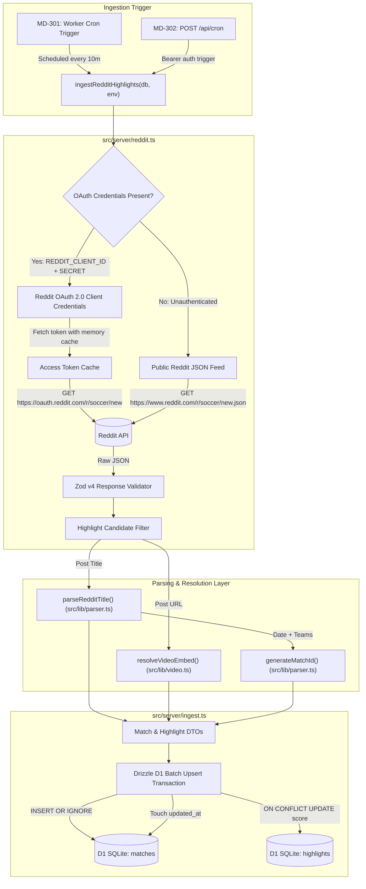

# Technical Specification: MD-EPIC-2 Reddit Ingestion Pipeline & Parsing Engine

- **Epic Key:** `MD-EPIC-2`
- **Target Sprint:** Sprint 1
- **Estimated Points:** 13 SP
- **Status:** Approved for Implementation
- **Target File:** `.orchestration/epic-2-reddit-ingestion/spec.md`
- **Document Version:** 1.0.0

---

## 1. Executive Summary & Scope

### 1.1 Overview

The objective of **MD-EPIC-2** is to implement the ingestion engine for MatchDay that automatically harvests soccer highlights from `r/soccer`. The engine parses unstructured Reddit post titles into normalized match and goal records, resolves raw media URLs into responsive embeds, and persists data idempotently into Cloudflare D1 using Drizzle ORM.

Downstream systems depend on this pipeline:

- **MD-EPIC-3**: Scheduled Cloudflare Workers cron trigger (`*/10 * * * *`) and authenticated manual trigger route (`/api/cron`) invoke `ingestRedditHighlights`.
- **MD-EPIC-4**: TanStack Start date route loaders (`/date/$date`) query the persisted `matches` and `highlights` tables.
- **MD-EPIC-5 & MD-EPIC-6**: Match cards display scorelines, goal badges, and inline 16:9 video player embeds.

### 1.2 User Story Scope

This specification defines implementation details for four user stories:

- **[MD-201] Regex Parser for Goal Titles & Deterministic Match ID (`src/lib/parser.ts`)**:
  Extract home team, away team, home score, away score, scorer name, minute (including stoppage time), and tags (e.g., `(Great Goal)`, `(Penalty)`) from post titles. Generate deterministic match IDs (`YYYY-MM-DD_home_away`) invariant to team parameter ordering.
- **[MD-202] Supported Video Domain Embed Resolver (`src/lib/video.ts`)**:
  Resolve raw submission links from supported video hosts (`dubz.co`, `dubz.link`, `streamin.one`, `streamin.me`, `streamff.com`, `caulse.com`, `v.redd.it`) into clean embed URLs or fallbacks.
- **[MD-203] Dual-Mode Reddit Client with Rate Limiting (`src/server/reddit.ts`)**:
  Implement a dual-mode Reddit client that authenticates via OAuth Client Credentials (`REDDIT_CLIENT_ID` / `REDDIT_CLIENT_SECRET`) when provided in the environment, or gracefully falls back to the public `r/soccer/new.json` feed with custom `User-Agent`. Enforce rate limit checking and strict Zod v4 schema validation.
- **[MD-204] Scraper Persistence Service with Conflict Deduplication (`src/server/ingest.ts`)**:
  Orchestrate fetching, parsing, embedding, and idempotent database persistence into Cloudflare D1. Upsert matches and highlights using Drizzle batching and conflict resolution, while touching match update timestamps.

### 1.3 Out of Scope

- Scheduled Cloudflare Worker cron triggers and worker event wiring (covered in MD-EPIC-3).
- Manual authenticated `/api/cron` route endpoint (covered in MD-EPIC-3).
- Front-end player components, UI containers, and calendar navigators (covered in MD-EPIC-4, 5, 6).

---

## 2. System Architecture & Ingestion Pipeline Dataflow

### 2.1 End-to-End Ingestion Flow Diagram



### 2.2 Component Hierarchy & File Responsibilities

| File Path              | Layer           | Responsibility                                                                                           | Dependencies                                                                                       |
| :--------------------- | :-------------- | :------------------------------------------------------------------------------------------------------- | :------------------------------------------------------------------------------------------------- |
| `src/lib/parser.ts`    | Shared Utility  | Unstructured title regex parsing, goal metadata extraction, deterministic match ID synthesis             | None                                                                                               |
| `src/lib/video.ts`     | Shared Utility  | Video domain matching, embed target resolution, safe fallback generation                                 | None                                                                                               |
| `src/server/reddit.ts` | Server / Worker | Dual-mode Reddit client (OAuth vs Public JSON), token caching, rate limit backoff, Zod schema validation | `zod`                                                                                              |
| `src/server/ingest.ts` | Server / Worker | Ingestion pipeline orchestration, D1 batch upserts, match timestamp updates, execution metrics           | `drizzle-orm`, `src/db/schema.ts`, `src/lib/parser.ts`, `src/lib/video.ts`, `src/server/reddit.ts` |
| `src/types/env.d.ts`   | Typings         | TypeScript ambient environment bindings for Cloudflare Workers and Node process                          | `@cloudflare/workers-types`                                                                        |

### 2.3 Cloudflare Workers & D1 Edge Runtime Constraints

1. **Subrequest Limits & Connection Lifecycle**:
   - Cloudflare Workers enforce limits on external subrequests (50 on free, up to 1,000 on paid plans per invocation).
   - Ingestion fetches a single page of Reddit listings (`limit=100`) per execution, making 1 HTTP request (public mode) or 2 HTTP requests (OAuth mode: 1 token exchange + 1 listing fetch).
2. **D1 Batching Efficiency**:
   - Cloudflare D1 operates over HTTP RPC. Executing individual queries per highlight causes latency amplification.
   - All match and highlight insertions must be batched using `db.batch([...])`, grouping operations into chunks of 25–50 statements to respect D1 statement limits.
3. **Stateless Memory**:
   - Module-level variables in Workers persist across requests on the same isolate but cannot be assumed globally permanent. The OAuth token cache must track expiry and gracefully refresh upon expiration.

---

## 3. Detailed Module Specifications

### 3.1 MD-201: Title Regex Parser & Deterministic Match ID (`src/lib/parser.ts`)

#### 3.1.1 Title Grammar & Syntax Varieties on `r/soccer`

Highlight submissions on `r/soccer` follow community conventions with minor bracket, hyphen, and spacing variations:

- **Standard**: `Arsenal [1] - 0 Chelsea - Bukayo Saka 45'`
- **Bracket on Away Team**: `Arsenal 1 - [1] Chelsea - Cole Palmer 45+1'`
- **Bracket on Both Teams**: `Arsenal [2] - [1] Chelsea - Gabriel Martinelli 60'`
- **No Brackets**: `Arsenal 1 - 0 Chelsea - Bukayo Saka 45'`
- **Parenthesized Tags**: `Real Madrid [3] - 2 Barcelona - Vinicius Jr. 90+2' (Great Goal)`
- **Penalty / Own Goal Tags**: `Arsenal [1] - 0 Chelsea - Bukayo Saka 22' (Penalty)` or `(P)`, `(OG)`
- **Tag Preceding Minute**: `Arsenal [1] - 0 Chelsea - Bukayo Saka (P) 45'`
- **No Hyphen Before Scorer**: `Arsenal [1] - 0 Chelsea Bukayo Saka 45'` (rare fallback)
- **Stoppage Time Variations**: `45+2'`, `90+6'`, `120+1'`, `45+3`, `90+4′`
- **Non-Goal Submissions (Must Return `null`)**:
  - `Post Match Thread: Arsenal 1-0 Chelsea`
  - `Match Thread: Arsenal vs Chelsea`
  - `[Fabrizio Romano] Here we go! Agreement reached.`
  - `Jurgen Klopp post-match interview quotes`

#### 3.1.2 Data Interface

```typescript
export interface ParsedTitle {
  teamHome: string;
  teamAway: string;
  scoreHome: number;
  scoreAway: number;
  scorer: string | null;
  minute: string | null;
  tag: string | null;
}
```

> [!NOTE]
> `scoreHome` and `scoreAway` are strictly typed as `number` because a successfully parsed goal title guarantees integer score extraction. If scores cannot be parsed, the function returns `null`.

#### 3.1.3 Regex Formulation & Detail Extraction

```typescript
/**
 * Matches score patterns such as:
 * "Arsenal [1] - 0 Chelsea" or "Real Madrid 2 - [2] Barcelona"
 * Captures: [1] teamHome, [2] scoreHome, [3] scoreAway, [4] teamAway, [5] optional details
 */
const GOAL_TITLE_REGEX =
  /^(.+?)\s*\[?(\d+)\]?\s*[-–—]\s*\[?(\d+)\]?\s*(.+?)(?:\s*[-–—]\s*(.*))?$/i;

/** Matches non-highlight meta threads to immediately discard */
const META_THREAD_PREFIX_REGEX =
  /^(?:\[?\s*(?:post[- ]match|match|pre[- ]match)\s*thread\s*\]?|daily discussion|transfer round[- ]up)/i;

/** Extracts trailing or inline parenthesized tags like (Great Goal), (P), (OG), (Penalty) */
const TAG_REGEX = /\(([^)]+)\)$/;

/** Extracts minute patterns like 45', 90+2', 120+1', 45+2, 90' */
const MINUTE_REGEX = /\b(\d+(?:\+\d+)?['′]?)$/;
const INLINE_MINUTE_REGEX = /\b(\d+(?:\+\d+)?['′]?)\b/;
```

#### 3.1.4 Deterministic Match ID Algorithm

Match IDs must be collision-free, deterministic, and invariant to the order in which home and away teams are passed:

```typescript
/**
 * Generates a deterministic match identifier using UTC date and alphabetically sorted
 * normalized team slugs.
 *
 * Example:
 *   generateMatchId("2026-09-09", "Arsenal", "Chelsea") === "2026-09-09_arsenal_chelsea"
 *   generateMatchId("2026-09-09", "Chelsea", "Arsenal") === "2026-09-09_arsenal_chelsea"
 */
export function generateMatchId(
  dateStr: string,
  teamA: string,
  teamB: string,
): string {
  const normalize = (team: string): string =>
    team.toLowerCase().replace(/[^a-z0-9]/g, '');

  const sortedTeams = [normalize(teamA), normalize(teamB)].sort().join('_');
  return `${dateStr}_${sortedTeams}`;
}
```

#### 3.1.5 Full `src/lib/parser.ts` Implementation Specification

```typescript
export interface ParsedTitle {
  teamHome: string;
  teamAway: string;
  scoreHome: number;
  scoreAway: number;
  scorer: string | null;
  minute: string | null;
  tag: string | null;
}

const GOAL_TITLE_REGEX =
  /^(.+?)\s*\[?(\d+)\]?\s*[-–—]\s*\[?(\d+)\]?\s*(.+?)(?:\s*[-–—]\s*(.*))?$/i;

const META_THREAD_PREFIX_REGEX =
  /^(?:\[?\s*(?:post[- ]match|match|pre[- ]match)\s*thread\s*\]?|daily discussion|transfer round[- ]up)/i;

const MINUTE_REGEX = /\b(\d+(?:\+\d+)?['′]?)$/;
const INLINE_MINUTE_REGEX = /\b(\d+(?:\+\d+)?['′]?)\b/;
const TAG_REGEX = /\(([^)]+)\)$/;

export function parseRedditTitle(title: string): ParsedTitle | null {
  const cleanTitle = title.trim();

  // 1. Filter out known meta and discussion threads
  if (META_THREAD_PREFIX_REGEX.test(cleanTitle)) {
    return null;
  }

  // 2. Execute primary team and score regex
  const match = cleanTitle.match(GOAL_TITLE_REGEX);
  if (!match) {
    return null;
  }

  const rawTeamHome = match[1]?.trim();
  const rawScoreHome = match[2];
  const rawScoreAway = match[3];
  const rawTeamAway = match[4]?.trim();
  let details = match[5]?.trim() ?? '';

  if (!rawTeamHome || !rawScoreHome || !rawScoreAway || !rawTeamAway) {
    return null;
  }

  // Reject titles where home team contains thread indicators
  if (META_THREAD_PREFIX_REGEX.test(rawTeamHome)) {
    return null;
  }

  const scoreHome = parseInt(rawScoreHome, 10);
  const scoreAway = parseInt(rawScoreAway, 10);

  if (Number.isNaN(scoreHome) || Number.isNaN(scoreAway)) {
    return null;
  }

  let tag: string | null = null;
  let minute: string | null = null;
  let scorer: string | null = null;

  // 3. Extract parenthesized tag (e.g., "(Great Goal)", "(Penalty)", "(P)")
  const tagMatch = details.match(TAG_REGEX);
  if (tagMatch && tagMatch[1]) {
    tag = tagMatch[1].trim();
    details = details.replace(TAG_REGEX, '').trim();
  }

  // 4. Extract minute from end of details or inline
  const minuteEndMatch = details.match(MINUTE_REGEX);
  if (minuteEndMatch && minuteEndMatch[1]) {
    minute = minuteEndMatch[1].trim();
    details = details.replace(MINUTE_REGEX, '').trim();
  } else {
    const inlineMinuteMatch = details.match(INLINE_MINUTE_REGEX);
    if (inlineMinuteMatch && inlineMinuteMatch[1]) {
      minute = inlineMinuteMatch[1].trim();
      details = details.replace(INLINE_MINUTE_REGEX, '').trim();
    }
  }

  // 5. Remaining string in details is the goalscorer
  if (details.length > 0) {
    scorer = details.replace(/^[-–—\s]+|[-–—\s]+$/g, '').trim() || null;
  }

  return {
    teamHome: rawTeamHome,
    teamAway: rawTeamAway,
    scoreHome,
    scoreAway,
    scorer,
    minute,
    tag,
  };
}
```

---

### 3.2 MD-202: Supported Video Domain Embed Resolver (`src/lib/video.ts`)

#### 3.2.1 Media Domain Resolution Matrix

Reddit highlights are hosted on several third-party video distribution services. Each service requires specific iframe embed patterns:

| Domain                         | Host Match Pattern                                        | Input URL Example                                    | Embed URL Output                        | Embed Type                       |
| :----------------------------- | :-------------------------------------------------------- | :--------------------------------------------------- | :-------------------------------------- | :------------------------------- |
| `dubz.co` / `dubz.link`        | `/(?:dubz\.(?:co\|link))\/(?:c\|v)\/([a-zA-Z0-9_-]+)/`    | `https://dubz.co/c/abc123`                           | `https://dubz.co/e/abc123`              | `isIframe: true`                 |
| `streamin.one` / `streamin.me` | `/(?:streamin\.(?:one\|me))\/(?:v\|e)\/([a-zA-Z0-9_-]+)/` | `https://streamin.one/v/xyz789`                      | `https://streamin.one/e/xyz789`         | `isIframe: true`                 |
| `streamff.com`                 | `/streamff\.com\/(?:v\|e)\/([a-zA-Z0-9_-]+)/`             | `https://streamff.com/v/fff111`                      | `https://streamff.com/e/fff111`         | `isIframe: true`                 |
| `caulse.com`                   | `/caulse\.com\/(?:v\|e)\/([a-zA-Z0-9_-]+)/`               | `https://caulse.com/v/cls222`                        | `https://caulse.com/e/cls222`           | `isIframe: true`                 |
| `v.redd.it`                    | `/v\.redd\.it\/([a-zA-Z0-9_-]+)/`                         | `https://v.redd.it/rdt333`                           | `https://v.redd.it/rdt333/DASH_720.mp4` | `isIframe: false` (Direct Video) |
| Unsupported Hosts              | Any other domain                                          | `https://twitter.com/...`, `https://youtube.com/...` | `embedUrl: null`                        | Fallback button                  |

#### 3.2.2 Output Interface

```typescript
export interface ResolvedMedia {
  embedUrl: string | null;
  isIframe: boolean;
  directVideoUrl: string | null;
  fallbackUrl: string;
}
```

#### 3.2.3 Full `src/lib/video.ts` Implementation Specification

```typescript
export interface ResolvedMedia {
  embedUrl: string | null;
  isIframe: boolean;
  directVideoUrl: string | null;
  fallbackUrl: string;
}

interface HostResolver {
  name: string;
  pattern: RegExp;
  resolve: (id: string, originalUrl: string) => ResolvedMedia;
}

const HOST_RESOLVERS: HostResolver[] = [
  {
    name: 'dubz',
    pattern:
      /(?:https?:\/\/)?(?:www\.)?dubz\.(?:co|link)\/(?:c|v|e)\/([a-zA-Z0-9_-]+)/i,
    resolve: (id: string, originalUrl: string) => ({
      embedUrl: `https://dubz.co/e/${id}`,
      isIframe: true,
      directVideoUrl: null,
      fallbackUrl: originalUrl,
    }),
  },
  {
    name: 'streamin',
    pattern:
      /(?:https?:\/\/)?(?:www\.)?streamin\.(?:one|me)\/(?:v|e)\/([a-zA-Z0-9_-]+)/i,
    resolve: (id: string, originalUrl: string) => ({
      embedUrl: `https://streamin.one/e/${id}`,
      isIframe: true,
      directVideoUrl: null,
      fallbackUrl: originalUrl,
    }),
  },
  {
    name: 'streamff',
    pattern:
      /(?:https?:\/\/)?(?:www\.)?streamff\.com\/(?:v|e)\/([a-zA-Z0-9_-]+)/i,
    resolve: (id: string, originalUrl: string) => ({
      embedUrl: `https://streamff.com/e/${id}`,
      isIframe: true,
      directVideoUrl: null,
      fallbackUrl: originalUrl,
    }),
  },
  {
    name: 'caulse',
    pattern:
      /(?:https?:\/\/)?(?:www\.)?caulse\.com\/(?:v|e)\/([a-zA-Z0-9_-]+)/i,
    resolve: (id: string, originalUrl: string) => ({
      embedUrl: `https://caulse.com/e/${id}`,
      isIframe: true,
      directVideoUrl: null,
      fallbackUrl: originalUrl,
    }),
  },
  {
    name: 'v.redd.it',
    pattern: /(?:https?:\/\/)?v\.redd\.it\/([a-zA-Z0-9_-]+)/i,
    resolve: (id: string, originalUrl: string) => ({
      embedUrl: `https://v.redd.it/${id}/DASH_720.mp4`,
      isIframe: false,
      directVideoUrl: `https://v.redd.it/${id}/DASH_720.mp4`,
      fallbackUrl: originalUrl,
    }),
  },
];

export function resolveVideoEmbed(rawUrl: string): ResolvedMedia {
  const trimmedUrl = rawUrl.trim();

  if (!trimmedUrl) {
    return {
      embedUrl: null,
      isIframe: false,
      directVideoUrl: null,
      fallbackUrl: '',
    };
  }

  for (const resolver of HOST_RESOLVERS) {
    const match = trimmedUrl.match(resolver.pattern);
    if (match && match[1]) {
      return resolver.resolve(match[1], trimmedUrl);
    }
  }

  return {
    embedUrl: null,
    isIframe: false,
    directVideoUrl: null,
    fallbackUrl: trimmedUrl,
  };
}
```

---

### 3.3 MD-203: Dual-Mode Reddit Client with Rate Limiting (`src/server/reddit.ts`)

#### 3.3.1 Dual-Mode Operation Strategy

The client must operate reliably in both zero-configuration development environments and authenticated production environments:

1. **OAuth Mode (Preferred when configured)**:
   - Enabled when both `REDDIT_CLIENT_ID` and `REDDIT_CLIENT_SECRET` are defined.
   - Endpoint: `https://oauth.reddit.com/r/soccer/new?limit=100`
   - Header: `Authorization: Bearer <access_token>`
   - Authenticates against `https://www.reddit.com/api/v1/access_token` via `grant_type=client_credentials` using HTTP Basic Authentication (`btoa("${clientId}:${clientSecret}")`).
   - Rate limit capacity: 100 requests per minute.
   - Access tokens are cached in-memory using an edge isolate cache (`cachedToken`, `tokenExpiresAt`).
2. **Public JSON Fallback Mode**:
   - Used when credentials are empty or absent.
   - Endpoint: `https://www.reddit.com/r/soccer/new.json?limit=100`
   - Header: `User-Agent: <REDDIT_USER_AGENT | default>`
   - Rate limit capacity: ~10–30 requests per minute.

```mermaid
flowchart TD
    Start[fetchRedditPosts] --> CheckCreds{REDDIT_CLIENT_ID & REDDIT_CLIENT_SECRET present?}

    CheckCreds -->|Yes| CheckToken{Cached Token Valid?}
    CheckToken -->|Yes| FetchOAuth[GET https://oauth.reddit.com/r/soccer/new]
    CheckToken -->|No / Expired| PostAuth[POST https://www.reddit.com/api/v1/access_token]
    PostAuth -->|Success: Cache Token| FetchOAuth
    PostAuth -->|Failure: Log Warning| FallbackPublic[Fallback to Public Mode]

    CheckCreds -->|No| FallbackPublic
    FallbackPublic --> FetchPublic[GET https://www.reddit.com/r/soccer/new.json]

    FetchOAuth & FetchPublic --> RateLimitCheck{Status 429?}
    RateLimitCheck -->|Yes| Handle429[Log Backoff Warning & Return Empty / Throw]
    RateLimitCheck -->|No 200 OK| ValidateZod[Validate with Zod v4 Schema]
    ValidateZod --> FilterCandidates[Filter: Media flair OR Goal syntax]
    FilterCandidates --> Output[Return HighlightPost[]]
```

#### 3.3.2 Zod v4 Schema Validation

In accordance with `agents.md` rule:

> Always use modern Zod top-level `z.url()` schema instead of the deprecated `z.string().url()`.

```typescript
import { z } from 'zod';

export const RedditPostDataSchema = z.object({
  id: z.string(),
  name: z.string(), // "t3_xxxxxx"
  title: z.string(),
  url: z.url(),
  permalink: z.string(),
  domain: z.string(),
  score: z.number().default(0),
  created_utc: z.number(),
  link_flair_text: z.string().nullable().optional(),
  is_self: z.boolean().default(false),
  stickied: z.boolean().default(false),
});

export const RedditListingResponseSchema = z.object({
  kind: z.literal('Listing'),
  data: z.object({
    after: z.string().nullable().optional(),
    children: z.array(
      z.object({
        kind: z.literal('t3'),
        data: RedditPostDataSchema,
      }),
    ),
  }),
});

export type RawRedditPost = z.infer<typeof RedditPostDataSchema>;

export interface HighlightPost {
  id: string; // Clean submission ID without "t3_"
  name: string; // Full "t3_xxxxxx" ID
  title: string;
  url: string;
  permalink: string;
  domain: string;
  score: number;
  createdUtc: number;
  flair: string | null;
}
```

#### 3.3.3 Rate Limiting & Error Handling

- Read Reddit response headers: `x-ratelimit-remaining`, `x-ratelimit-reset`, `x-ratelimit-used`.
- On `429 Too Many Requests`:
  - Extract `retry-after` header or `x-ratelimit-reset`.
  - Log structured error: `[REDDIT_CLIENT] Rate limited. Reset in ${reset} seconds.`
  - Return an empty list without crashing the worker process.

#### 3.3.4 Full `src/server/reddit.ts` Implementation Specification

```typescript
import { z } from 'zod';
import { parseRedditTitle } from '../lib/parser';

export const RedditPostDataSchema = z.object({
  id: z.string(),
  name: z.string(),
  title: z.string(),
  url: z.url(),
  permalink: z.string(),
  domain: z.string(),
  score: z.number().default(0),
  created_utc: z.number(),
  link_flair_text: z.string().nullable().optional(),
  is_self: z.boolean().default(false),
  stickied: z.boolean().default(false),
});

export const RedditListingResponseSchema = z.object({
  kind: z.literal('Listing'),
  data: z.object({
    after: z.string().nullable().optional(),
    children: z.array(
      z.object({
        kind: z.literal('t3'),
        data: RedditPostDataSchema,
      }),
    ),
  }),
});

export type RawRedditPost = z.infer<typeof RedditPostDataSchema>;

export interface HighlightPost {
  id: string;
  name: string;
  title: string;
  url: string;
  permalink: string;
  domain: string;
  score: number;
  createdUtc: number;
  flair: string | null;
}

export interface RedditClientConfig {
  clientId?: string;
  clientSecret?: string;
  userAgent?: string;
}

interface CachedToken {
  token: string;
  expiresAt: number;
}

let inMemoryTokenCache: CachedToken | null = null;

const DEFAULT_USER_AGENT = 'web:matchday-bot:v1.0.0 (by /u/matchday_app)';

async function getOAuthToken(
  clientId: string,
  clientSecret: string,
  userAgent: string,
): Promise<string | null> {
  const now = Date.now();
  if (inMemoryTokenCache && inMemoryTokenCache.expiresAt > now + 60_000) {
    return inMemoryTokenCache.token;
  }

  const credentials = btoa(`${clientId}:${clientSecret}`);

  try {
    const response = await fetch('https://www.reddit.com/api/v1/access_token', {
      method: 'POST',
      headers: {
        Authorization: `Basic ${credentials}`,
        'Content-Type': 'application/x-www-form-urlencoded',
        'User-Agent': userAgent,
      },
      body: 'grant_type=client_credentials',
    });

    if (!response.ok) {
      console.warn(
        `[REDDIT_CLIENT] OAuth token request failed with status: ${response.status}`,
      );
      return null;
    }

    const json = (await response.json()) as {
      access_token?: string;
      expires_in?: number;
    };

    if (!json.access_token || typeof json.expires_in !== 'number') {
      return null;
    }

    inMemoryTokenCache = {
      token: json.access_token,
      expiresAt: now + json.expires_in * 1000,
    };

    return inMemoryTokenCache.token;
  } catch (error) {
    console.error('[REDDIT_CLIENT] Failed to obtain OAuth token:', error);
    return null;
  }
}

export async function fetchRedditPosts(
  config?: RedditClientConfig,
): Promise<HighlightPost[]> {
  const userAgent = config?.userAgent || DEFAULT_USER_AGENT;
  const clientId = config?.clientId;
  const clientSecret = config?.clientSecret;

  let endpoint = 'https://www.reddit.com/r/soccer/new.json?limit=100';
  const headers: Record<string, string> = {
    'User-Agent': userAgent,
  };

  // Attempt OAuth if credentials are provided
  if (clientId && clientSecret) {
    const token = await getOAuthToken(clientId, clientSecret, userAgent);
    if (token) {
      endpoint = 'https://oauth.reddit.com/r/soccer/new?limit=100';
      headers['Authorization'] = `Bearer ${token}`;
    }
  }

  const response = await fetch(endpoint, { headers });

  if (response.status === 429) {
    const reset = response.headers.get('x-ratelimit-reset') ?? 'unknown';
    console.warn(`[REDDIT_CLIENT] Rate limited (429). Reset in ${reset}s.`);
    return [];
  }

  if (!response.ok) {
    console.error(
      `[REDDIT_CLIENT] Failed to fetch feed. Status: ${response.status} ${response.statusText}`,
    );
    return [];
  }

  const rawJson: unknown = await response.json();
  const parsed = RedditListingResponseSchema.safeParse(rawJson);

  if (!parsed.success) {
    console.error(
      '[REDDIT_CLIENT] Reddit listing schema validation error:',
      parsed.error.format(),
    );
    return [];
  }

  const posts = parsed.data.data.children.map((child) => child.data);

  // Filter candidate posts:
  // 1. Must not be self-posts or stickied threads
  // 2. Flair must be "Media" or "Highlight", OR title must parse cleanly as a goal
  return posts
    .filter((post) => {
      if (post.is_self || post.stickied) return false;

      const flair = post.link_flair_text?.toLowerCase() ?? '';
      const isMediaFlair =
        flair.includes('media') || flair.includes('highlight');
      const isGoalTitle = parseRedditTitle(post.title) !== null;

      return isMediaFlair || isGoalTitle;
    })
    .map((post) => ({
      id: post.id,
      name: post.name,
      title: post.title,
      url: post.url,
      permalink: `https://reddit.com${post.permalink}`,
      domain: post.domain,
      score: post.score,
      createdUtc: post.created_utc,
      flair: post.link_flair_text ?? null,
    }));
}
```

---

### 3.4 MD-204: Scraper Persistence Service & Conflict Deduplication (`src/server/ingest.ts`)

#### 3.4.1 Ingestion Workflow & Conflict Semantics

For every fetched post:

1. Parse the title via `parseRedditTitle(post.title)`. If `null`, skip.
2. Resolve media embed via `resolveVideoEmbed(post.url)`.
3. Extract UTC match date (`YYYY-MM-DD`) from `post.createdUtc`:
   ```typescript
   const matchDate = new Date(post.createdUtc * 1000)
     .toISOString()
     .slice(0, 10);
   ```
4. Compute deterministic `matchId` via `generateMatchId(matchDate, parsed.teamHome, parsed.teamAway)`.
5. Prepare match record (`matches` table):
   - `id`: `matchId`
   - `matchDate`: `matchDate`
   - `teamHome`: `parsed.teamHome`
   - `teamAway`: `parsed.teamAway`
   - `createdAt`: `Date.now()`
   - `updatedAt`: `Date.now()`
   - **Conflict Action**: `INSERT OR IGNORE` (preserves original `createdAt` if match exists).
6. Prepare highlight record (`highlights` table):
   - `id`: post submission ID (`post.name`, preserving unique `t3_` prefix)
   - `matchId`: `matchId`
   - `title`: `post.title`
   - `scoreHome`: `parsed.scoreHome`
   - `scoreAway`: `parsed.scoreAway`
   - `scorer`: `parsed.scorer`
   - `minute`: `parsed.minute`
   - `tag`: `parsed.tag`
   - `embedUrl`: `media.embedUrl`
   - `sourceUrl`: `post.url`
   - `redditUrl`: `post.permalink`
   - `redditScore`: `post.score`
   - `postedAt`: `Math.floor(post.createdUtc * 1000)` (epoch milliseconds)
   - **Conflict Action**:
     ```sql
     ON CONFLICT(id) DO UPDATE SET
       reddit_score = excluded.reddit_score,
       embed_url = coalesce(excluded.embed_url, highlights.embed_url);
     ```
7. Touch match `updatedAt`:
   - Set `matches.updatedAt = Date.now()` where `matches.id = matchId`.

#### 3.4.2 Drizzle D1 Batching Optimization

To prevent 50–100 individual roundtrips across D1 HTTP RPC, group statements into `db.batch([ ... ])` calls:

```typescript
// Chunk statements into batches of 30 to avoid D1 request payload limits
const CHUNK_SIZE = 30;
for (let i = 0; i < statements.length; i += CHUNK_SIZE) {
  const slice = statements.slice(i, i + CHUNK_SIZE);
  await db.batch(slice);
}
```

#### 3.4.3 Result & Metric Interface

```typescript
export interface IngestResult {
  totalFetched: number;
  parsedCount: number;
  persistedCount: number;
  skippedCount: number;
  errors: string[];
}
```

#### 3.4.4 Full `src/server/ingest.ts` Implementation Specification

```typescript
import type { D1Database } from '@cloudflare/workers-types';
import { sql } from 'drizzle-orm';
import { createDb } from '../db';
import * as schema from '../db/schema';
import { parseRedditTitle, generateMatchId } from '../lib/parser';
import { resolveVideoEmbed } from '../lib/video';
import { fetchRedditPosts, type RedditClientConfig } from './reddit';

export interface IngestResult {
  totalFetched: number;
  parsedCount: number;
  persistedCount: number;
  skippedCount: number;
  errors: string[];
}

export async function ingestRedditHighlights(
  d1: D1Database,
  config?: RedditClientConfig,
): Promise<IngestResult> {
  const db = createDb(d1);
  const result: IngestResult = {
    totalFetched: 0,
    parsedCount: 0,
    persistedCount: 0,
    skippedCount: 0,
    errors: [],
  };

  let posts;
  try {
    posts = await fetchRedditPosts(config);
    result.totalFetched = posts.length;
  } catch (error) {
    const errorMsg = error instanceof Error ? error.message : String(error);
    result.errors.push(`Failed to fetch Reddit posts: ${errorMsg}`);
    return result;
  }

  const now = Date.now();
  const matchInsertMap = new Map<string, schema.NewMatch>();
  const highlightInsertMap = new Map<string, schema.NewHighlight>();
  const touchedMatchIds = new Set<string>();

  for (const post of posts) {
    const parsed = parseRedditTitle(post.title);
    if (!parsed) {
      result.skippedCount++;
      continue;
    }

    result.parsedCount++;

    const media = resolveVideoEmbed(post.url);
    const postDate = new Date(post.createdUtc * 1000);
    const matchDate = postDate.toISOString().slice(0, 10);
    const matchId = generateMatchId(
      matchDate,
      parsed.teamHome,
      parsed.teamAway,
    );

    if (!matchInsertMap.has(matchId)) {
      matchInsertMap.set(matchId, {
        id: matchId,
        matchDate,
        teamHome: parsed.teamHome,
        teamAway: parsed.teamAway,
        createdAt: now,
        updatedAt: now,
      });
    }

    touchedMatchIds.add(matchId);

    const highlightRecord: schema.NewHighlight = {
      id: post.name, // e.g. "t3_xxxxxx"
      matchId,
      title: post.title,
      scoreHome: parsed.scoreHome,
      scoreAway: parsed.scoreAway,
      scorer: parsed.scorer,
      minute: parsed.minute,
      tag: parsed.tag,
      embedUrl: media.embedUrl,
      sourceUrl: post.url,
      redditUrl: post.permalink,
      redditScore: post.score,
      postedAt: Math.floor(post.createdUtc * 1000),
    };

    highlightInsertMap.set(post.name, highlightRecord);
  }

  if (matchInsertMap.size === 0 && highlightInsertMap.size === 0) {
    return result;
  }

  // Build batch statements
  const statements = [];

  // 1. Matches: INSERT OR IGNORE
  for (const match of matchInsertMap.values()) {
    statements.push(
      db.insert(schema.matches).values(match).onConflictDoNothing(),
    );
  }

  // 2. Highlights: INSERT OR ON CONFLICT UPDATE reddit_score & embed_url
  for (const highlight of highlightInsertMap.values()) {
    statements.push(
      db
        .insert(schema.highlights)
        .values(highlight)
        .onConflictDoUpdate({
          target: schema.highlights.id,
          set: {
            redditScore: highlight.redditScore,
            embedUrl: sql`coalesce(${highlight.embedUrl}, ${schema.highlights.embedUrl})`,
          },
        }),
    );
  }

  // 3. Touch updatedAt for matches containing new/updated highlights
  for (const matchId of touchedMatchIds) {
    statements.push(
      db
        .update(schema.matches)
        .set({ updatedAt: now })
        .where(sql`${schema.matches.id} = ${matchId}`),
    );
  }

  // Execute in manageable chunks to respect Cloudflare D1 batch thresholds
  const CHUNK_SIZE = 30;
  for (let i = 0; i < statements.length; i += CHUNK_SIZE) {
    const chunk = statements.slice(i, i + CHUNK_SIZE);
    try {
      await db.batch(
        chunk as [(typeof statements)[0], ...(typeof statements)[0][]],
      );
    } catch (error) {
      const errorMsg = error instanceof Error ? error.message : String(error);
      result.errors.push(`D1 batch execution failed: ${errorMsg}`);
    }
  }

  result.persistedCount = highlightInsertMap.size;
  return result;
}
```

---

### 3.5 Environment Configuration Updates (`src/types/env.d.ts`)

File: `src/types/env.d.ts`

Update ambient declarations to include OAuth credentials and user-agent bindings:

```typescript
import type { D1Database } from '@cloudflare/workers-types';

export interface CloudflareEnv {
  DB: D1Database;
  CRON_SECRET?: string;
  REDDIT_CLIENT_ID?: string;
  REDDIT_CLIENT_SECRET?: string;
  REDDIT_USER_AGENT?: string;
}

declare global {
  namespace NodeJS {
    interface ProcessEnv {
      DATABASE_URL?: string;
      CRON_SECRET?: string;
      REDDIT_CLIENT_ID?: string;
      REDDIT_CLIENT_SECRET?: string;
      REDDIT_USER_AGENT?: string;
    }
  }
}
```

---

## 4. Strict TypeScript Standards & Oxlint Compliance

In strict compliance with `agents.md` and repository standards:

1. **Zero `any` Types**:
   - Every Reddit API response property is validated through Zod v4 and typed as `RawRedditPost` or `HighlightPost`.
   - Raw JSON responses use `unknown` before `safeParse`.
   - Database inputs use inferred Drizzle types (`schema.NewMatch`, `schema.NewHighlight`).
2. **Modern Zod URL Validation**:
   - `z.url()` is used for Reddit submission URLs in `RedditPostDataSchema`.
3. **Oxlint Anti-Slop Rule Adherence**:
   - `anti-slop/no-object-parameters`: All function arguments accept declared interfaces (`RedditClientConfig`, `ParsedTitle`, `ResolvedMedia`, `D1Database`). No raw `object` types are permitted.
   - `anti-slop/no-chained-type-assertions`: No `as unknown as Type` gymnastics.
   - `anti-slop/no-module-mocking`: Tests use pure functional inputs and dependency injection rather than runtime module mocking.
4. **Git Commit Discipline**:
   - Automated git commits are strictly prohibited. Code changes will be formatted with `bun run format` and verified with `bun run check`.

---

## 5. Verification, Testing & QA Strategy

### 5.1 Unit Testing Strategy (`bun test`)

Create comprehensive test suites in `src/lib/` and `src/server/` verified via Bun's native test runner (`bun test src/`):

#### 5.1.1 Title Parser Test Matrix (`src/lib/parser.test.ts`)

| Scenario          | Input String                                            | Expected `teamHome` | Expected `teamAway` | Expected `scoreHome` | Expected `scoreAway` | Expected `scorer` | Expected `minute` | Expected `tag` |
| :---------------- | :------------------------------------------------------ | :------------------ | :------------------ | :------------------- | :------------------- | :---------------- | :---------------- | :------------- |
| Standard          | `Arsenal [1] - 0 Chelsea - Bukayo Saka 45'`             | `Arsenal`           | `Chelsea`           | `1`                  | `0`                  | `Bukayo Saka`     | `45'`             | `null`         |
| Away Bracket      | `Arsenal 1 - [1] Chelsea - Cole Palmer 45+1'`           | `Arsenal`           | `Chelsea`           | `1`                  | `1`                  | `Cole Palmer`     | `45+1'`           | `null`         |
| Both Brackets     | `Arsenal [2] - [1] Chelsea - Martinelli 60'`            | `Arsenal`           | `Chelsea`           | `2`                  | `1`                  | `Martinelli`      | `60'`             | `null`         |
| Stoppage Time     | `Liverpool [3] - 2 Man City - Salah 90+4'`              | `Liverpool`         | `Man City`          | `3`                  | `2`                  | `Salah`           | `90+4'`           | `null`         |
| Great Goal Tag    | `Real Madrid [3] - 2 Barca - Vinicius 90' (Great Goal)` | `Real Madrid`       | `Barca`             | `3`                  | `2`                  | `Vinicius`        | `90'`             | `Great Goal`   |
| Penalty Tag       | `Bayern [1] - 0 Dortmund - Kane 14' (Penalty)`          | `Bayern`            | `Dortmund`          | `1`                  | `0`                  | `Kane`            | `14'`             | `Penalty`      |
| Tag Before Min    | `Arsenal [1] - 0 Chelsea - Saka (P) 22'`                | `Arsenal`           | `Chelsea`           | `1`                  | `0`                  | `Saka`            | `22'`             | `P`            |
| Match Thread      | `Match Thread: Arsenal vs Chelsea`                      | `null`              | -                   | -                    | -                    | -                 | -                 | -              |
| Post-Match Thread | `Post Match Thread: Arsenal 1-0 Chelsea`                | `null`              | -                   | -                    | -                    | -                 | -                 | -              |
| Romano Quote      | `[Fabrizio Romano] Deal signed for player.`             | `null`              | -                   | -                    | -                    | -                 | -                 | -              |

#### 5.1.2 Deterministic Match ID Test Matrix (`src/lib/parser.test.ts`)

- `generateMatchId("2026-09-09", "Arsenal", "Chelsea") === "2026-09-09_arsenal_chelsea"`
- `generateMatchId("2026-09-09", "Chelsea", "Arsenal") === "2026-09-09_arsenal_chelsea"`
- Special characters handled: `generateMatchId("2026-09-09", "Bayern München", "Borussia Dortmund") === "2026-09-09_bayernmnchen_borussiadortmund"`

#### 5.1.3 Video Embed Resolver Test Matrix (`src/lib/video.test.ts`)

| Domain       | Raw Input URL                         | Expected `embedUrl`                     | Expected `isIframe` | Expected `directVideoUrl`               |
| :----------- | :------------------------------------ | :-------------------------------------- | :------------------ | :-------------------------------------- |
| Dubz         | `https://dubz.co/c/abc123`            | `https://dubz.co/e/abc123`              | `true`              | `null`                                  |
| Dubz Link    | `https://dubz.link/v/xyz789`          | `https://dubz.co/e/xyz789`              | `true`              | `null`                                  |
| Streamin     | `https://streamin.one/v/stm456`       | `https://streamin.one/e/stm456`         | `true`              | `null`                                  |
| Streamin Me  | `https://streamin.me/e/stm789`        | `https://streamin.one/e/stm789`         | `true`              | `null`                                  |
| Streamff     | `https://streamff.com/v/sff123`       | `https://streamff.com/e/sff123`         | `true`              | `null`                                  |
| Caulse       | `https://caulse.com/v/cls456`         | `https://caulse.com/e/cls456`           | `true`              | `null`                                  |
| Reddit Video | `https://v.redd.it/rdt123`            | `https://v.redd.it/rdt123/DASH_720.mp4` | `false`             | `https://v.redd.it/rdt123/DASH_720.mp4` |
| Twitter / X  | `https://twitter.com/user/status/123` | `null`                                  | `false`             | `null`                                  |
| Empty String | `""`                                  | `null`                                  | `false`             | `null`                                  |

### 5.2 Automated Verification Pipeline

Prior to concluding implementation, execute:

```bash
bun test src/
bun run format
bun run check
```

- `bun test src/`: All parser, video resolver, and Reddit client test cases pass.
- `bun run check`: Strictly verifies `tsc --noEmit` (zero type errors), `oxlint .` (anti-slop clean), and `prettier . --check`.

---

## 6. Acceptance Criteria & Quality Gates

### Story MD-201: Title Regex Parser & Deterministic Match ID

- [ ] `src/lib/parser.ts` exports `parseRedditTitle` and `generateMatchId`.
- [ ] Correctly parses score brackets `[1] - 0`, `1 - [1]`, `[2] - [1]`, and non-bracketed `1 - 0`.
- [ ] Extracts stoppage time minutes (`45+2'`, `90+4'`, `120+1'`) and trailing/inline tags (`(Great Goal)`, `(Penalty)`, `(P)`).
- [ ] Rejects discussion threads, match threads, quotes, and non-score titles by returning `null`.
- [ ] `generateMatchId` produces identical hashes regardless of parameter order (`home` vs `away`).
- [ ] Test coverage verified via `bun test src/lib/parser.test.ts`.

### Story MD-202: Supported Video Domain Embed Resolver

- [ ] `src/lib/video.ts` exports `resolveVideoEmbed` and `ResolvedMedia` interface.
- [ ] Supports `dubz.co`, `dubz.link`, `streamin.one`, `streamin.me`, `streamff.com`, `caulse.com`, and `v.redd.it`.
- [ ] Unsupported third-party domains cleanly return `embedUrl: null` with `fallbackUrl: sourceUrl` without throwing errors.
- [ ] Test coverage verified via `bun test src/lib/video.test.ts`.

### Story MD-203: Dual-Mode Reddit Client with Rate Limiting

- [ ] `src/server/reddit.ts` exports `fetchRedditPosts` and Zod schemas.
- [ ] Supports OAuth client credentials authentication when `clientId` and `clientSecret` are configured.
- [ ] Gracefully falls back to public `/r/soccer/new.json` with custom `User-Agent` if credentials are not present.
- [ ] Access token is cached in-memory with automatic expiration tracking.
- [ ] Handles HTTP 429 rate limit responses gracefully with structured warnings and safe backoff.
- [ ] Strict Zod v4 validation passes without `any` casts using top-level `z.url()`.
- [ ] Filters out self-posts, stickied threads, and non-media threads.

### Story MD-204: Scraper Persistence Service with Conflict Deduplication

- [ ] `src/server/ingest.ts` exports `ingestRedditHighlights(d1: D1Database, config?: RedditClientConfig): Promise<IngestResult>`.
- [ ] Computes deterministic match IDs and commits matches with `INSERT OR IGNORE`.
- [ ] Upserts highlights with `ON CONFLICT(id) DO UPDATE` to refresh upvote scores and embeds.
- [ ] Touches match `updated_at` timestamps whenever highlights are processed.
- [ ] Statements are batched using `db.batch` to operate efficiently within Cloudflare D1 request limits.
- [ ] `src/types/env.d.ts` is updated to include optional `REDDIT_CLIENT_ID` and `REDDIT_CLIENT_SECRET`.
- [ ] Zero `any` types; `bun run format && bun run check` succeeds cleanly.

---

## 7. Open Questions & Architectural Decisions

### 7.1 Clip Host Lifecycle & Extensibility

- **Context**: Community video hosts for soccer clips on Reddit change periodically due to domain rotation, DMCA takedowns, or hosting changes (e.g., historical migrations from Streamable to Dubz, Caulse, and Streamin).
- **Decision**: The `HOST_RESOLVERS` table in `src/lib/video.ts` is designed as an array of resolver definitions. Adding or updating domains requires adding a single entry to this table without altering the ingestion pipeline, database schema, or UI players.

### 7.2 Cloudflare D1 Batch Size Ceiling

- **Context**: Cloudflare D1 supports batch executions up to a limit of 100 statements per HTTP call. A single scrape of 100 Reddit posts could yield up to 100 highlight inserts, 50 match inserts, and 50 timestamp updates (~200 statements).
- **Decision**: In `src/server/ingest.ts`, statements are sliced into chunks of 30 statements per `db.batch()` execution. This ensures safe execution under D1 payload ceilings while keeping roundtrips to under 7 per scrape cycle.

### 7.3 Epoch Millisecond Timestamp Alignment

- **Context**: Reddit API returns `created_utc` in seconds (e.g., `1757424000`), whereas `seed.ts` and standard JavaScript runtimes use epoch milliseconds (`Date.now()`).
- **Decision**: In `src/server/ingest.ts`, `posted_at` is stored as `Math.floor(post.createdUtc * 1000)` to maintain millisecond precision and full compatibility with the existing Drizzle schema (`integer({ mode: 'number' })`) and date formatters.
