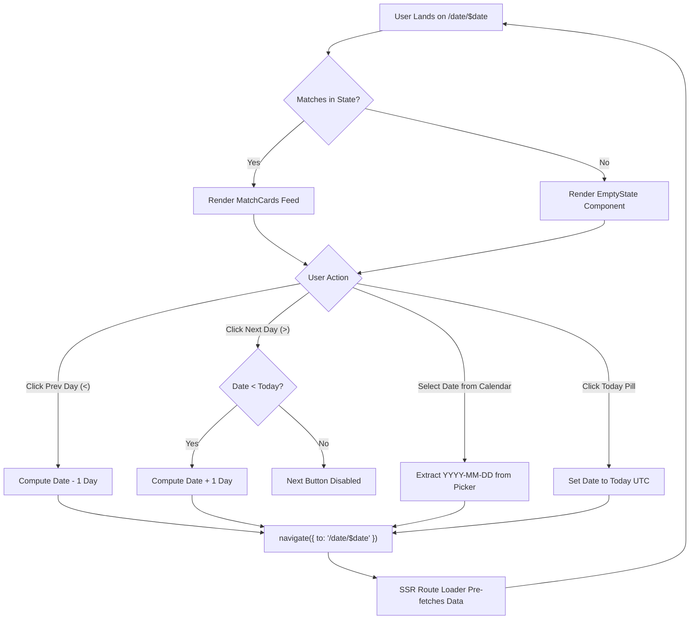
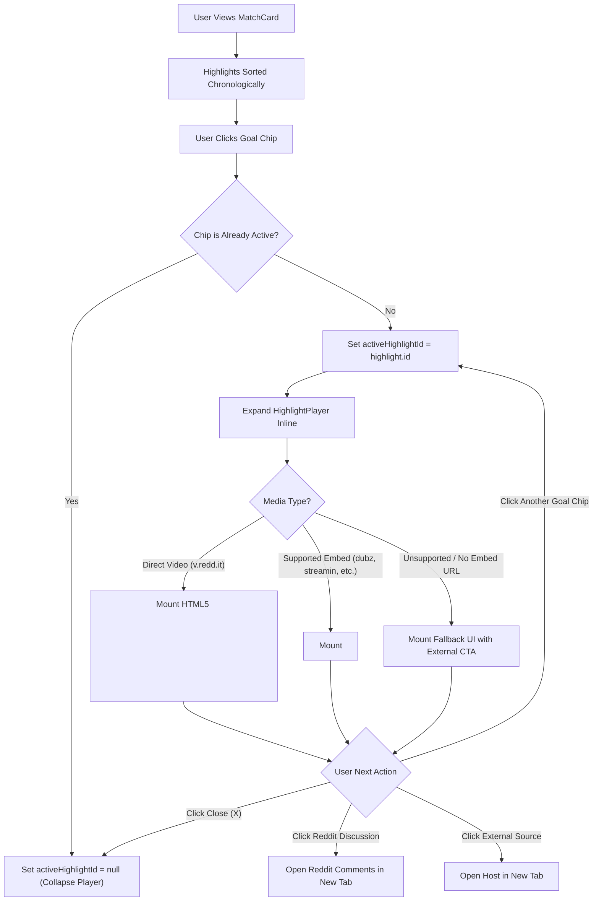

# Design Specification: MD-EPIC-5 & MD-EPIC-6 (UI Shell, Date Navigation & Inline Media Player)

- **Feature Scope:** `MD-EPIC-5` (Core UI Shell, Date Navigation & Match Feed) & `MD-EPIC-6` (Inline Media Player & Domain Fallbacks)
- **Target Release:** Sprint 3
- **Author:** Principal Product Designer & Design Systems Architect
- **Status:** Approved / Ready for Implementation

---

## 1. Executive Summary & Design Philosophy

MatchDay is an ultra-fast, distraction-free soccer highlight digest built on top of `r/soccer` submissions. The user experience prioritizes:

1. **Instant Clarity**: Users scan match scorelines and goal timelines within seconds on both mobile and desktop.
2. **Context-Preserving Playback**: Highlights expand inline directly inside match cards without disruptive page reloads, modals, or routing shifts.
3. **High-Converting Typography & Aesthetics**: Dark theme palette (`zinc-950`, `zinc-900`, `zinc-800`) paired with radiant emerald accents for goals and tactical tags for penalties and wonder-strikes.
4. **Resilient Media Consumption**: Graceful fallback states ensure users can always access clips even when third-party embed hosts block iframes.

```
+-----------------------------------------------------------------------------+
|  MATCHDAY  [● LIVE DIGEST]                         [r/soccer ↗]  [GitHub ↗] |
+-----------------------------------------------------------------------------+
|  [ < ]  Saturday, September 9, 2026 [ 📅 ]  [ > ]           [ Today ]        |
+-----------------------------------------------------------------------------+
| +-------------------------------------------------------------------------+ |
| | Arsenal                    [ 2 - 1 ]                     Brighton       | |
| | ....................................................................... | |
| | [ Saka 14' (1-0) ▲1.4k ]  [ Mitoma 38' (1-1) ]  [ Havertz 68' (Great G) ] | |
| |                                                                         | |
| | +---------------------------------------------------------------------+ | |
| | |  ▶ Inline 16:9 Highlight Player (dubz / streamin / v.redd.it)   [X] | | |
| | +---------------------------------------------------------------------+ | |
| | [ Reddit Discussion (▲1.4k) ↗ ]              [ Watch on Source Host ↗ ] | |
| +-------------------------------------------------------------------------+ |
+-----------------------------------------------------------------------------+
```

---

## 2. Design Tokens & Color Palette

### 2.1 Theme Palette (Tailwind CSS v4)

MatchDay enforces a dark-first aesthetic inspired by linear broadcast scoreboards and modern sports analytics platforms:

| Token                  | Class Name                             | Hex / OKLCH Value       | UI Context                                             |
| :--------------------- | :------------------------------------- | :---------------------- | :----------------------------------------------------- |
| **Canvas Base**        | `bg-zinc-950`                          | `#09090b`               | Global app background, body background                 |
| **Card Surface**       | `bg-zinc-900/80`                       | `#18181b` (80% opacity) | Match cards, popover cards, toolbar containers         |
| **Card Border**        | `border-zinc-800`                      | `#27272a`               | Card structural boundaries, subtle dividers            |
| **Border Hover**       | `border-zinc-700`                      | `#3f3f46`               | Interactive hover states on cards and chips            |
| **Foreground Primary** | `text-zinc-100`                        | `#f4f4f5`               | Team names, primary headlines, active scores           |
| **Foreground Muted**   | `text-zinc-400`                        | `#a1a1aa`               | Minutes, dates, metadata labels, helper text           |
| **Goal Accent**        | `emerald-500` / `emerald-400`          | `#10b981` / `#34d399`   | Scored goals, live digest indicators, active chip ring |
| **Penalty Badge**      | `amber-400` / `bg-amber-950/50`        | `#fbbf24`               | `(Penalty)` / `(P)` goal tags                          |
| **Great Goal Badge**   | `purple-400` / `bg-purple-950/50`      | `#c084fc`               | `(Great Goal)` wonder-strike badges                    |
| **Own Goal Badge**     | `rose-400` / `bg-rose-950/50`          | `#fb7185`               | `(OG)` / Own Goal tags                                 |
| **Reddit Pill**        | `text-orange-400` / `bg-orange-950/30` | `#fb923c`               | Reddit upvote indicator (`▲ 1.4k`)                     |

### 2.2 Typography Scale

- **Font Family**: `Manrope`, ui-sans-serif, system-ui, sans-serif.
- **Numbers / Clocks**: Monospace tabular figures (`tabular-nums font-mono`) ensure scores and minutes align vertically without layout jitter.
- **Scale Hierarchy**:
  - `Display / Brand`: `text-xl font-black tracking-tight text-zinc-100`
  - `Match Title / Teams`: `text-base sm:text-lg font-bold tracking-tight text-zinc-100`
  - `Scoreline Display`: `text-lg sm:text-xl font-extrabold font-mono tracking-wider text-emerald-400`
  - `Goal Chip Title`: `text-xs sm:text-sm font-semibold text-zinc-200`
  - `Goal Chip Meta`: `text-[11px] font-medium text-zinc-400`
  - `Tag Badges`: `text-[10px] font-bold uppercase tracking-wider`

---

## 3. Component Specifications

### 3.1 Global App Shell & Header (`src/routes/__root.tsx`)

#### Layout & Hierarchy

- **Position**: Sticky top header (`sticky top-0 z-40 backdrop-blur-md bg-zinc-950/85 border-b border-zinc-800/80`).
- **Width Limit**: `max-w-4xl mx-auto px-4 sm:px-6`.
- **Height**: `h-16 flex items-center justify-between`.

#### Header Elements

1. **Brand Identity (Left)**:
   - Icon: Soccer ball (`CircleDot` or `Trophy` from `lucide-react`) in `text-emerald-400` with subtle glow `drop-shadow-[0_0_8px_rgba(16,185,129,0.3)]`.
   - Brand Wordmark: `MatchDay` (`text-lg font-extrabold text-zinc-100 tracking-tight`).
   - Live Badge: Pill with green pulsing dot (`bg-zinc-900 border border-zinc-800 text-zinc-300 text-xs px-2.5 py-0.5 rounded-full flex items-center gap-1.5`).
2. **Global Navigation / Quick Links (Right)**:
   - Link to `r/soccer`: External link (`https://reddit.com/r/soccer`) with `ExternalLink` icon.
   - Link to GitHub: External link to the open-source repository with `Github` icon.
   - Clean, ghost hover states: `text-zinc-400 hover:text-zinc-100 transition-colors`.

---

### 3.2 DateNav Component (`src/components/DateNav.tsx`)

The `DateNav` component controls the chronological browsing across daily digests.

```
       [ < Prev ]   [ 📅 Saturday, Sep 9, 2026 ▾ ]   [ Next > ]      [ Today ]
```

#### Component Interface

```typescript
export interface DateNavProps {
  currentDate: string; // ISO format 'YYYY-MM-DD'
}
```

#### States & Actions

- **Previous Day (`<`)**:
  - Decrements date by 1 day (`date - 1`).
  - Navigates client-side via `@tanstack/react-router` `navigate({ to: '/date/$date', params: { date: prevDate } })`.
- **Next Day (`>`)**:
  - Increments date by 1 day (`date + 1`).
  - **Disabled condition**: If `currentDate >= todayUtcString`, next button is disabled (`opacity-40 cursor-not-allowed pointer-events-none`).
- **Formatted Date Popover Trigger**:
  - Formatted string: `Saturday, September 9, 2026` (Desktop) or `Sat, Sep 9` (Mobile).
  - Triggers Shadcn `Popover` containing the `Calendar` picker.
- **Calendar Popover**:
  - Accessible date picker displaying past dates up to today (`fromDate={new Date('2020-01-01')}` and `toDate={new Date()}`).
  - Picking a date automatically closes the popover and navigates to the selected date.
- **Today Shortcut Button**:
  - Rendered when `currentDate !== todayUtcString`.
  - Immediately routes to today's date (`/date/$today`).
  - Highlighted with subtle emerald accent border.

---

### 3.3 MatchCard Component (`src/components/MatchCard.tsx`)

The central component representing a single football match with all recorded goal highlights.

#### Component Interface

```typescript
import type { MatchWithHighlights, Highlight } from '#/db/schema';

export interface MatchCardProps {
  match: MatchWithHighlights;
  activeHighlightId: string | null;
  onSelectHighlight: (highlight: Highlight) => void;
  onCloseHighlight: () => void;
}
```

#### Card Layout Structure

```
+-------------------------------------------------------------------------------+
|  [H] Home Team                     2 - 1                     Away Team [A]    |
|  ---------------------------------------------------------------------------  |
|  [ Saka 14'  [1]-0  (▲ 1.4k) ]  [ Mitoma 38'  1-[1] ]  [ Havertz 68'  [2]-1 ] |
|  ---------------------------------------------------------------------------  |
|  (If activeHighlightId matches a goal in this card:)                          |
|  [▶ Inline HighlightPlayer Component]                                        |
+-------------------------------------------------------------------------------+
```

#### Header Sub-elements

1. **Team Crest / Placeholder Badge**:
   - Circular avatar (`w-8 h-8 rounded-full bg-zinc-800 border border-zinc-700/80 flex items-center justify-center font-bold text-xs text-zinc-300`).
   - Abbreviated initials (e.g. `ARS`, `BHA`).
2. **Team Names**:
   - `text-base sm:text-lg font-bold text-zinc-100 leading-snug`.
3. **Score Display Pill**:
   - Centered badge with dark backdrop (`bg-zinc-950/90 border border-zinc-800 px-3 py-1 rounded-lg text-emerald-400 font-mono font-black text-lg tracking-widest shadow-inner`).

#### Highlights Row & Interactive Goal Chips

Each goal highlight is rendered as an interactive chip button:

- **Scorer & Minute**: e.g. `Saka 14'` or `Haaland 90+3'`.
- **Score State at Goal**: e.g. `[1] - 0` indicates the scoring side.
- **Special Tag Badges**:
  - `(Great Goal)`: Rendered with purple styling (`bg-purple-950/50 text-purple-300 border border-purple-800/60`).
  - `(Penalty)` / `(P)`: Rendered with amber styling (`bg-amber-950/50 text-amber-300 border border-amber-800/60`).
  - `(OG)` / Own Goal: Rendered with rose styling (`bg-rose-950/50 text-rose-300 border border-rose-800/60`).
- **Reddit Score Indicator**:
  - Compact counter: `▲ 1.4k` (formatted via `formatRedditScore`).
- **Interactive State**:
  - **Default**: `bg-zinc-900/90 border border-zinc-800 text-zinc-300 hover:border-emerald-500/50 hover:bg-zinc-800/80 hover:text-zinc-100`.
  - **Active (Playing)**: `bg-emerald-950/40 border-emerald-500 text-emerald-200 ring-1 ring-emerald-500 shadow-[0_0_12px_rgba(16,185,129,0.2)]`.

---

### 3.4 HighlightPlayer Component (`src/components/HighlightPlayer.tsx`)

The inline video player embedded directly under the highlight chips.

#### Component Interface

```typescript
import type { Highlight } from '#/db/schema';

export interface HighlightPlayerProps {
  highlight: Highlight;
  onClose: () => void;
}
```

#### Media Presentation Architecture

1. **Container Guidelines (Zero Layout Shift)**:
   - Wrapper: `relative w-full aspect-video rounded-xl overflow-hidden bg-black shadow-2xl border border-zinc-800 mt-4`.
   - Guaranteed 16:9 ratio across mobile, tablet, and desktop screens (`aspect-video w-full`).
2. **Player Controls / Title Bar**:
   - Floating top action strip with dark translucent gradient:
     - Left: Scorer, minute, scoreline, and special badge.
     - Right: Close button (`X` icon from `lucide-react`) with accessible `aria-label="Close player"`.
3. **Playback Engines**:
   - **Direct Video Engine (`v.redd.it`)**:
     - Render native HTML5 `<video>` tag.
     - Attributes: `controls`, `playsInline`, `autoPlay`, `preload="metadata"`, `className="w-full h-full object-contain bg-black"`.
   - **Iframe Embed Engine (`dubz`, `streamin`, `streamff`, `caulse`)**:
     - Render `<iframe>` with `src={highlight.embedUrl}`.
     - Attributes: `allow="autoplay; fullscreen; picture-in-picture; web-share"`, `allowFullScreen`, `loading="lazy"`, `className="w-full h-full border-0"`.
4. **Footer Action Bar**:
   - Attached beneath the video container:
     - **Reddit Discussion Button**: Links to `highlight.redditUrl` in a new tab (`target="_blank" rel="noopener noreferrer"`). Includes formatted Reddit score and `MessageSquare` / `ExternalLink` icon.
     - **External Source Link**: Clean link to original host for credit and high-res alternatives.

---

### 3.5 Fallback UI Component

When an embed URL is missing, unsupported, or blocked by cross-origin security headers (CSP):

```
+-------------------------------------------------------------------------------+
|                                                                               |
|                                [ VideoOff Icon ]                              |
|                                                                               |
|                         Direct Embed Not Available                            |
|             This host does not support inline iframe embedding.               |
|                                                                               |
|            [ Watch on Source Host ↗ ]    [ View Reddit Thread ↗ ]             |
|                                                                               |
+-------------------------------------------------------------------------------+
```

#### Technical Specifications

- Displayed when `!highlight.embedUrl` inside the same 16:9 container.
- Content:
  - Icon: `VideoOff` or `ExternalLink` in amber/zinc circle.
  - Heading: "Direct Playback Unavailable".
  - Explanation: "This video hosting service does not support inline playback. You can watch the clip directly on the source host or view the community discussion."
  - Primary CTA Button: `Watch on Source Host ↗` (`Button variant="default" className="bg-emerald-600 hover:bg-emerald-500 text-white"`).
  - Secondary CTA Button: `View Reddit Thread ↗` (`Button variant="outline"`).

---

### 3.6 EmptyState Component (`src/components/EmptyState.tsx`)

Rendered when `matches.length === 0` for the current date.

#### Component Interface

```typescript
export interface EmptyStateProps {
  date: string;
  onJumpToToday?: () => void;
}
```

#### Visual Layout

- Container: `flex flex-col items-center justify-center p-12 text-center rounded-2xl border border-dashed border-zinc-800 bg-zinc-900/30 my-8`.
- Icon: `CalendarOff` or `Trophy` enclosed in a muted emerald/zinc badge.
- Title: `No highlights recorded for this day`.
- Description: `No matches were found or the scraper is still compiling posts for this date.`
- Interactive Actions:
  1. `Jump to Today` button: Primary CTA that navigates to today's date.
  2. `Visit r/soccer ↗` button: Secondary external link.

---

## 4. Required Shadcn UI Primitives

To construct the components cleanly using existing Tailwind v4 and project styling conventions, the following Shadcn UI primitives must be installed:

```bash
bun dlx shadcn@latest add button badge popover calendar tooltip
```

### Primitives Mapping

| Component        | Shadcn Primitive                               | File Location                    | Purpose in MatchDay                                        |
| :--------------- | :--------------------------------------------- | :------------------------------- | :--------------------------------------------------------- |
| **Buttons**      | `Button`                                       | `src/components/ui/button.tsx`   | Date nav controls, goal chips, close player, external CTAs |
| **Badges**       | `Badge`                                        | `src/components/ui/badge.tsx`    | Live digest pill, match scoreline, penalty/great goal tags |
| **Date Popover** | `Popover`, `PopoverTrigger`, `PopoverContent`  | `src/components/ui/popover.tsx`  | Accessible dropdown container for date picker              |
| **Calendar**     | `Calendar`                                     | `src/components/ui/calendar.tsx` | Month/day grid date selection constrained to past dates    |
| **Tooltips**     | `Tooltip`, `TooltipContent`, `TooltipProvider` | `src/components/ui/tooltip.tsx`  | Scorer explanations, keyboard shortcut hints               |

---

## 5. User Flows & State Transitions

### 5.1 Date Navigation Flow



### 5.2 Highlight Selection & Inline Playback Flow



---

## 6. Responsive Breakpoints & Accessibility (a11y)

### 6.1 Breakpoint Strategy

- **Mobile (<640px)**:
  - Header: Compact logo + icon links.
  - DateNav: Compact chevron buttons with short date label (`Sat, Sep 9`).
  - MatchCard: Stacked or flex-wrap team headers, horizontal scroll / wrapping goal chips.
  - HighlightPlayer: Full-width container adhering strictly to `aspect-video` without horizontal overflow.
- **Tablet & Desktop (>=640px)**:
  - Full formatted date string (`Saturday, September 9, 2026`).
  - Wider spacing and hover effects on goal chips.

### 6.2 Accessibility Standards (WCAG 2.1 AA)

1. **Screen Readers**:
   - `aria-label="Previous day, September 8, 2026"` on DateNav buttons.
   - `aria-label="Close video player"` on player close button.
   - Goal chips declared with `role="button"` and `aria-pressed={isActive}`.
2. **Keyboard Navigation**:
   - `Tab` moves logically across DateNav buttons, then MatchCards, then Goal Chips.
   - `Enter` / `Space` activates highlight playback.
   - `Escape` key automatically collapses the active video player.
3. **Contrast Ratios**:
   - Primary text (`#f4f4f5`) on card background (`#18181b`) has a contrast ratio of `14.2:1` (exceeds WCAG AAA).
   - Emerald accent (`#34d399`) on dark canvas has a contrast ratio of `9.4:1` (exceeds WCAG AAA).

---

## 7. Implementation Roadmap & Checklist

### Phase 1: Primitives & Shell Setup (MD-501)

- [ ] Install Shadcn primitives (`button`, `badge`, `popover`, `calendar`, `tooltip`).
- [ ] Update `src/routes/__root.tsx` with responsive dark theme header, branding, live badge, and links.
- [ ] Configure `styles.css` dark mode defaults and font smoothing.

### Phase 2: Date Navigation & Empty State (MD-502, MD-504)

- [ ] Implement `src/components/DateNav.tsx` with prev/next controls and calendar popover.
- [ ] Implement `src/components/EmptyState.tsx` with "Jump to Today" action.
- [ ] Integrate into `src/routes/date/$date.tsx`.

### Phase 3: MatchCard & Highlight Chips (MD-503)

- [ ] Implement `src/components/MatchCard.tsx` with team display, scoreline pill, and goal chips.
- [ ] Implement score formatter and tag styling (`Great Goal`, `Penalty`, `OG`).
- [ ] Maintain `activeHighlightId` state per page or match.

### Phase 4: HighlightPlayer & Domain Fallbacks (MD-601, MD-602, MD-603)

- [ ] Implement `src/components/HighlightPlayer.tsx` with strict 16:9 container (`aspect-video w-full`).
- [ ] Support native `<video>` for `v.redd.it` and `<iframe>` for supported hosts (`dubz`, `streamin`, `streamff`, `caulse`).
- [ ] Add graceful fallback card with external host CTA for unsupported domains.
- [ ] Connect Reddit discussion link button and close button.
- [ ] Run automated quality verification (`bun test src`, `bun run check`).
