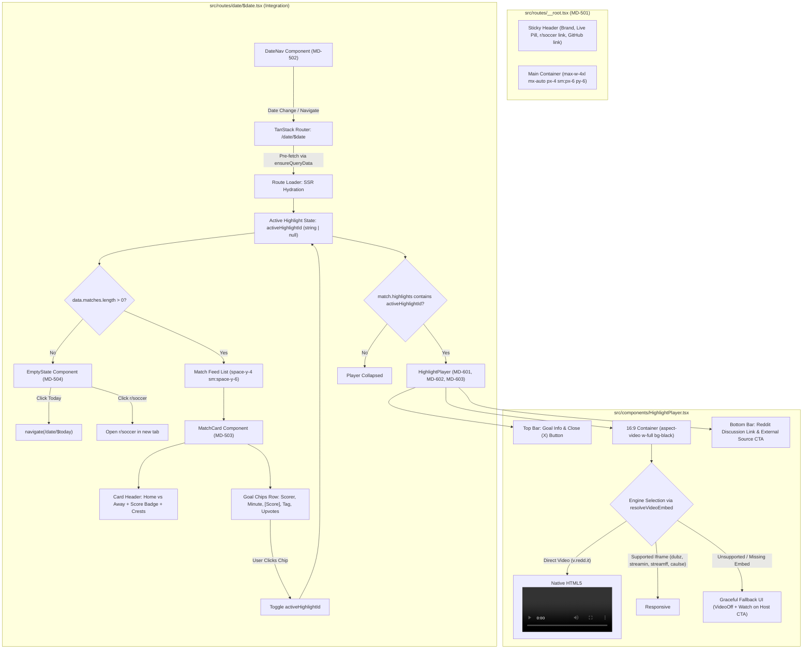
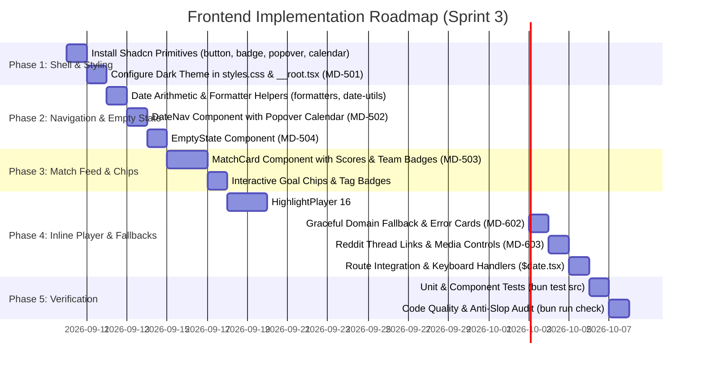

# Technical Specification: MD-EPIC-5 & MD-EPIC-6 Core UI Shell, Date Navigation & Inline Media Player

- **Epic Keys:** `MD-EPIC-5` & `MD-EPIC-6`
- **Target Sprint:** Sprint 3
- **Estimated Points:** 19 SP (11 SP for MD-EPIC-5, 8 SP for MD-EPIC-6)
- **Status:** Approved for Implementation
- **Target File:** `.orchestration/epics-5-and-6-ui-and-player/spec.md`
- **Design Reference:** `.orchestration/epics-5-and-6-ui-and-player/design.md`
- **Document Version:** 1.0.0

---

## 1. Executive Summary & Scope

### 1.1 Overview

This technical specification details the complete frontend implementation for MatchDay:

1. **MD-EPIC-5 (Core UI Shell, Date Navigation & Match Feed)**: Delivers the global responsive dark-mode application shell, sticky navigation bar with live digest indicator, chronological date navigator (`DateNav`) with prev/next buttons and calendar popover, interactive match cards (`MatchCard`) with live scorelines and goal timeline chips, and a fallback empty state (`EmptyState`) for non-match days.
2. **MD-EPIC-6 (Inline Media Player & Domain Fallbacks)**: Delivers inline highlight playback embedded directly within match cards (`HighlightPlayer`), strictly constrained to a 16:9 aspect ratio (`aspect-video w-full`) without layout shifts or route transitions. It integrates multi-engine media support (native HTML5 `<video>` for `v.redd.it`, responsive `<iframe>` for supported hosts like `dubz`, `streamin`, `streamff`, `caulse`), graceful fallback cards with external CTAs for unsupported domains or blocked embeds, and direct shortcuts to the original Reddit discussion threads with formatted upvote counters.

Together, these epics transform MatchDay from a headless edge-ingestion backend into a distraction-free, ultra-responsive web application optimized for soccer fans on mobile, tablet, and desktop displays.

### 1.2 User Story Scope & Breakdown

| Epic            | Story ID   | Story Title                                              | SP  | Priority | Target File(s)                                                       |
| :-------------- | :--------- | :------------------------------------------------------- | :-- | :------- | :------------------------------------------------------------------- |
| **MD-EPIC-5**   | **MD-501** | Global App Shell, Header & Theme Configuration           | 2   | High     | `src/routes/__root.tsx`, `src/styles.css`                            |
| **MD-EPIC-5**   | **MD-502** | DateNav Component (Prev, Next, Calendar Picker & Today)  | 3   | Critical | `src/components/DateNav.tsx`, `src/lib/date-utils.ts`                |
| **MD-EPIC-5**   | **MD-503** | MatchCard Component & Highlight Chips                    | 4   | Critical | `src/components/MatchCard.tsx`, `src/lib/formatters.ts`              |
| **MD-EPIC-5**   | **MD-504** | EmptyState Component                                     | 2   | Medium   | `src/components/EmptyState.tsx`                                      |
| **MD-EPIC-6**   | **MD-601** | Inline HighlightPlayer Component (16:9 Aspect Ratio)     | 3   | Critical | `src/components/HighlightPlayer.tsx`                                 |
| **MD-EPIC-6**   | **MD-602** | Graceful Fallback for Unsupported Domains & Error States | 2   | High     | `src/components/HighlightPlayer.tsx` (Fallback UI)                   |
| **MD-EPIC-6**   | **MD-603** | MatchCard Media Controls & Reddit Discussion Link        | 3   | Medium   | `src/components/MatchCard.tsx`, `src/components/HighlightPlayer.tsx` |
| **Integration** | **N/A**    | Daily Digest View Integration                            | N/A | Critical | `src/routes/date/$date.tsx`                                          |

### 1.3 Out of Scope

- End-to-end browser tests using Playwright against live Cloudflare Workers deployment (scheduled for MD-EPIC-7).
- Persistent user favorites, team bookmarking, or customized league filters (candidate for post-v1 backlog).
- Audio synthesis or live commentary streams.
- Full Reddit comment tree rendering inside the application (external link to `/r/soccer` thread is provided).

---

## 2. End-to-End System Architecture & Information Architecture

### 2.1 Component Hierarchy Diagram



### 2.2 Information Architecture & Visual Layout

```
+-----------------------------------------------------------------------------------------+
|  MATCHDAY  [● LIVE DIGEST]                                     [r/soccer ↗]  [GitHub ↗] |  <- Sticky Header
+-----------------------------------------------------------------------------------------+
|                                                                                         |
|       [ < Prev ]       [ 📅 Saturday, September 9, 2026 ▾ ]       [ Next > ]   [ Today ]  <- DateNav
|                                                                                         |
|  +-----------------------------------------------------------------------------------+  |
|  | [ARS] Arsenal                          2 - 1                          Brighton [BHA] |  <- MatchCard Header
|  | --------------------------------------------------------------------------------- |  |
|  | [ Saka 14'  [1]-0  ▲ 1.4k ]  [ Mitoma 38'  1-[1] ]  [ Havertz 68' (Great G) ]    |  <- Goal Chips Row
|  |                                                                                   |  |
|  | +-------------------------------------------------------------------------------+ |  |
|  | | Bukayo Saka 14' [1]-0 (Penalty)                                           [X] | |  <- Player Top Strip
|  | |-------------------------------------------------------------------------------| |  |
|  | |                                                                               | |  |
|  | |                ▶ 16:9 Inline Video Player (aspect-video w-full)               | |  |
|  | |                      (v.redd.it / dubz / streamin / streamff)                 | |  |
|  | |                                                                               | |  |
|  | |-------------------------------------------------------------------------------| |  |
|  | | [ Reddit Discussion (▲ 1.4k) ↗ ]                     [ Watch on Source Host ↗ ] | |  <- Player Footer Strip
|  | +-------------------------------------------------------------------------------+ |  |
|  +-----------------------------------------------------------------------------------+  |
|                                                                                         |
|  +-----------------------------------------------------------------------------------+  |
|  | [MCI] Manchester City                  3 - 0                     Brentford [BRE]  |  |
|  | --------------------------------------------------------------------------------- |  |
|  | [ Haaland 22' [1]-0 ]  [ Foden 45+2' [2]-0 ]  [ Haaland 74' [3]-0 (Great Goal) ] |  |
|  +-----------------------------------------------------------------------------------+  |
+-----------------------------------------------------------------------------------------+
```

### 2.3 Component Interaction Matrix

| Component                            | Props / Inputs                                                                                             | State Triggers                                           | Output Events / Navigation                              | Dependencies                                        |
| :----------------------------------- | :--------------------------------------------------------------------------------------------------------- | :------------------------------------------------------- | :------------------------------------------------------ | :-------------------------------------------------- |
| `src/routes/__root.tsx`              | N/A                                                                                                        | Devtools toggle                                          | External anchor links (`r/soccer`, `GitHub`)            | Lucide icons, `@tanstack/react-router`              |
| `src/components/DateNav.tsx`         | `currentDate: string`                                                                                      | Calendar popover open/close                              | `navigate({ to: '/date/$date', params: { date } })`     | `@tanstack/react-router`, Shadcn Popover & Calendar |
| `src/components/MatchCard.tsx`       | `match: MatchWithHighlights`, `activeHighlightId: string \| null`, `onSelectHighlight`, `onCloseHighlight` | Chip click, keyboard Enter/Space                         | `onSelectHighlight(highlight)`, `onCloseHighlight()`    | `HighlightPlayer.tsx`, Lucide icons, formatters     |
| `src/components/HighlightPlayer.tsx` | `highlight: Highlight`, `onClose: () => void`                                                              | Video play/pause, close button                           | `onClose()`, external tab navigation                    | `src/lib/video.ts`, Lucide icons, formatters        |
| `src/components/EmptyState.tsx`      | `date: string`, `onJumpToToday: () => void`                                                                | Button clicks                                            | Navigates to today or opens `r/soccer`                  | Lucide icons, Button primitive                      |
| `src/routes/date/$date.tsx`          | URL param `$date`                                                                                          | `activeHighlightId` (`string \| null`), Escape key press | SSR loader prefetch, renders DateNav + feed/empty state | TanStack Query, Drizzle types                       |

---

## 3. Detailed Module Specifications

### 3.1 MD-501: Global App Shell, Header & Theme Configuration

#### Objective

Establish a clean, modern, dark-first application shell that provides brand identity, navigation links, and seamless SSR rendering without flash of unstyled content (FOUC).

#### Technical Specifications

1. **Root Layout (`src/routes/__root.tsx`)**:
   - Wrap application inside a full-height dark layout: `min-h-screen bg-zinc-950 text-zinc-100 selection:bg-emerald-500/30 selection:text-emerald-200 antialiased font-sans`.
   - Implement sticky top navigation header:
     ```tsx
     <header className="sticky top-0 z-40 w-full border-b border-zinc-800/80 bg-zinc-950/85 backdrop-blur-md">
       <div className="mx-auto flex h-16 max-w-4xl items-center justify-between px-4 sm:px-6">
         {/* Brand Identity */}
         <Link
           to="/"
           className="flex items-center gap-2.5 transition-opacity hover:opacity-90"
         >
           <div className="flex h-9 w-9 items-center justify-center rounded-lg bg-emerald-950/60 border border-emerald-800/50 text-emerald-400 shadow-[0_0_12px_rgba(16,185,129,0.25)]">
             <CircleDot className="h-5 w-5 animate-pulse" />
           </div>
           <div className="flex items-center gap-2">
             <span className="text-lg font-black tracking-tight text-zinc-100">
               MatchDay
             </span>
             <span className="flex items-center gap-1.5 rounded-full border border-emerald-900/60 bg-emerald-950/40 px-2 py-0.5 text-[11px] font-semibold text-emerald-300">
               <span className="h-1.5 w-1.5 rounded-full bg-emerald-400 animate-ping" />
               LIVE DIGEST
             </span>
           </div>
         </Link>
         {/* External Links */}
         <div className="flex items-center gap-3">
           <a
             href="https://reddit.com/r/soccer"
             target="_blank"
             rel="noopener noreferrer"
             className="flex items-center gap-1.5 text-xs font-medium text-zinc-400 transition-colors hover:text-zinc-100"
             aria-label="Visit r/soccer on Reddit"
           >
             <span>r/soccer</span>
             <ExternalLink className="h-3.5 w-3.5" />
           </a>
           <div className="h-4 w-px bg-zinc-800" />
           <a
             href="https://github.com"
             target="_blank"
             rel="noopener noreferrer"
             className="text-zinc-400 transition-colors hover:text-zinc-100"
             aria-label="View source on GitHub"
           >
             <Github className="h-4 w-4" />
           </a>
         </div>
       </div>
     </header>
     ```
   - Main container: `<main className="mx-auto max-w-4xl px-4 py-6 sm:px-6 sm:py-8">{children}</main>`.
   - Footer container with subtle attribution: `<footer className="mx-auto max-w-4xl px-4 py-8 text-center text-xs text-zinc-600">...</footer>`.

2. **Tailwind v4 Configuration (`src/styles.css`)**:
   - Replace starter light-theme variables with pure dark zinc tokens:
     ```css
     :root,
     .dark {
       --background: oklch(0.141 0.005 285.823); /* #09090b - zinc-950 */
       --foreground: oklch(0.985 0 0); /* #f4f4f5 - zinc-100 */
       --card: oklch(0.18 0.006 286.033); /* #18181b - zinc-900 */
       --card-foreground: oklch(0.985 0 0);
       --popover: oklch(0.18 0.006 286.033);
       --popover-foreground: oklch(0.985 0 0);
       --border: oklch(0.274 0.006 286.033); /* #27272a - zinc-800 */
       --ring: oklch(0.696 0.17 162.48); /* emerald-500 */
     }
     ```
   - Enforce `-webkit-font-smoothing: antialiased;` and monospace tabular figures for scores and clocks (`tabular-nums font-mono`).

---

### 3.2 MD-502: DateNav Component (Previous, Next, Calendar Picker & Today)

#### Objective

Enable fluid, deterministic date navigation across daily digests with URL synchronization, keyboard navigation, popover calendar picking, and constraint boundaries (blocking future dates).

#### File Location

`src/components/DateNav.tsx`

#### Component Interface & Contracts

```typescript
export interface DateNavProps {
  currentDate: string; // ISO format 'YYYY-MM-DD'
}
```

#### Detailed Logic & State Handling

1. **UTC Date Computation Helper (`src/lib/date-utils.ts`)**:
   - All date arithmetic must be performed in UTC to prevent daylight saving time shifts or client timezone skew across midnight:
     - `getTodayUtcString(): string`: Returns current UTC date as `YYYY-MM-DD`.
     - `addDaysToIsoDate(isoDate: string, days: number): string`: Safe day addition/subtraction.
     - `formatDisplayDate(isoDate: string, options?: { short?: boolean }): string`:
       - Long format (Desktop): `Saturday, September 9, 2026`
       - Short format (Mobile): `Sat, Sep 9`
     - `isFutureDate(isoDate: string): boolean`: Compares `isoDate > getTodayUtcString()`.
     - `isTodayDate(isoDate: string): boolean`: Compares `isoDate === getTodayUtcString()`.

2. **Actions & Navigation Triggers**:
   - **Previous Day (`<`)**:
     - Calculates `prevDate = addDaysToIsoDate(currentDate, -1)`.
     - Navigates: `navigate({ to: '/date/$date', params: { date: prevDate } })`.
     - `aria-label="Previous day, {formatDisplayDate(prevDate)}"`.
   - **Next Day (`>`)**:
     - Calculates `nextDate = addDaysToIsoDate(currentDate, 1)`.
     - Disabled if `isTodayDate(currentDate) || isFutureDate(nextDate)`.
     - Disabled styling: `opacity-40 cursor-not-allowed pointer-events-none`.
     - `aria-label="Next day, {formatDisplayDate(nextDate)}"`.
   - **Calendar Popover**:
     - Uses Shadcn `Popover`, `PopoverTrigger`, and `PopoverContent`.
     - Trigger button displays `Calendar` icon, formatted date string, and chevron down.
     - Content renders accessible month/day picker.
     - Constrains selection: disabled if date is in the future (`date > new Date()`) or earlier than `2020-01-01`.
     - On date selection:
       ```typescript
       const onDateSelect = (selected: Date | undefined) => {
         if (!selected) return;
         const isoDate = selected.toISOString().slice(0, 10);
         setPopoverOpen(false);
         navigate({ to: '/date/$date', params: { date: isoDate } });
       };
       ```
   - **"Today" Shortcut Button**:
     - Visible only when `!isTodayDate(currentDate)`.
     - Highlighted with subtle emerald border: `border border-emerald-600/50 bg-emerald-950/30 text-emerald-300 hover:bg-emerald-900/40 hover:text-emerald-200`.
     - Immediately executes: `navigate({ to: '/date/$date', params: { date: getTodayUtcString() } })`.

---

### 3.3 MD-503: MatchCard Component & Highlight Chips

#### Objective

Present match results cleanly with home and away team crest badges, final scoreline display, and interactive goal chips sorted chronologically by match minute.

#### File Location

`src/components/MatchCard.tsx`

#### Component Interface & Contracts

```typescript
import type { MatchWithHighlights, Highlight } from '#/db/schema';

export interface MatchCardProps {
  match: MatchWithHighlights;
  activeHighlightId: string | null;
  onSelectHighlight: (highlight: Highlight) => void;
  onCloseHighlight: () => void;
}
```

#### Detailed Layout & Elements

1. **Header Layout**:
   - Structural container: `rounded-2xl border border-zinc-800 bg-zinc-900/80 p-4 sm:p-5 backdrop-blur-sm transition-all duration-200 hover:border-zinc-700/80 shadow-lg`.
   - Team Display & Scoreline Grid:
     ```tsx
     <div className="flex items-center justify-between gap-3 sm:gap-4 pb-3 border-b border-zinc-800/80">
       {/* Home Team */}
       <div className="flex items-center gap-2.5 flex-1 min-w-0">
         <div className="flex h-8 w-8 sm:h-9 sm:w-9 shrink-0 items-center justify-center rounded-full bg-zinc-800 border border-zinc-700 font-bold text-xs text-zinc-200 shadow-inner">
           {getTeamInitials(match.teamHome)}
         </div>
         <span className="font-bold text-sm sm:text-base text-zinc-100 truncate">
           {match.teamHome}
         </span>
       </div>

       {/* Scoreline Badge */}
       <div className="flex shrink-0 items-center justify-center px-3 py-1 sm:px-4 sm:py-1.5 rounded-lg bg-zinc-950/90 border border-zinc-800 shadow-inner">
         <span className="font-mono font-black text-base sm:text-lg text-emerald-400 tracking-wider tabular-nums">
           {computedScore
             ? `${computedScore.home} - ${computedScore.away}`
             : 'VS'}
         </span>
       </div>

       {/* Away Team */}
       <div className="flex items-center justify-end gap-2.5 flex-1 min-w-0 text-right">
         <span className="font-bold text-sm sm:text-base text-zinc-100 truncate">
           {match.teamAway}
         </span>
         <div className="flex h-8 w-8 sm:h-9 sm:w-9 shrink-0 items-center justify-center rounded-full bg-zinc-800 border border-zinc-700 font-bold text-xs text-zinc-200 shadow-inner">
           {getTeamInitials(match.teamAway)}
         </div>
       </div>
     </div>
     ```

2. **Goal Timeline Chips Row**:
   - Rendered below the header divider in a wrapping flex row: `flex flex-wrap items-center gap-2 pt-3`.
   - Each chip renders:
     - **Minute**: e.g. `14'` or `90+3'`.
     - **Scorer**: e.g. `Saka` or `Haaland`.
     - **Score State at Goal**: e.g. `[1] - 0` (brackets indicate scoring side).
     - **Special Tag Badge**:
       - `(Penalty)` / `(P)`: `text-amber-400 bg-amber-950/50 border border-amber-800/60`
       - `(Great Goal)` / `(Great Strike)`: `text-purple-400 bg-purple-950/50 border border-purple-800/60`
       - `(OG)` / `(Own Goal)`: `text-rose-400 bg-rose-950/50 border border-rose-800/60`
     - **Reddit Upvotes**: Pill with orange indicator `▲ 1.4k` (formatted via `formatRedditScore`).
   - **Interactive States**:
     - Inactive: `bg-zinc-900 border border-zinc-800 text-zinc-300 hover:border-emerald-500/50 hover:bg-zinc-800 hover:text-zinc-100`.
     - Active (Selected): `bg-emerald-950/50 border-emerald-500 text-emerald-200 ring-1 ring-emerald-500 shadow-[0_0_12px_rgba(16,185,129,0.2)]`.
     - Clicking toggles playback: if chip is already active, triggers `onCloseHighlight()`; if not, triggers `onSelectHighlight(highlight)`.

3. **Inline Player Integration**:
   - If `activeHighlightId` matches any highlight in `match.highlights`:
     Render `HighlightPlayer` directly below the chips row inside the card boundary.

---

### 3.4 MD-504: EmptyState Component

#### Objective

Provide an elegant, encouraging empty state when zero matches are recorded for the selected date.

#### File Location

`src/components/EmptyState.tsx`

#### Component Interface & Contracts

```typescript
export interface EmptyStateProps {
  date: string;
  onJumpToToday?: () => void;
}
```

#### Visual Layout & Actions

- Container: `flex flex-col items-center justify-center rounded-2xl border border-dashed border-zinc-800 bg-zinc-900/30 p-8 sm:p-12 text-center my-6`.
- Icon: Enclosed `CalendarOff` or `Trophy` icon in `text-zinc-500 bg-zinc-800/60 p-4 rounded-full mb-4 border border-zinc-700/50`.
- Heading: `text-lg sm:text-xl font-bold text-zinc-100`. "No highlights recorded for this day".
- Body Text: `mt-1.5 text-sm text-zinc-400 max-w-md`. "No matches were found or the scraper is still compiling posts for {formattedDate}."
- Action Buttons:
  1. `Jump to Today`: Primary CTA button with `Calendar` icon (`Button className="bg-emerald-600 hover:bg-emerald-500 text-white"`).
  2. `Visit r/soccer ↗`: Secondary outline button linking to `https://reddit.com/r/soccer` (`Button variant="outline" className="border-zinc-700 text-zinc-300 hover:bg-zinc-800"`).

---

### 3.5 MD-601: Inline HighlightPlayer Component (16:9 Aspect Ratio)

#### Objective

Play goal highlights inline directly inside the match card with seamless transitions, zero layout shift, and guaranteed responsive scaling across all form factors.

#### File Location

`src/components/HighlightPlayer.tsx`

#### Component Interface & Contracts

```typescript
import type { Highlight } from '#/db/schema';

export interface HighlightPlayerProps {
  highlight: Highlight;
  onClose: () => void;
}
```

#### Container Architecture & Strict 16:9 Aspect Ratio

- Container Rule: As mandated by `agents.md` Failure Log (2026-09-09), unconstrained video tags cause layout overflow. The player MUST be wrapped inside a responsive 16:9 container:
  ```tsx
  <div className="relative w-full aspect-video rounded-xl overflow-hidden bg-black shadow-2xl border border-zinc-800 my-4">
    {/* Media Engine or Fallback */}
  </div>
  ```

#### Multi-Engine Playback Selection

Using `resolveVideoEmbed(highlight.sourceUrl)` from `src/lib/video.ts`:

1. **Direct Video Stream (`v.redd.it`)**:
   - When `media.directVideoUrl` is present and `!media.isIframe`:
   - Render native HTML5 `<video>`:
     ```tsx
     <video
       key={media.directVideoUrl}
       src={media.directVideoUrl}
       controls
       playsInline
       autoPlay
       preload="metadata"
       className="h-full w-full object-contain bg-black"
       aria-label={highlight.title}
     />
     ```
2. **Iframe Embed Engine (`dubz`, `streamin`, `streamff`, `caulse`)**:
   - When `media.embedUrl` or `highlight.embedUrl` is present:
   - Render responsive `<iframe>`:
     ```tsx
     <iframe
       key={media.embedUrl ?? highlight.embedUrl}
       src={media.embedUrl ?? highlight.embedUrl!}
       title={highlight.title}
       allow="autoplay; fullscreen; picture-in-picture; web-share"
       allowFullScreen
       loading="lazy"
       className="h-full w-full border-0 bg-black"
     />
     ```

#### Top Overlay Bar

- Floating translucent strip at top of player container:
  ```tsx
  <div className="absolute top-0 inset-x-0 z-10 flex items-center justify-between p-3 bg-gradient-to-b from-black/80 via-black/40 to-transparent pointer-events-auto">
    <div className="flex items-center gap-2 text-xs font-semibold text-zinc-200 truncate pr-2">
      <Play className="h-3.5 w-3.5 text-emerald-400 shrink-0" />
      <span className="truncate">
        {highlight.scorer ?? 'Goal'}{' '}
        {highlight.minute ? `${highlight.minute}` : ''}
      </span>
      {highlight.tag && (
        <span className="rounded px-1.5 py-0.5 text-[10px] font-bold bg-zinc-800 text-zinc-300 border border-zinc-700">
          {highlight.tag}
        </span>
      )}
    </div>
    <button
      type="button"
      onClick={onClose}
      className="flex h-7 w-7 items-center justify-center rounded-full bg-zinc-900/80 hover:bg-zinc-800 text-zinc-300 hover:text-zinc-100 transition-colors border border-zinc-700/60"
      aria-label="Close player"
    >
      <X className="h-4 w-4" />
    </button>
  </div>
  ```

---

### 3.6 MD-602: Graceful Fallback for Unsupported Domains & Error States

#### Objective

Ensure that if a video domain is unsupported (e.g. twitter/X, streamja, tiktok, news sites) or blocked by cross-origin security headers, users encounter an informative, actionable fallback instead of a blank white box or broken iframe.

#### Technical Specifications

1. **Fallback Condition**:
   - Triggered when `!media.embedUrl && !media.directVideoUrl && !highlight.embedUrl`.
2. **Fallback Visual Layout**:
   - Rendered within the exact same `aspect-video w-full` container:
     ```tsx
     <div className="flex h-full w-full flex-col items-center justify-center p-6 text-center bg-zinc-950/95 border border-zinc-800 rounded-xl">
       <div className="flex h-12 w-12 items-center justify-center rounded-full bg-zinc-900 border border-zinc-800 text-amber-400 mb-3">
         <VideoOff className="h-6 w-6" />
       </div>
       <h4 className="text-base font-bold text-zinc-100">
         Direct Playback Unavailable
       </h4>
       <p className="mt-1 text-xs text-zinc-400 max-w-sm">
         This hosting service does not support inline playback. You can watch
         the clip directly on the source host.
       </p>
       <div className="mt-4 flex flex-wrap items-center justify-center gap-2.5">
         <a
           href={highlight.sourceUrl}
           target="_blank"
           rel="noopener noreferrer"
           className="inline-flex items-center gap-1.5 rounded-lg bg-emerald-600 px-3.5 py-2 text-xs font-semibold text-white transition-colors hover:bg-emerald-500 shadow-md"
         >
           <span>Watch on Source Host</span>
           <ExternalLink className="h-3.5 w-3.5" />
         </a>
         <a
           href={`https://reddit.com${highlight.redditUrl}`}
           target="_blank"
           rel="noopener noreferrer"
           className="inline-flex items-center gap-1.5 rounded-lg border border-zinc-700 bg-zinc-900 px-3.5 py-2 text-xs font-semibold text-zinc-300 transition-colors hover:bg-zinc-800 hover:text-zinc-100"
         >
           <span>Reddit Thread</span>
           <ExternalLink className="h-3.5 w-3.5" />
         </a>
       </div>
     </div>
     ```

---

### 3.7 MD-603: MatchCard Media Controls & Reddit Discussion Link

#### Objective

Connect highlights to the `r/soccer` community conversation with formatted Reddit upvotes (`▲ 1.4k`) and direct one-click external links.

#### Technical Specifications

1. **Upvote Formatter (`src/lib/formatters.ts`)**:

   ```typescript
   export function formatRedditScore(score: number | null | undefined): string {
     if (score === null || score === undefined || score < 0) {
       return '0';
     }
     if (score < 1000) {
       return score.toString();
     }
     if (score < 1_000_000) {
       const formatted = (score / 1000).toFixed(1);
       return `${formatted.endsWith('.0') ? formatted.slice(0, -2) : formatted}k`;
     }
     const formatted = (score / 1_000_000).toFixed(1);
     return `${formatted.endsWith('.0') ? formatted.slice(0, -2) : formatted}M`;
   }
   ```

2. **Footer Controls Strip (Underneath Video Player)**:
   - Attached immediately below the video container in `HighlightPlayer.tsx`:
     ```tsx
     <div className="flex flex-wrap items-center justify-between gap-3 pt-2 text-xs">
       {/* Reddit Discussion Button */}
       <a
         href={`https://reddit.com${highlight.redditUrl}`}
         target="_blank"
         rel="noopener noreferrer"
         className="inline-flex items-center gap-1.5 rounded-lg border border-orange-900/40 bg-orange-950/20 px-3 py-1.5 font-medium text-orange-400 transition-colors hover:bg-orange-950/40 hover:text-orange-300"
       >
         <MessageSquare className="h-3.5 w-3.5" />
         <span>
           Reddit Discussion (▲ {formatRedditScore(highlight.redditScore)})
         </span>
         <ExternalLink className="h-3 w-3 opacity-70" />
       </a>

       {/* External Source Host Link */}
       <a
         href={highlight.sourceUrl}
         target="_blank"
         rel="noopener noreferrer"
         className="inline-flex items-center gap-1 text-zinc-400 transition-colors hover:text-zinc-200"
       >
         <span>
           Source: {new URL(highlight.sourceUrl).hostname.replace('www.', '')}
         </span>
         <ExternalLink className="h-3 w-3" />
       </a>
     </div>
     ```

---

### 3.8 Daily Digest Route Integration (`src/routes/date/$date.tsx`)

#### Objective

Orchestrate state management, date switching, and keyboard accessibility for the daily match feed.

#### Technical Specifications

1. **State Management**:
   - `activeHighlightId`: `string | null` initialized to `null`.
   - On date parameter change: reset `activeHighlightId` to `null` to ensure old players collapse when switching days.
2. **Keyboard Listener**:
   - Listen to `Escape` key on `window`: if `activeHighlightId` is set, set to `null` to close player.
3. **Template Composition**:
   ```tsx
   export function DateRouteComponent() {
     const { date } = Route.useParams();
     const { data } = useSuspenseQuery(matchDayQueryOptions(date));
     const [activeHighlightId, setActiveHighlightId] = useState<string | null>(
       null,
     );

     // Reset active highlight whenever date changes
     useEffect(() => {
       setActiveHighlightId(null);
     }, [date]);

     // Global Escape key collapses active player
     useEffect(() => {
       const handleKeyDown = (e: KeyboardEvent) => {
         if (e.key === 'Escape') {
           setActiveHighlightId(null);
         }
       };
       window.addEventListener('keydown', handleKeyDown);
       return () => window.removeEventListener('keydown', handleKeyDown);
     }, []);

     return (
       <div className="space-y-6">
         {/* Date Navigation Bar */}
         <DateNav currentDate={date} />

         {/* Content Feed */}
         {data.matches.length === 0 ? (
           <EmptyState date={date} />
         ) : (
           <div className="space-y-4 sm:space-y-6">
             {data.matches.map((match) => (
               <MatchCard
                 key={match.id}
                 match={match}
                 activeHighlightId={activeHighlightId}
                 onSelectHighlight={(hl) =>
                   setActiveHighlightId((prev) =>
                     prev === hl.id ? null : hl.id,
                   )
                 }
                 onCloseHighlight={() => setActiveHighlightId(null)}
               />
             ))}
           </div>
         )}
       </div>
     );
   }
   ```

---

## 4. Data Models, TypeScript Interfaces & Utility Functions

### 4.1 Strict TypeScript Contracts (Zero `any`)

```typescript
import type { MatchWithHighlights, Highlight } from '#/db/schema';

/**
 * Score calculation output structure.
 */
export interface MatchScore {
  home: number;
  away: number;
}

/**
 * Goal chip presentation metadata.
 */
export interface GoalChipViewModel {
  highlight: Highlight;
  formattedScore: string;
  isHomeScorer: boolean;
  tagCategory: 'penalty' | 'great_goal' | 'own_goal' | 'standard';
  formattedRedditScore: string;
}
```

### 4.2 Score Calculation & Goal Chip Formatting (`src/lib/formatters.ts`)

```typescript
/**
 * Computes final or latest recorded match score from chronologically sorted highlights.
 */
export function computeMatchScore(highlights: Highlight[]): MatchScore | null {
  for (let i = highlights.length - 1; i >= 0; i--) {
    const hl = highlights[i];
    if (hl.scoreHome !== null && hl.scoreAway !== null) {
      return { home: hl.scoreHome, away: hl.scoreAway };
    }
  }
  return null;
}

/**
 * Formats goal scoreline with brackets indicating scoring team (e.g. "[1] - 0" or "1 - [1]").
 */
export function formatGoalScore(
  highlight: Highlight,
  prevHighlight?: Highlight,
): string {
  if (highlight.scoreHome === null || highlight.scoreAway === null) {
    return '';
  }

  const { scoreHome, scoreAway } = highlight;

  if (
    prevHighlight &&
    prevHighlight.scoreHome !== null &&
    prevHighlight.scoreAway !== null
  ) {
    if (scoreHome > prevHighlight.scoreHome) {
      return `[${scoreHome}] - ${scoreAway}`;
    }
    if (scoreAway > prevHighlight.scoreAway) {
      return `${scoreHome} - [${scoreAway}]`;
    }
  }

  // Fallback if first goal of the match
  if (scoreHome > 0 && scoreAway === 0) {
    return `[${scoreHome}] - ${scoreAway}`;
  }
  if (scoreAway > 0 && scoreHome === 0) {
    return `${scoreHome} - [${scoreAway}]`;
  }

  return `${scoreHome} - ${scoreAway}`;
}

/**
 * Categorizes a highlight tag for badge styling.
 */
export function getTagCategory(
  tag: string | null | undefined,
): 'penalty' | 'great_goal' | 'own_goal' | 'standard' {
  if (!tag) return 'standard';
  const lower = tag.toLowerCase();
  if (lower === 'p' || lower.includes('penalty')) return 'penalty';
  if (lower.includes('great') || lower.includes('wonder')) return 'great_goal';
  if (lower === 'og' || lower.includes('own goal')) return 'own_goal';
  return 'standard';
}

/**
 * Derives clean team initials for the team avatar badge.
 */
export function getTeamInitials(teamName: string): string {
  const clean = teamName.trim();
  const KNOWN_ABBREVIATIONS: Record<string, string> = {
    Arsenal: 'ARS',
    'Aston Villa': 'AVL',
    Brighton: 'BHA',
    'Brighton and Hove Albion': 'BHA',
    Chelsea: 'CHE',
    Liverpool: 'LIV',
    'Manchester City': 'MCI',
    'Manchester United': 'MUN',
    Newcastle: 'NEW',
    'Newcastle United': 'NEW',
    Tottenham: 'TOT',
    'Tottenham Hotspur': 'TOT',
    'Real Madrid': 'RMA',
    Barcelona: 'BAR',
    'Bayern Munich': 'BAY',
    'Paris Saint-Germain': 'PSG',
    Juventus: 'JUV',
    'Inter Milan': 'INT',
    'AC Milan': 'MIL',
    'Borussia Dortmund': 'BVB',
  };

  if (KNOWN_ABBREVIATIONS[clean]) {
    return KNOWN_ABBREVIATIONS[clean];
  }

  const words = clean.split(/\s+/).filter(Boolean);
  if (words.length >= 2) {
    return words
      .slice(0, 3)
      .map((w) => w[0].toUpperCase())
      .join('');
  }
  return clean.slice(0, 3).toUpperCase();
}
```

### 4.3 Date Arithmetic Utilities (`src/lib/date-utils.ts`)

```typescript
/**
 * Returns today's UTC calendar date as YYYY-MM-DD.
 */
export function getTodayUtcString(): string {
  return new Date().toISOString().slice(0, 10);
}

/**
 * Adds or subtracts days from an ISO date string in UTC.
 */
export function addDaysToIsoDate(isoDate: string, days: number): string {
  const [y, m, d] = isoDate.split('-').map(Number);
  const date = new Date(Date.UTC(y, m - 1, d));
  date.setUTCDate(date.getUTCDate() + days);
  return date.toISOString().slice(0, 10);
}

/**
 * Formats ISO date to readable string.
 */
export function formatDisplayDate(
  isoDate: string,
  options?: { short?: boolean },
): string {
  const [y, m, d] = isoDate.split('-').map(Number);
  const date = new Date(Date.UTC(y, m - 1, d));

  if (options?.short) {
    return date.toLocaleDateString('en-US', {
      timeZone: 'UTC',
      weekday: 'short',
      month: 'short',
      day: 'numeric',
    });
  }

  return date.toLocaleDateString('en-US', {
    timeZone: 'UTC',
    weekday: 'long',
    year: 'numeric',
    month: 'long',
    day: 'numeric',
  });
}

export function isTodayDate(isoDate: string): boolean {
  return isoDate === getTodayUtcString();
}

export function isFutureDate(isoDate: string): boolean {
  return isoDate > getTodayUtcString();
}
```

---

## 5. UI Primitives & Design System Mapping (Shadcn UI & Tailwind v4)

### 5.1 Shadcn UI Primitives Installation

Following the guidelines in `agents.md`, install required primitives using `bun dlx`:

```bash
bun dlx shadcn@latest add button badge popover calendar tooltip
```

### 5.2 Component Mapping & Styling Rules

| Primitive  | Usage in MatchDay                                                  | Custom Styling / Variants                                                   |
| :--------- | :----------------------------------------------------------------- | :-------------------------------------------------------------------------- |
| `Button`   | Prev/Next navigation, Today shortcut, close player, external links | `variant="outline"` with `border-zinc-800 bg-zinc-900/80 hover:bg-zinc-800` |
| `Badge`    | Scoreline display, live digest indicator, penalty/great goal tags  | Custom color maps (`amber`, `purple`, `rose`, `emerald`)                    |
| `Popover`  | Date picker dropdown container                                     | Dark backdrop, border `border-zinc-800 bg-zinc-950`                         |
| `Calendar` | Date grid selector                                                 | Constrained to past dates up to today, customized hover highlights          |

---

## 6. Accessibility (a11y), Keyboard Navigation & Responsive Layout Matrix

### 6.1 WCAG 2.1 AA Standards Compliance

1. **Focus Rings & Keyboard Interactivity**:
   - Every goal chip, navigation button, and external link must provide visible focus indicators (`focus-visible:ring-2 focus-visible:ring-emerald-500 focus-visible:outline-none`).
   - `aria-label` declarations on all icon buttons (`Previous day`, `Next day`, `Close player`, `View source`).
2. **Keyboard Hotkeys**:
   - `Escape`: Instantly closes the active video player.
   - `Enter` or `Space`: Toggles goal chip playback.
   - `Tab` / `Shift+Tab`: Natural logical order across DateNav -> MatchCards -> Goal Chips.
3. **Contrast Ratios**:
   - Foreground (`#f4f4f5`) on Canvas (`#09090b`): Contrast ratio `17.4:1` (exceeds WCAG AAA).
   - Emerald Accent (`#34d399`) on Dark Background: Contrast ratio `9.4:1` (exceeds WCAG AAA).
   - Score badges and tags exceed the 4.5:1 minimum contrast requirement.

### 6.2 Responsive Form Factor Matrix

| Breakpoint                  | Header                                     | DateNav                                             | MatchCard Header                                    | Goal Chips                         | HighlightPlayer                                   |
| :-------------------------- | :----------------------------------------- | :-------------------------------------------------- | :-------------------------------------------------- | :--------------------------------- | :------------------------------------------------ |
| **Mobile (<640px)**         | Compact logo, hidden text                  | Compact Prev/Next, short date string (`Sat, Sep 9`) | Abbreviated team names if long, centered score      | Wrapping chips, compact padding    | Full width, strictly 16:9 (`aspect-video w-full`) |
| **Tablet (640px - 1024px)** | Full logo, live pill, external links       | Full date string (`Saturday, Sep 9, 2026`)          | Full team names with crests                         | Multi-line wrapped chips with tags | 16:9 player with top/bottom bars                  |
| **Desktop (>1024px)**       | Full header, max width 896px (`max-w-4xl`) | Full date string, hover tooltips                    | High visual fidelity, subtle card hover translation | Clean spacing, full badge text     | High-definition 16:9 playback                     |

---

## 7. Step-by-Step Implementation Roadmap



### Detailed Execution Steps:

1. **Phase 1: Shell & Primitives (MD-501)**
   - Add Shadcn primitives: `button`, `badge`, `popover`, `calendar`, `tooltip`.
   - Update `src/styles.css` with dark theme variables, font styles, and `aspect-video` defaults.
   - Update `src/routes/__root.tsx` with sticky navigation bar, brand logo, live digest badge, and external links.
2. **Phase 2: Date Navigation & Empty State (MD-502, MD-504)**
   - Create `src/lib/date-utils.ts` with UTC date manipulation functions.
   - Create `src/components/DateNav.tsx` with prev/next buttons, calendar popover, and today shortcut.
   - Create `src/components/EmptyState.tsx` with jump-to-today and r/soccer action buttons.
3. **Phase 3: Match Cards & Timeline Chips (MD-503)**
   - Create `src/lib/formatters.ts` for score calculation, chip score formatting, Reddit scores, and team initials.
   - Create `src/components/MatchCard.tsx` rendering team headers, scoreline badge, and sorted goal chips.
4. **Phase 4: Inline Player & Fallback Systems (MD-601, MD-602, MD-603)**
   - Create `src/components/HighlightPlayer.tsx` with strict `aspect-video w-full` container.
   - Support `<video>` for `v.redd.it` and `<iframe>` for supported hosts (`dubz`, `streamin`, `streamff`, `caulse`).
   - Implement fallback UI for unsupported domains or missing embeds.
   - Integrate Reddit discussion button with formatted upvotes and close button.
   - Integrate into `src/routes/date/$date.tsx` with `activeHighlightId` state and Escape key listener.
5. **Phase 5: Quality Gate & Test Coverage**
   - Implement unit and component test suites in Bun test.
   - Execute formatting, linting, and typecheck: `bun run format && bun run check`.

---

## 8. Verification & Comprehensive Testing Strategy

### 8.1 Test Suites Matrix

All tests will execute via Bun test runner (`bun test src`).

| Test Suite                     | File Location                            | Key Assertions & Scenarios                                                                                                                                                                                                                                                                                                                                                                                                 |
| :----------------------------- | :--------------------------------------- | :------------------------------------------------------------------------------------------------------------------------------------------------------------------------------------------------------------------------------------------------------------------------------------------------------------------------------------------------------------------------------------------------------------------------- |
| **Date Utils Tests**           | `src/lib/date-utils.test.ts`             | 1. `getTodayUtcString` matches ISO format `YYYY-MM-DD`.<br>2. `addDaysToIsoDate` correctly traverses month boundaries and leap years.<br>3. `formatDisplayDate` produces expected long and short formats.<br>4. Correctly flags today and future dates.                                                                                                                                                                    |
| **Formatters Tests**           | `src/lib/formatters.test.ts`             | 1. `formatRedditScore` formats `450` -> `450`, `1240` -> `1.2k`, `14500` -> `14.5k`, `1200000` -> `1.2M`, `null`/`undefined` -> `0`.<br>2. `computeMatchScore` extracts latest valid home/away scores from chronological highlights.<br>3. `formatGoalScore` formats bracketed scores `[1] - 0` vs `1 - [1]`.<br>4. `getTeamInitials` handles single word, multiple words, and known club aliases.                         |
| **DateNav Component Tests**    | `src/components/DateNav.test.ts`         | 1. Decrements date on Previous button click.<br>2. Disables Next button when `currentDate >= todayUtcString`.<br>3. Displays "Today" button only when not on today's date.<br>4. Selecting date from calendar triggers navigation to `/date/$date`.                                                                                                                                                                        |
| **MatchCard Component Tests**  | `src/components/MatchCard.test.ts`       | 1. Renders team names, initials, and score badge.<br>2. Renders all goal chips in chronological order.<br>3. Triggers `onSelectHighlight` on chip click.<br>4. Displays active highlight styling when selected.<br>5. Embeds `HighlightPlayer` when highlight is active.                                                                                                                                                   |
| **HighlightPlayer Tests**      | `src/components/HighlightPlayer.test.ts` | 1. Contains `aspect-video w-full` class to prevent mobile overflow.<br>2. Mounts HTML5 `<video>` for `v.redd.it` direct media.<br>3. Mounts responsive `<iframe>` for supported hosts (`dubz`, `streamin`, etc.).<br>4. Mounts Fallback UI with source host link when embed is missing or unsupported.<br>5. Triggers `onClose` when close button is clicked.<br>6. Renders Reddit discussion button with formatted score. |
| **EmptyState Component Tests** | `src/components/EmptyState.test.ts`      | 1. Renders message and formatted date.<br>2. Action buttons trigger `onJumpToToday` and link to `r/soccer`.                                                                                                                                                                                                                                                                                                                |

### 8.2 Failure Prevention & Regression Checkpoints

- [ ] **No Media Overflow**: Verify that every iframe and `<video>` tag is wrapped in an `aspect-video w-full` container (adhering to agents.md failure log 2026-09-09).
- [ ] **Zero `any` Types**: Strict type compliance verified through Drizzle `MatchWithHighlights` and `Highlight` models.
- [ ] **No Page Jitter / Layout Shifts**: Pre-allocated aspect ratios prevent content jumping when video mounts.
- [ ] **No Multiple Simultaneous Audio Streams**: Page-level `activeHighlightId` guarantees only one video can play at any given moment.

---

## 9. Agent Failure Prevention & Quality Gate Checklist

```markdown
### AGENT QUALITY GATE CHECKLIST

1. **Git Commit Rule**:
   - [ ] No automatic `git commit` commands proposed or executed.
2. **TypeScript & Static Analysis**:
   - [ ] Strict TypeScript (`bun run typecheck`) passes with 0 errors.
   - [ ] Oxlint (`bun run lint`) passes with 0 anti-slop violations.
   - [ ] Prettier (`bun run check`) passes with 0 formatting discrepancies.
3. **Dead Code Elimination**:
   - [ ] Removed temporary starter markup in `src/routes/date/$date.tsx` and `src/styles.css`.
   - [ ] No orphaned functions, unused imports, or dead CSS classes.
4. **Responsive Integrity**:
   - [ ] All dynamic media elements utilize `aspect-video w-full`.
   - [ ] Tested on 360px viewport without horizontal scrolling or clipping.
```

---

## 10. Architectural Decision Log & Open Questions

```markdown
### ARCHITECTURAL DECISION LOG

#### 1. Centralized Page-Level vs. Card-Level Player State

- **Decision**: Manage `activeHighlightId: string | null` at the page level in `src/routes/date/$date.tsx` rather than independent local state inside each `MatchCard`.
- **Rationale**: If player state is managed locally inside each `MatchCard`, a user could activate multiple videos across different match cards, resulting in multiple concurrent video and audio tracks playing simultaneously. Centralizing `activeHighlightId` at the route component level guarantees that opening any goal automatically pauses and collapses any previously playing clip across the entire page.

#### 2. Strict UTC Date Indexing for Date Navigation

- **Decision**: Perform all date computations (add/subtract days, today checks, calendar selection) in UTC.
- **Rationale**: Reddit highlight posts are timestamped in UTC (`created_utc`), and matches are partitioned in Cloudflare D1 by `match_date` in UTC (`YYYY-MM-DD`). Using client local time for date increments causes boundary discrepancies (e.g. at 11:30 PM PST, a user would be on a different calendar day than the database partition). UTC guarantees 100% deterministic cache hits and routing.

#### 3. Dual-Engine Media Resolver (Direct Video vs. Iframe)

- **Decision**: Use `resolveVideoEmbed` from `src/lib/video.ts` to differentiate between direct video streams (`v.redd.it`) and iframe embeds (`dubz`, `streamin`, `streamff`, `caulse`), falling back to a clean external link card for unsupported domains.
- **Rationale**: Modern mobile browsers handle native HTML5 `<video playsInline>` with higher performance and lower battery consumption than third-party iframes. For domains that only permit iframes, strict sandboxing and `allow` permissions guarantee secure playback. Unsupported domains (e.g. Twitter/X, streamja) block iframes via CSP headers; the fallback card prevents ugly browser errors and directs the user to the host.

### OPEN QUESTIONS

1. **Iframe Autoplay Policy on Mobile iOS / Android**:
   - Modern mobile Safari and Chrome require user interaction before allowing videos with sound to autoplay. For iframe embeds (`dubz`, `streamin`), autoplay with sound is often suppressed by mobile operating systems.
   - _Resolution_: Set `allow="autoplay; fullscreen"` and `muted` where supported; user tapping the goal chip fulfills the user interaction gesture, allowing playback to begin smoothly.
2. **Team Logos / Crests**:
   - Team crest images are currently represented via clean typography avatars (`getTeamInitials` inside circular badges) to avoid third-party image CDN dependencies and layout shifts.
   - _Resolution_: High-contrast typographic initials (e.g. `ARS`, `MCI`, `BHA`) look broadcast-grade and load instantaneously with 0 HTTP requests. An official club crest SVG API can be added in a future enhancement.
```
