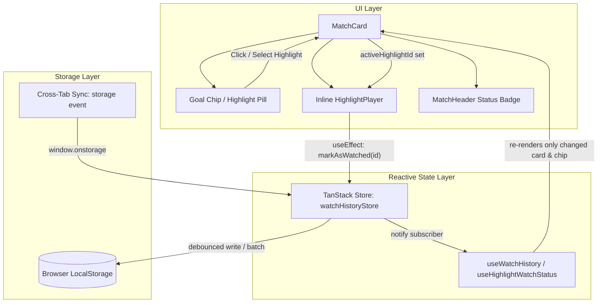
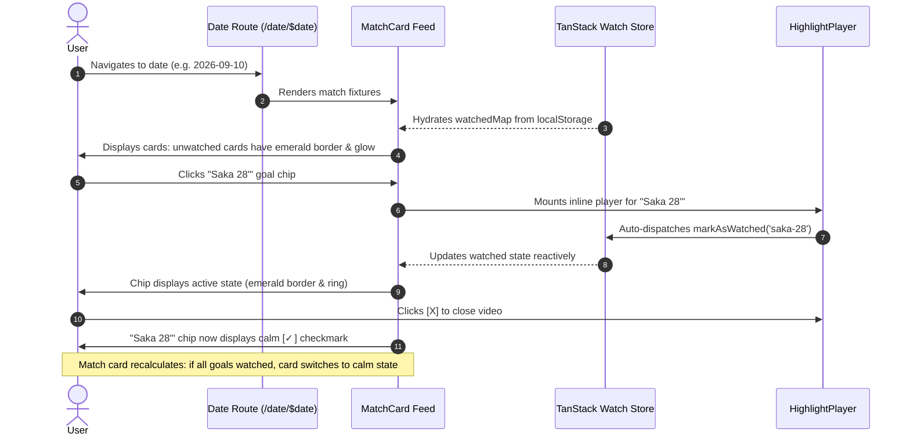

# Design Specification: Client-Side Watch History & Visual Tracking System

- **Feature:** Client-Side Watch History Store & Interactive Progress Indicators
- **Document Path:** `.orchestration/watch-history-store/design.md`
- **Target Stack:** TanStack Store (`@tanstack/store` + `@tanstack/react-store`), React 19, Tailwind CSS v4, Lucide Icons, Shadcn UI primitives
- **Author:** Principal Product Designer & Design Systems Architect
- **Status:** Approved for Implementation

---

## 1. Executive Summary & Product Objectives

### 1.1 Problem Statement

In MatchDay's daily highlight feed, users browse dozens of football matches with multiple video clips per match (ranging from 1 to 7+ goals). Currently:

- There is zero state persistence or visual differentiation between watched and unwatched clips.
- Users scanning a packed Saturday slate lose track of which matches have fresh goals they haven't seen yet.
- Returning users must mentally track which goals they clicked earlier in the day or across browser sessions.

### 1.2 Design Solution

Introduce an ultra-responsive, lightweight client-side **Watch History Engine** powered by `@tanstack/store` and backed by `localStorage`. As users browse and expand highlight clips:

1. **Automatic Watched Progression:** The instant a user expands or plays a goal clip, it is marked as watched.
2. **Goal Chip Visual Hierarchy:** Clear visual distinction between unwatched goals (high contrast, vibrant play prompt) and watched goals (subtle checkmark, calm muted background, zero visual noise).
3. **Match Card Triage States:**
   - **Unwatched Match:** Subtle emerald border accent and gentle aura highlight to catch the eye during scanning.
   - **Fully Watched Match:** Calm, muted container with a refined `3/3 watched` pill badge so users know that match is settled.
   - **Zero-Highlight Match (0-0 or Upcoming):** Minimalist neutral frame with no distracting badges.
4. **Seamless, Non-Disruptive Inline Playback:** Strict 16:9 container, zero layout jump, maintaining full scroll stability.

---

## 2. Design Principles & Mental Model

| Principle                   | UX & Architectural Translation                                                                                                                              |
| :-------------------------- | :---------------------------------------------------------------------------------------------------------------------------------------------------------- |
| **Calm Triage**             | The UI reduces cognitive load. Unwatched goals beckon exploration; watched goals gracefully step back without disappearing.                                 |
| **Zero Friction Tracking**  | No manual "Mark as watched" button required. Expansion/playback automatically commits watch state into the store immediately.                               |
| **Subtle Feedback**         | Watched states use muted tones and quiet icons (`Check`), avoiding garish strikes or aggressive color shifts.                                               |
| **Rock-Solid Performance**  | TanStack Store provides fine-grained selector reactivity. Toggling one clip does not cause re-render cascading across the match feed.                       |
| **Universal Accessibility** | Never rely on color alone. Use distinct iconography (`Play` vs `Check`), semantic ARIA labels (`aria-label="... (watched)"`), and WCAG AAA contrast ratios. |

---

## 3. Architecture & Data Flow



### 3.1 Store Schema

The client-side watch store maintains a normalized record of watched highlight IDs with timestamps for LRU pruning or time-based expiration if needed:

```typescript
export interface WatchRecord {
  /** Highlight unique identifier (corresponds to Highlight.id) */
  id: string;
  /** ISO timestamp when the user watched the clip */
  watchedAt: number;
}

export interface WatchHistoryState {
  /** Map of highlight ID -> timestamp watched */
  watchedMap: Record<string, number>;
  /** Schema version for forward migrations */
  version: number;
}
```

### 3.2 Storage Synchronization & Hydration Safety

- **SSR Safe Initial State:** TanStack Start renders on the server where `localStorage` is unavailable. The store initializes with an empty state `watchedMap: {}` during SSR.
- **Client Hydration:** A client-side effect reads `localStorage.getItem('matchday_watch_history_v1')` immediately on mount and hydrates the store seamlessly without layout shift.
- **Cross-Tab Synchronization:** A `window.addEventListener('storage', ...)` listener synchronizes watched goals across multiple browser tabs in real time.
- **Quota & Error Handling:** If `localStorage` is disabled (e.g. strict Safari Private Mode) or full, state continues to function in-memory without throwing unhandled exceptions.

---

## 4. Design Tokens & Visual Language

Built natively with **Tailwind CSS v4** dark palette tokens:

### 4.1 Color Tokens

| Semantic Role           | Token / Utility Class                           | Purpose / Applied To                        |
| :---------------------- | :---------------------------------------------- | :------------------------------------------ |
| **Background Deep**     | `bg-zinc-950` (`oklch(0.141 0.005 285.823)`)    | Page background, player container backdrop  |
| **Card Surface Normal** | `bg-zinc-900/80`                                | Default match card background               |
| **Card Surface Muted**  | `bg-zinc-900/50`                                | Fully watched match card background         |
| **Border Neutral**      | `border-zinc-800`                               | Standard card border, chips border          |
| **Border Highlight**    | `border-emerald-500/40`                         | Match card with unwatched highlights        |
| **Border Glow**         | `shadow-[0_0_20px_-3px_rgba(16,185,129,0.08)]`  | Match card unwatched ambient illumination   |
| **Chip Unwatched BG**   | `bg-zinc-900/90 hover:bg-zinc-800`              | Unwatched goal chip                         |
| **Chip Watched BG**     | `bg-zinc-950/40 hover:bg-zinc-900/60`           | Watched goal chip (calm recession)          |
| **Chip Active BG**      | `bg-emerald-950/50 border-emerald-500`          | Currently playing clip                      |
| **Accent Emerald**      | `text-emerald-400` / `fill-emerald-400`         | Unwatched indicator, active video indicator |
| **Muted Checkmark**     | `text-zinc-500 group-hover:text-emerald-400/80` | Watched goal checkmark icon                 |

### 4.2 Typography & Sizing Hierarchy

| Element             | Size / Weight                                    | Font Family         | Notes                               |
| :------------------ | :----------------------------------------------- | :------------------ | :---------------------------------- |
| **Card Scoreline**  | `text-base sm:text-lg font-black tracking-wider` | Font Mono           | High-contrast tabular numbers       |
| **Team Name**       | `text-sm sm:text-base font-bold`                 | Font Sans (Manrope) | Truncated with ellipsis on mobile   |
| **Goal Chip Label** | `text-xs font-semibold`                          | Font Sans           | Scorer name + minute                |
| **Goal Chip Score** | `text-xs font-mono tabular-nums`                 | Font Mono           | Subdued `text-zinc-400`             |
| **Watch Badge**     | `text-[10px] sm:text-xs font-medium`             | Font Mono / Sans    | Compact pill in header or chips bar |

---

## 5. Component-Level UX/UI Specifications

### 5.1 MatchCard Container States

The outer `<article>` card dynamically applies visual cues based on whether highlights exist and whether any are unwatched.

```
+-----------------------------------------------------------------------------------+
|  [Premier League] Liverpool vs Arsenal                       (Kickoff: 17:30)    |
|                                                                                   |
|  [Crest] Liverpool                     3 - 2                       Arsenal [Crest]|
|                                                                                   |
|  [> Salah 14' (1-0)]   [> Saka 28' (1-1)]   [> Diaz 60' (2-1)]   [> Havertz 75']  |
|                                                                                   |
|  [== Inline 16:9 Video Player ==================================================]  |
+-----------------------------------------------------------------------------------+
```

#### State A: Has Unwatched Highlights (Active Discovery Cue)

- **Visual Goal:** Subtly elevate the card so users scrolling a 10-match feed instantly spot matches with unviewed goals.
- **Card Container Classes:**
  ```css
  border border-emerald-500/30 bg-zinc-900/85 hover:border-emerald-500/50
  shadow-[0_4px_24px_-4px_rgba(16,185,129,0.07)]
  ```
- **Top Accent Line (Optional Subtle Aura):** An extremely subtle emerald gradient glow on the card's top rim:
  ```css
  before:absolute before:inset-x-0 before:top-0 before:h-px
  before:bg-gradient-to-r before:from-transparent before:via-emerald-500/40 before:to-transparent
  ```
- **Progress Pill:** Displays remaining unwatched count or progress ratio (e.g., `2 unwatched` or `1/3 watched`).

#### State B: All Highlights Watched (Calm Completed State)

- **Visual Goal:** Provide closure and visual satisfaction. The card feels "settled", resting quietly in the feed.
- **Card Container Classes:**
  ```css
  border border-zinc-800/60 bg-zinc-900/50 hover:border-zinc-700/80
  opacity-90 hover:opacity-100 transition-opacity duration-200
  ```
- **Completion Pill:** A distinct, calm badge rendered in the header or timeline:
  ```css
  inline-flex items-center gap-1 rounded-full border border-zinc-800 bg-zinc-950/70
  px-2.5 py-0.5 font-mono text-[11px] text-zinc-400
  ```
  Featuring a small emerald checkmark icon (`<Check className="h-3 w-3 text-emerald-400" />`) with text `3/3 watched`.

#### State C: Zero Highlights / Upcoming / 0-0 Draw

- **Visual Goal:** Clean, neutral, unopinionated.
- **Card Container Classes:**
  ```css
  border border-zinc-800 bg-zinc-900/80 hover:border-zinc-700/80
  ```
- **Badge:** No watch history badge is rendered.

---

### 5.2 Match Header Watch Badges

The `MatchHeader` or top of the timeline provides glanceable status.

#### Layout in `MatchHeader`:

```
[Logo] Premier League · Matchday 28       [ Kickoff: 15:00 ]   [ 2/3 watched ✓ ]
```

#### Badge Variations:

1. **Unwatched Highlights Present:**
   ```tsx
   <span className="inline-flex items-center gap-1 rounded-full border border-emerald-500/30 bg-emerald-950/30 px-2 py-0.5 font-mono text-[10px] sm:text-xs text-emerald-300">
     <span className="h-1.5 w-1.5 rounded-full bg-emerald-400 animate-pulse" />
     {watchedCount}/{totalCount} watched
   </span>
   ```
2. **All Watched (Settled):**
   ```tsx
   <span className="inline-flex items-center gap-1 rounded-full border border-zinc-800 bg-zinc-950/80 px-2 py-0.5 font-mono text-[10px] sm:text-xs text-zinc-400">
     <Check className="h-3 w-3 text-emerald-400/90" />
     {totalCount}/{totalCount} watched
   </span>
   ```

---

### 5.3 Goal Timeline Chips (Highlight Pills)

Each goal chip is an interactive button with three distinct states:

#### State 1: Unwatched Goal Chip

- **Visual:** Clean dark button with crisp text and bright play icon.
- **Classes:**
  ```css
  border border-zinc-700/80 bg-zinc-900/90 text-zinc-200
  hover:border-emerald-500/60 hover:bg-zinc-800 hover:text-white
  shadow-sm
  ```
- **Icon:** `<Play className="h-3 w-3 text-emerald-400 group-hover:scale-110 transition-transform" />`
- **Scorer & Minute:** `text-zinc-200 group-hover:text-zinc-100 font-semibold`
- **Score at Goal:** `text-zinc-400 font-mono`

#### State 2: Active / Currently Playing Chip

- **Visual:** High-contrast emerald active ring, elevated background, radiant glow.
- **Classes:**
  ```css
  border border-emerald-500 bg-emerald-950/60 text-emerald-100
  ring-1 ring-emerald-500 shadow-[0_0_12px_rgba(16,185,129,0.25)]
  ```
- **Icon:** `<Play className="h-3 w-3 fill-emerald-400 text-emerald-400" />`
- **Accessibility:** `aria-pressed="true"`

#### State 3: Watched Goal Chip

- **Visual:** De-emphasized, calm background. The player icon switches to a neat checkmark.
- **Classes:**
  ```css
  border border-zinc-800/80 bg-zinc-950/50 text-zinc-400
  hover:border-zinc-700 hover:bg-zinc-900/80 hover:text-zinc-200
  transition-all
  ```
- **Icon:** `<Check className="h-3 w-3 text-emerald-500/70 group-hover:text-emerald-400 transition-colors" />`
- **Scorer & Minute:** `text-zinc-400 group-hover:text-zinc-200 font-medium`
- **Score at Goal:** `text-zinc-500 font-mono`

#### Special Tags on Watched vs Unwatched Chips

Special tags (`PEN`, `GREAT GOAL`, `OWN GOAL`) remain readable but adapt:

- **Unwatched:** Vivid tag background (e.g. `border-purple-800/60 bg-purple-950/50 text-purple-300`).
- **Watched:** Subdued tag styling (`border-purple-900/40 bg-purple-950/20 text-purple-400/80`).

---

### 5.4 Inline HighlightPlayer Integration

When a user clicks any goal chip, the inline 16:9 player expands directly underneath the scoreline/chips.

```
+-----------------------------------------------------------------------------------+
|  [Play] Saka 28' [GREAT GOAL]                                               [ X ] |
|-----------------------------------------------------------------------------------|
|                                                                                   |
|                                                                                   |
|                               16:9 Video Container                                |
|                        (Direct Video / Streamable Iframe)                         |
|                                                                                   |
|                                                                                   |
|-----------------------------------------------------------------------------------|
|  [Reddit Discussion (1.4k comments)]                      Source: dubz.co [↗]     |
+-----------------------------------------------------------------------------------+
```

#### Immediate Auto-Watch Trigger

- The moment `activeHighlightId === highlight.id` (or when `HighlightPlayer` mounts with `highlight.id`), the component dispatches `markAsWatched(highlight.id)`.
- **Zero Latency:** The store immediately sets `watchedMap[highlight.id] = Date.now()`.
- **State Transition:** The clicked chip transitions from unwatched -> active. When closed or when switching to another clip, the previous chip displays as watched with the checkmark icon.

---

## 6. User Flows & State Transitions

### Flow 1: Daily Match Feed Triage



### Flow 2: Multi-Goal Completion & Match Level Progression

Consider a 3-goal match (Goals: A, B, C):

1. **Initial State (0/3 watched):**
   - Card border: `border-emerald-500/30` with subtle top glow.
   - Badge: `0/3 watched` (or `3 unwatched`).
   - Chips: Three unwatched chips with `Play` icons.
2. **First Goal Watched (1/3 watched):**
   - Chip A displays `Check` icon (`text-zinc-400`).
   - Badge updates to `1/3 watched`.
   - Card retains subtle emerald border because 2 unwatched goals remain.
3. **All Goals Watched (3/3 watched):**
   - Chip C displays `Check` icon.
   - Badge transitions to `3/3 watched` with calm neutral background (`bg-zinc-950/80 text-zinc-400`).
   - Card border relaxes from `border-emerald-500/30` to `border-zinc-800/60`, matching the rest of the completed slate.

---

## 7. Detailed Visual Mockups & Viewport Specs

### 7.1 Mobile Viewport (<640px)

On mobile displays, horizontal space is constrained. Goal chips wrap into clean rows without truncating scorer names, maintaining a touch-friendly 38px height.

```
+---------------------------------------------------+
| PL · Matchday 5               Kickoff: 17:30      |
| 1/2 watched                                       |
|---------------------------------------------------|
| (Crest) Arsenal          2 - 1      Chelsea (Crest)|
|---------------------------------------------------|
| [✓] Saka 14' (1-0)                                |
| [>] Havertz 68' (2-1) [GREAT GOAL]                |
|                                                   |
| +-----------------------------------------------+ |
| | [>] Havertz 68'                           [X] | |
| |-----------------------------------------------| |
| |                                               | |
| |              16:9 Aspect Video                | |
| |                                               | |
| +-----------------------------------------------+ |
| [Reddit Comments (482)]         dubz.link [↗]     |
+---------------------------------------------------+
```

### 7.2 Desktop Viewport (>=1024px)

On desktop displays, headers and chips stretch across wide grid layouts with hover feedback.

```
+---------------------------------------------------------------------------------------------+
| (Logo) Premier League · Matchday 5             Kickoff: 17:30 EST        [ 2/2 watched ✓ ]  |
|---------------------------------------------------------------------------------------------|
| (Crest) Arsenal                               2 - 0                         Chelsea (Crest) |
|---------------------------------------------------------------------------------------------|
| [✓ Saka 14' (1-0)]   [✓ Odegaard 82' (2-0)]                                                 |
+---------------------------------------------------------------------------------------------+
```

---

## 8. Accessibility & Ergonomics (WCAG 2.2 AAA)

### 8.1 Visual Contrast & Color-Blind Safety

- Watched state is never conveyed by color alone:
  - Unwatched state uses `<Play />` icon + high-contrast text (`zinc-200` on `zinc-900`, ratio > 8.5:1).
  - Watched state uses `<Check />` icon + subdued text (`zinc-400` on `zinc-950`, ratio > 4.8:1, compliant with WCAG AA/AAA for non-primary text).
  - Completed match cards display clear numerical pill counts (`3/3 watched`).

### 8.2 Screen Reader Announcements

- Goal buttons feature dynamic `aria-label` describing the goal, minute, and watched status:
  - Unwatched: `aria-label="Play goal: Saka 14th minute, score 1-0. Unwatched"`
  - Watched: `aria-label="Play goal: Saka 14th minute, score 1-0. Watched"`
  - Active: `aria-label="Currently playing goal: Saka 14th minute. Press to close player"`
- The player expansion is declared with `aria-expanded="true"` and managed with `aria-controls="highlight-player-{id}"`.
- Pressing `Escape` on the keyboard cleanly dismisses the inline player and returns focus to the trigger chip.

### 8.3 Reduced Motion Support

All hover transitions, glow pulses, and expand/collapse actions respect `@media (prefers-reduced-motion: reduce)`. Pulsing dots become solid, and transitions drop to 0ms.

---

## 9. Implementation Blueprint

### 9.1 Store Definition: `src/stores/watchHistoryStore.ts`

```typescript
import { Store } from '@tanstack/store';

const STORAGE_KEY = 'matchday_watch_history_v1';

export interface WatchHistoryState {
  watchedMap: Record<string, number>; // highlightId -> timestamp
}

function loadInitialState(): WatchHistoryState {
  if (typeof window === 'undefined') {
    return { watchedMap: {} };
  }
  try {
    const raw = window.localStorage.getItem(STORAGE_KEY);
    if (!raw) return { watchedMap: {} };
    const parsed = JSON.parse(raw);
    return { watchedMap: parsed.watchedMap ?? {} };
  } catch {
    return { watchedMap: {} };
  }
}

export const watchHistoryStore = new Store<WatchHistoryState>(
  loadInitialState(),
);

// Subscribe and persist to localStorage on client
if (typeof window !== 'undefined') {
  watchHistoryStore.subscribe((state) => {
    try {
      window.localStorage.setItem(STORAGE_KEY, JSON.stringify(state));
    } catch {
      // Ignore quota exceeded or storage disabled
    }
  });

  // Cross-tab synchronization
  window.addEventListener('storage', (event) => {
    if (event.key === STORAGE_KEY && event.newValue) {
      try {
        const nextState = JSON.parse(event.newValue);
        watchHistoryStore.setState(() => nextState);
      } catch {
        // Fallback
      }
    }
  });
}

// Action helpers
export function markHighlightWatched(highlightId: string): void {
  watchHistoryStore.setState((prev) => {
    if (prev.watchedMap[highlightId]) return prev;
    return {
      ...prev,
      watchedMap: {
        ...prev.watchedMap,
        [highlightId]: Date.now(),
      },
    };
  });
}

export function toggleHighlightWatched(highlightId: string): void {
  watchHistoryStore.setState((prev) => {
    const nextMap = { ...prev.watchedMap };
    if (nextMap[highlightId]) {
      delete nextMap[highlightId];
    } else {
      nextMap[highlightId] = Date.now();
    }
    return { ...prev, watchedMap: nextMap };
  });
}

export function clearWatchHistory(): void {
  watchHistoryStore.setState(() => ({ watchedMap: {} }));
}
```

### 9.2 React Hook: `src/hooks/useWatchHistory.ts`

```typescript
import { useStore } from '@tanstack/react-store';
import {
  watchHistoryStore,
  markHighlightWatched,
  toggleHighlightWatched,
} from '#/stores/watchHistoryStore';

export function useHighlightWatchStatus(highlightId: string): boolean {
  return useStore(watchHistoryStore, (state) =>
    Boolean(state.watchedMap[highlightId]),
  );
}

export function useMatchWatchStatus(highlightIds: string[]) {
  return useStore(watchHistoryStore, (state) => {
    const total = highlightIds.length;
    if (total === 0) {
      return {
        total: 0,
        watchedCount: 0,
        hasUnwatched: false,
        isAllWatched: false,
      };
    }
    let watchedCount = 0;
    for (const id of highlightIds) {
      if (state.watchedMap[id]) watchedCount++;
    }
    return {
      total,
      watchedCount,
      hasUnwatched: watchedCount < total,
      isAllWatched: watchedCount === total,
    };
  });
}

export { markHighlightWatched, toggleHighlightWatched };
```

---

## 10. Quality Assurance & Edge Cases

| Scenario                             | Anticipated Risk                                             | Mitigating Design / Architecture                                                                                            |
| :----------------------------------- | :----------------------------------------------------------- | :-------------------------------------------------------------------------------------------------------------------------- |
| **0-0 Scoreline (No Goals)**         | Card might render broken `0/0 watched` badge                 | Badge condition requires `highlights.length > 0`. 0-0 matches stay clean neutral cards.                                     |
| **High-Scoring Blowout (e.g., 7-0)** | Goal chips overflow card container                           | Chips container uses `flex flex-wrap items-center gap-2` with responsive wrap and clean vertical spacing.                   |
| **LocalStorage Quota Exceeded**      | App crashes during `localStorage.setItem`                    | Wrapped in try/catch block with silent failover to in-memory state.                                                         |
| **SSR Hydration Discrepancy**        | Server renders unwatched, client immediately flashes watched | Store hydrates without modifying HTML structure; class changes occur cleanly post-hydration without DOM tree restructuring. |
| **Duplicate Highlight IDs**          | Multiple goals share a key                                   | Keys use unique database ID (`hl.id`).                                                                                      |
| **Fast Navigation / Rapid Clicks**   | Race condition between multiple video plays                  | Inline player unmounts previous embed and triggers immediate synchronous store update for new ID.                           |

---

## 11. Conclusion & Next Steps

This specification delivers:

1. **Clear, effortless user discovery** through intentional visual cues (emerald borders for unwatched, calm settled tones for watched).
2. **Rock-solid technical foundation** leveraging `@tanstack/store` with automatic client persistence and cross-tab sync.
3. **Rigorous accessible styling** compliant with WCAG 2.2 AAA standards and mobile-first ergonomics.

Proceed with installing `@tanstack/store` & `@tanstack/react-store`, implementing `src/stores/watchHistoryStore.ts`, creating the custom hooks, and updating `MatchCard.tsx` and `HighlightPlayer.tsx`.
