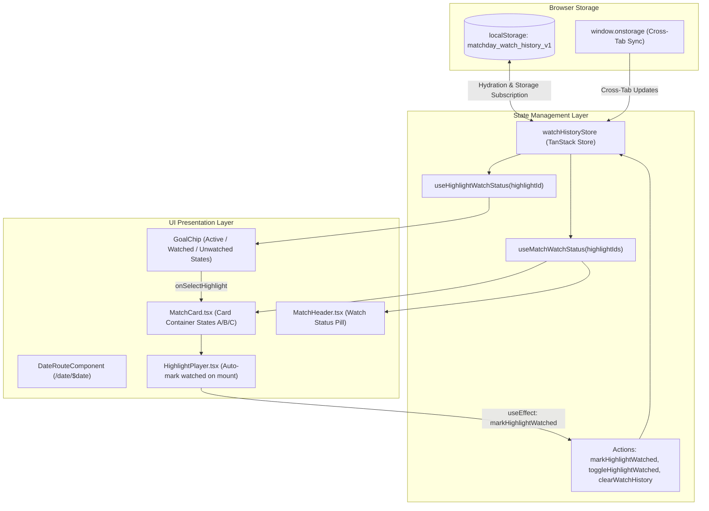

# Technical Specification: Client-Side Watch History & Interactive Progress Tracking

- **Feature:** Client-Side Watch History Store & Interactive Progress Indicators
- **Document Path:** [`.orchestration/watch-history-store/spec.md`](file:///Users/khoa/Documents/matchday/.orchestration/watch-history-store/spec.md)
- **Design Reference:** [`.orchestration/watch-history-store/design.md`](file:///Users/khoa/Documents/matchday/.orchestration/watch-history-store/design.md)
- **Target Stack:** TanStack Store (`@tanstack/store` v0.11.1 + `@tanstack/react-store` v0.11.1), React 19.3, Tailwind CSS v4, Lucide Icons, Happy DOM / Bun Test
- **Architect:** Principal Systems Architect & Technical Planner
- **Status:** Ready for Implementation

---

## 1. Architectural Overview & Objectives

### 1.1 Problem & Objective

Users scanning MatchDay's daily highlight feed encounter dozens of football fixtures with multiple video clips per match. Currently, there is zero client-side tracking of which clips have been watched. Users lose track of fresh goals versus seen goals, especially across multiple sessions or after navigating away.

This specification details the technical blueprint for:

1. **Client-Side Watch History Store:** An ultra-lightweight, reactive store implemented via `@tanstack/store` with automatic `localStorage` persistence and cross-tab synchronization.
2. **Immediate Auto-Watch Tracking:** The instant a user expands or plays a goal clip in [`HighlightPlayer`](file:///Users/khoa/Documents/matchday/src/components/HighlightPlayer.tsx), the clip is marked as watched.
3. **Goal Chip Visual Triage:** Distinct styling across 3 states: Unwatched (vibrant emerald play cue), Active (emerald glow & ring), and Watched (calm muted surface, checkmark icon).
4. **Match-Level Progress Tracking:** Match header counter (e.g. `2/3 watched` with pulsing status or `3/3 watched` with settled checkmark) and card-level aura cues (State A: Unwatched goals remain, State B: All goals watched, State C: No highlights / upcoming / 0-0).

### 1.2 System Boundary & Component Topology



---

## 2. Dependencies & Runtime Environment

### 2.1 Package Verification

The workspace `node_modules` already contains `@tanstack/store@0.11.1` and `@tanstack/react-store@0.11.1`. To ensure reproducibility across fresh installs and CI/CD pipelines, both packages will be declared explicitly in [`package.json`](file:///Users/khoa/Documents/matchday/package.json).

```json
{
  "dependencies": {
    "@tanstack/react-store": "^0.11.1",
    "@tanstack/store": "^0.11.1"
  }
}
```

### 2.2 React 19 Compatibility

`@tanstack/react-store` internally uses `useSyncExternalStore` from React. Both `useSelector` and `useStore` are fully compatible with React 19 concurrent features and SSR hydration without tear.

---

## 3. Storage Architecture & Store Implementation

### 3.1 File Location: [`src/stores/watchHistoryStore.ts`](file:///Users/khoa/Documents/matchday/src/stores/watchHistoryStore.ts)

### 3.2 Schema & Data Contracts

```typescript
/**
 * Internal schema version to allow future forward migrations
 * (e.g. adding playback position or team bookmarking).
 */
export const WATCH_HISTORY_VERSION = 1;
export const WATCH_HISTORY_STORAGE_KEY = 'matchday_watch_history_v1';

export interface WatchHistoryState {
  /**
   * Map of highlight ID -> Unix epoch timestamp (ms) when marked watched.
   * Using a dictionary enables O(1) membership lookups and fine-grained reactivity.
   */
  watchedMap: Record<string, number>;
  /** Schema version */
  version: number;
}
```

### 3.3 SSR Safety, Hydration & Storage Error Handling

1. **SSR Fallback:** In server-side environments (`typeof window === 'undefined'`), the store initializes with an empty state: `{ watchedMap: {}, version: WATCH_HISTORY_VERSION }`.
2. **Client Hydration:** When initialized on the client, the store attempts to load and validate state from `localStorage`:
   - Valid JSON matching the schema is adopted directly.
   - Malformed data or version mismatches gracefully reset to clean initial state.
3. **Quota & Exception Handling:** Storage operations are wrapped in `try / catch` blocks to safeguard against:
   - Safari Private Browsing quota restrictions (`QuotaExceededError`).
   - Browser security policies disabling `localStorage` (e.g., in strict iframes).
   - In-memory state continues functioning uninterrupted even if storage write fails.
4. **Cross-Tab Synchronization:** A `window.addEventListener('storage', ...)` listener monitors changes from other browser tabs and synchronizes `watchHistoryStore` in real time.

### 3.4 Store Actions Implementation Details

```typescript
import { Store } from '@tanstack/store';

export const WATCH_HISTORY_STORAGE_KEY = 'matchday_watch_history_v1';
export const WATCH_HISTORY_VERSION = 1;

export interface WatchHistoryState {
  watchedMap: Record<string, number>;
  version: number;
}

function getDefaultState(): WatchHistoryState {
  return {
    watchedMap: {},
    version: WATCH_HISTORY_VERSION,
  };
}

export function loadInitialState(): WatchHistoryState {
  if (typeof window === 'undefined') {
    return getDefaultState();
  }
  try {
    const raw = window.localStorage.getItem(WATCH_HISTORY_STORAGE_KEY);
    if (!raw) return getDefaultState();
    const parsed = JSON.parse(raw);
    if (
      parsed &&
      typeof parsed.watchedMap === 'object' &&
      parsed.watchedMap !== null
    ) {
      return {
        watchedMap: parsed.watchedMap,
        version:
          typeof parsed.version === 'number'
            ? parsed.version
            : WATCH_HISTORY_VERSION,
      };
    }
    return getDefaultState();
  } catch {
    return getDefaultState();
  }
}

export const watchHistoryStore = new Store<WatchHistoryState>(
  loadInitialState(),
);

// Client-side persistence and cross-tab synchronizer
if (typeof window !== 'undefined') {
  watchHistoryStore.subscribe((snapshot) => {
    try {
      window.localStorage.setItem(
        WATCH_HISTORY_STORAGE_KEY,
        JSON.stringify(snapshot),
      );
    } catch {
      // Gracefully ignore QuotaExceededError or security policy violations
    }
  });

  window.addEventListener('storage', (event) => {
    if (event.key === WATCH_HISTORY_STORAGE_KEY && event.newValue) {
      try {
        const nextState = JSON.parse(event.newValue);
        if (nextState && typeof nextState.watchedMap === 'object') {
          watchHistoryStore.setState(() => ({
            watchedMap: nextState.watchedMap ?? {},
            version: nextState.version ?? WATCH_HISTORY_VERSION,
          }));
        }
      } catch {
        // Ignore unparseable external event payloads
      }
    }
  });
}

/**
 * Idempotently marks a highlight as watched.
 * If already watched, this is a no-op that avoids triggering store subscriptions.
 */
export function markHighlightWatched(highlightId: string): void {
  if (!highlightId) return;
  watchHistoryStore.setState((prev) => {
    if (prev.watchedMap[highlightId]) {
      return prev;
    }
    return {
      ...prev,
      watchedMap: {
        ...prev.watchedMap,
        [highlightId]: Date.now(),
      },
    };
  });
}

/**
 * Toggles a highlight's watched status (useful for keyboard or future manual overrides).
 */
export function toggleHighlightWatched(highlightId: string): void {
  if (!highlightId) return;
  watchHistoryStore.setState((prev) => {
    const nextMap = { ...prev.watchedMap };
    if (nextMap[highlightId]) {
      delete nextMap[highlightId];
    } else {
      nextMap[highlightId] = Date.now();
    }
    return {
      ...prev,
      watchedMap: nextMap,
    };
  });
}

/**
 * Resets all watch history.
 */
export function clearWatchHistory(): void {
  watchHistoryStore.setState(() => getDefaultState());
}

/**
 * Non-reactive point-in-time check for highlight watch status.
 */
export function isHighlightWatched(highlightId: string): boolean {
  if (!highlightId) return false;
  return Boolean(watchHistoryStore.state.watchedMap[highlightId]);
}
```

---

## 4. Reactive Hooks Architecture

### 4.1 File Location: [`src/hooks/useWatchHistory.ts`](file:///Users/khoa/Documents/matchday/src/hooks/useWatchHistory.ts)

### 4.2 Hook Contracts & Selector Optimization

#### 1. `useHighlightWatchStatus(highlightId: string): boolean`

- Subscribes specifically to `state.watchedMap[highlightId]`.
- Returns a primitive `boolean`.
- Fine-grained reactivity ensures that watching one clip only re-renders the specific clip chip and its parent match card without re-rendering unrelated match cards across the feed.

#### 2. `useMatchWatchStatus(highlightIds: string[]): MatchWatchStatus`

- Computes aggregate watch status for a match fixture:

```typescript
export interface MatchWatchStatus {
  total: number;
  watchedCount: number;
  hasUnwatched: boolean;
  isAllWatched: boolean;
}
```

- **Referential Stability with `shallow`:** To prevent unnecessary re-renders in React 19, use the `shallow` comparator exported by `@tanstack/store` with `useSelector` / `useStore`. Even if other highlights update in the store, if `total`, `watchedCount`, `hasUnwatched`, and `isAllWatched` remain identical for this match, the hook does NOT trigger a re-render.

```typescript
import { useSelector } from '@tanstack/react-store';
import { shallow } from '@tanstack/store';
import {
  watchHistoryStore,
  markHighlightWatched,
  toggleHighlightWatched,
  clearWatchHistory,
  isHighlightWatched,
  type WatchHistoryState,
} from '#/stores/watchHistoryStore';

export interface MatchWatchStatus {
  total: number;
  watchedCount: number;
  hasUnwatched: boolean;
  isAllWatched: boolean;
}

export function useHighlightWatchStatus(highlightId: string): boolean {
  return useSelector(watchHistoryStore, (state: WatchHistoryState) =>
    Boolean(state.watchedMap[highlightId]),
  );
}

export function useMatchWatchStatus(
  highlightIds: readonly string[],
): MatchWatchStatus {
  return useSelector(
    watchHistoryStore,
    (state: WatchHistoryState) => {
      const total = highlightIds.length;
      if (total === 0) {
        return {
          total: 0,
          watchedCount: 0,
          hasUnwatched: false,
          isAllWatched: false,
        };
      }
      let watchedCount = 0;
      for (const id of highlightIds) {
        if (state.watchedMap[id]) {
          watchedCount++;
        }
      }
      return {
        total,
        watchedCount,
        hasUnwatched: watchedCount < total,
        isAllWatched: watchedCount === total,
      };
    },
    { compare: shallow },
  );
}

export {
  markHighlightWatched,
  toggleHighlightWatched,
  clearWatchHistory,
  isHighlightWatched,
};
```

---

## 5. UI Component Integration & Specifications

### 5.1 Inline Player Auto-Watch: [`src/components/HighlightPlayer.tsx`](file:///Users/khoa/Documents/matchday/src/components/HighlightPlayer.tsx)

- When [`HighlightPlayer`](file:///Users/khoa/Documents/matchday/src/components/HighlightPlayer.tsx) mounts or when `highlight.id` changes, an immediate `useEffect` dispatches `markHighlightWatched(highlight.id)`.
- This ensures zero latency and requires no manual action from the user.

```tsx
useEffect(() => {
  if (highlight.id) {
    markHighlightWatched(highlight.id);
  }
}, [highlight.id]);
```

### 5.2 Match Header Badge: [`src/components/MatchHeader.tsx`](file:///Users/khoa/Documents/matchday/src/components/MatchHeader.tsx)

#### Props Extension:

```typescript
export interface MatchHeaderProps {
  competition?: string | null;
  leagueLogo?: string | null;
  kickoffTime?: number | null;
  timeZone?: string;
  className?: string;
  /** Aggregate watch status for the match */
  watchStatus?: MatchWatchStatus;
}
```

#### Layout & Badge Variations:

Rendered directly alongside or adjacent to the kickoff badge:

1. **State A: Unwatched Highlights Present (`watchStatus.total > 0 && watchStatus.hasUnwatched`):**

   ```tsx
   <span
     data-testid="watch-badge-unwatched"
     className="inline-flex items-center gap-1.5 rounded-full border border-emerald-500/30 bg-emerald-950/30 px-2 py-0.5 font-mono text-[10px] sm:text-xs text-emerald-300"
   >
     <span className="h-1.5 w-1.5 rounded-full bg-emerald-400 animate-pulse motion-reduce:animate-none" />
     {watchStatus.watchedCount}/{watchStatus.total} watched
   </span>
   ```

2. **State B: All Highlights Watched (`watchStatus.total > 0 && watchStatus.isAllWatched`):**

   ```tsx
   <span
     data-testid="watch-badge-all-watched"
     className="inline-flex items-center gap-1 rounded-full border border-zinc-800 bg-zinc-950/80 px-2 py-0.5 font-mono text-[10px] sm:text-xs text-zinc-400"
   >
     <Check className="h-3 w-3 text-emerald-400/90" aria-hidden="true" />
     {watchStatus.total}/{watchStatus.total} watched
   </span>
   ```

3. **State C: Zero Highlights / Upcoming / 0-0 Draw (`watchStatus.total === 0`):**
   - The watch badge is omitted entirely. No `0/0 watched` badge is ever rendered.

### 5.3 Match Card Container & Goal Chips: [`src/components/MatchCard.tsx`](file:///Users/khoa/Documents/matchday/src/components/MatchCard.tsx)

#### Container Styling Matrix

The outer `<article>` element in [`MatchCard`](file:///Users/khoa/Documents/matchday/src/components/MatchCard.tsx) must be relatively positioned (`relative overflow-hidden`) to support the top gradient accent aura:

| State                        | Condition                   | Tailwind Utility Classes                                                                                                                                                                                                                                                                                                                                                        | Visual Intent                                                        |
| :--------------------------- | :-------------------------- | :------------------------------------------------------------------------------------------------------------------------------------------------------------------------------------------------------------------------------------------------------------------------------------------------------------------------------------------------------------------------------ | :------------------------------------------------------------------- |
| **State A: Unwatched Goals** | `total > 0 && hasUnwatched` | `relative overflow-hidden rounded-2xl border border-emerald-500/30 bg-zinc-900/85 p-4 backdrop-blur-sm transition-all duration-200 hover:border-emerald-500/50 shadow-[0_4px_24px_-4px_rgba(16,185,129,0.07)] before:absolute before:inset-x-0 before:top-0 before:h-px before:bg-gradient-to-r before:from-transparent before:via-emerald-500/40 before:to-transparent sm:p-5` | High visual discoverability. Beckons user to explore unviewed goals. |
| **State B: All Watched**     | `total > 0 && isAllWatched` | `relative overflow-hidden rounded-2xl border border-zinc-800/60 bg-zinc-900/50 p-4 backdrop-blur-sm transition-all duration-200 hover:border-zinc-700/80 opacity-90 hover:opacity-100 shadow-lg sm:p-5`                                                                                                                                                                         | Calm, settled, de-emphasized. Visually indicates completed triage.   |
| **State C: No Highlights**   | `total === 0`               | `relative overflow-hidden rounded-2xl border border-zinc-800 bg-zinc-900/80 p-4 backdrop-blur-sm transition-all duration-200 hover:border-zinc-700/80 shadow-lg sm:p-5`                                                                                                                                                                                                         | Neutral, unobtrusive standard fixture presentation.                  |

#### Goal Chip Component Architecture

To ensure clean isolation and optimal selector reactivity, each goal chip should be extracted into a subcomponent `GoalChip` (or rendered with isolated hook call):

```tsx
interface GoalChipProps {
  highlight: Highlight;
  isActive: boolean;
  goalScore?: string | null;
  onSelect: () => void;
  onClose: () => void;
}

function GoalChip({
  highlight,
  isActive,
  goalScore,
  onSelect,
  onClose,
}: GoalChipProps) {
  const isWatched = useHighlightWatchStatus(highlight.id);
  const tagCategory = getTagCategory(highlight.tag);

  // Compute ARIA label
  const ariaLabel = isActive
    ? `Currently playing goal: ${highlight.scorer ?? 'Goal'} ${highlight.minute ?? ''}. Press to close player`
    : `Play goal: ${highlight.scorer ?? 'Goal'} ${highlight.minute ?? ''}${
        goalScore ? `, score ${goalScore}` : ''
      }. ${isWatched ? 'Watched' : 'Unwatched'}`;

  return (
    <button
      type="button"
      role="button"
      aria-pressed={isActive}
      aria-label={ariaLabel}
      onClick={() => (isActive ? onClose() : onSelect())}
      className={cn(
        'group flex items-center gap-1.5 rounded-lg px-2.5 py-1.5 text-xs font-medium transition-all focus-visible:outline-none focus-visible:ring-2 focus-visible:ring-emerald-500',
        isActive
          ? 'border border-emerald-500 bg-emerald-950/60 text-emerald-100 ring-1 ring-emerald-500 shadow-[0_0_12px_rgba(16,185,129,0.25)]'
          : isWatched
            ? 'border border-zinc-800/80 bg-zinc-950/50 text-zinc-400 hover:border-zinc-700 hover:bg-zinc-900/80 hover:text-zinc-200'
            : 'border border-zinc-700/80 bg-zinc-900/90 text-zinc-200 hover:border-emerald-500/60 hover:bg-zinc-800 hover:text-white shadow-sm',
      )}
    >
      {/* Icon: Active/Unwatched use Play, Watched uses Check */}
      {isActive ? (
        <Play className="h-3 w-3 shrink-0 fill-emerald-400 text-emerald-400" />
      ) : isWatched ? (
        <Check className="h-3 w-3 shrink-0 text-emerald-500/70 group-hover:text-emerald-400 transition-colors" />
      ) : (
        <Play className="h-3 w-3 shrink-0 text-emerald-400 transition-transform group-hover:scale-110" />
      )}

      {/* Scorer & Minute */}
      <span
        className={cn(
          'font-semibold',
          isActive
            ? 'text-emerald-100'
            : isWatched
              ? 'text-zinc-400 group-hover:text-zinc-200 font-medium'
              : 'text-zinc-200 group-hover:text-zinc-100',
        )}
      >
        {highlight.scorer ?? 'Goal'}{' '}
        {highlight.minute ? `${highlight.minute}` : ''}
      </span>

      {/* Score at Goal */}
      {goalScore && (
        <span
          className={cn(
            'font-mono tabular-nums',
            isWatched ? 'text-zinc-500' : 'text-zinc-400',
          )}
        >
          {goalScore}
        </span>
      )}

      {/* Special Tags (Vivid when unwatched, subdued when watched) */}
      {highlight.tag && (
        <span
          className={cn(
            'rounded px-1.5 py-0.5 text-[10px] font-bold tracking-wider uppercase',
            tagCategory === 'penalty' &&
              (isWatched
                ? 'border border-amber-900/40 bg-amber-950/20 text-amber-400/80'
                : 'border border-amber-800/60 bg-amber-950/50 text-amber-300'),
            tagCategory === 'great_goal' &&
              (isWatched
                ? 'border border-purple-900/40 bg-purple-950/20 text-purple-400/80'
                : 'border border-purple-800/60 bg-purple-950/50 text-purple-300'),
            tagCategory === 'own_goal' &&
              (isWatched
                ? 'border border-rose-900/40 bg-rose-950/20 text-rose-400/80'
                : 'border border-rose-800/60 bg-rose-950/50 text-rose-300'),
            tagCategory === 'standard' &&
              (isWatched
                ? 'border border-zinc-800 bg-zinc-900/50 text-zinc-500'
                : 'border border-zinc-700 bg-zinc-800 text-zinc-300'),
          )}
        >
          {highlight.tag}
        </span>
      )}
    </button>
  );
}
```

---

## 6. Edge Cases & Resilience Strategy

| Scenario                                 | Potential Hazard                                                    | Technical Defense & Mitigation                                                                                                                                                                         |
| :--------------------------------------- | :------------------------------------------------------------------ | :----------------------------------------------------------------------------------------------------------------------------------------------------------------------------------------------------- |
| **0-0 Scoreline / Untracked Fixtures**   | Render nonsensical `0/0 watched` badge                              | Badge rendering is strictly conditioned on `watchStatus.total > 0`. 0-0 matches remain clean neutral cards (State C).                                                                                  |
| **High-Scoring Blowout (e.g. 7-1)**      | Goal chips wrap awkwardly, distorting card layout                   | Chips row uses `flex flex-wrap items-center gap-2 pt-3` with min-h touch boundaries (38px touch target).                                                                                               |
| **LocalStorage Unavailable or Disabled** | Unhandled exception throws, breaking whole page                     | Wrapped in try/catch in `loadInitialState` and `subscribe`. In-memory state remains fully functional.                                                                                                  |
| **Cross-Tab Concurrency**                | Watching a clip in Tab A leaves Tab B stale                         | `window.addEventListener('storage')` immediately ingests external tab changes and calls `watchHistoryStore.setState`.                                                                                  |
| **Rapid Expansion & Switching**          | Race condition between multiple video player mounts                 | Synchronous store dispatch on mount; clicking another clip updates `activeHighlightId` in parent and triggers player remount.                                                                          |
| **Corrupted LocalStorage JSON**          | App crash during `JSON.parse`                                       | Safe validation in `loadInitialState` reverts to clean default state if parsing fails or structure is invalid.                                                                                         |
| **SSR Hydration Warnings**               | Server renders unwatched, client immediately hydrates watched state | Because external store data is client-local, `useSelector` gracefully subscribes on mount. Goal chips and badges suppress hydration warnings or mount cleanly post-hydration without DOM layout shift. |

---

## 7. Testing & Verification Plan

### 7.1 Test Suite Breakdown

#### 1. Store Unit Tests: [`src/stores/watchHistoryStore.test.ts`](file:///Users/khoa/Documents/matchday/src/stores/watchHistoryStore.test.ts)

- **Initial State:** Empty store when `localStorage` is empty.
- **Persistence:** Serializes to `localStorage` when highlights are marked watched.
- **Hydration:** Restores existing watched state from `localStorage` on init.
- **Corrupt Data Handling:** Recovers safely when `localStorage` contains invalid JSON.
- **Idempotency:** Calling `markHighlightWatched` multiple times with the same ID does not overwrite the timestamp or issue unnecessary state notifications.
- **Toggle Action:** `toggleHighlightWatched` toggles state on and off accurately.
- **Clear Action:** `clearWatchHistory` resets state to empty object.
- **Cross-Tab Sync:** Simulating a `storage` event updates the store state.

#### 2. Hooks Unit Tests: [`src/hooks/useWatchHistory.test.ts`](file:///Users/khoa/Documents/matchday/src/hooks/useWatchHistory.test.ts)

- **`useHighlightWatchStatus`:**
  - Returns `false` initially for unwatched clip.
  - Returns `true` after `markHighlightWatched`.
- **`useMatchWatchStatus`:**
  - Returns `{ total: 0, watchedCount: 0, hasUnwatched: false, isAllWatched: false }` for empty highlight list.
  - Returns `{ total: 2, watchedCount: 1, hasUnwatched: true, isAllWatched: false }` when 1 of 2 goals is watched.
  - Returns `{ total: 2, watchedCount: 2, hasUnwatched: false, isAllWatched: true }` when all goals are watched.
  - Verifies selector does not trigger extraneous re-renders due to `shallow` equality check.

#### 3. Component Tests: [`src/components/HighlightPlayer.test.ts`](file:///Users/khoa/Documents/matchday/src/components/HighlightPlayer.test.ts)

- Verifies that mounting [`HighlightPlayer`](file:///Users/khoa/Documents/matchday/src/components/HighlightPlayer.tsx) immediately marks the highlight as watched in `watchHistoryStore`.

#### 4. Component Tests: [`src/components/MatchHeader.test.ts`](file:///Users/khoa/Documents/matchday/src/components/MatchHeader.test.ts)

- Verifies rendering of unwatched badge with `animate-pulse` dot when `watchStatus.hasUnwatched === true`.
- Verifies rendering of all-watched badge with `Check` icon when `watchStatus.isAllWatched === true`.
- Verifies badge is completely absent when `watchStatus` is undefined or `watchStatus.total === 0`.

#### 5. Component Tests: [`src/components/MatchCard.test.ts`](file:///Users/khoa/Documents/matchday/src/components/MatchCard.test.ts)

- **Card Styling:**
  - State A: Verifies `border-emerald-500/30` when unwatched highlights exist.
  - State B: Verifies `border-zinc-800/60` and `bg-zinc-900/50` when all highlights are watched.
  - State C: Verifies standard neutral styling when match has 0 highlights.
- **Chip Styling & Icons:**
  - Unwatched chip displays `Play` icon and has `(Unwatched)` in `aria-label`.
  - Active chip displays emerald fill `Play` icon and `aria-pressed="true"`.
  - Watched chip displays `Check` icon and has `(Watched)` in `aria-label`.
  - Subdued tag badges rendered for watched clips.

### 7.2 Verification Commands

```bash
# Run unit and integration tests
bun test src

# Verify TypeScript type-checking
./node_modules/.bin/tsc --noEmit

# Verify linting
./node_modules/.bin/oxlint src
```

---

## 8. Step-by-Step Implementation Roadmap

```
Phase 1: Dependencies & Store Layer
  ├── [1.1] Update package.json to declare @tanstack/store and @tanstack/react-store dependencies
  ├── [1.2] Create src/stores/watchHistoryStore.ts with persistence, cross-tab sync, and action helpers
  └── [1.3] Create src/stores/watchHistoryStore.test.ts and verify 100% test coverage

Phase 2: Reactive Hooks Layer
  ├── [2.1] Create src/hooks/useWatchHistory.ts with useHighlightWatchStatus and useMatchWatchStatus (shallow optimized)
  └── [2.2] Create src/hooks/useWatchHistory.test.ts and verify reactive updates

Phase 3: Component Integration
  ├── [3.1] Update src/components/HighlightPlayer.tsx to dispatch markHighlightWatched on mount
  ├── [3.2] Update src/components/MatchHeader.tsx to accept watchStatus and render progress badges
  ├── [3.3] Update src/components/MatchCard.tsx to compute watchStatus, apply Card States A/B/C, and render GoalChip states 1/2/3
  └── [3.4] Update and expand unit tests for HighlightPlayer, MatchHeader, and MatchCard

Phase 4: Route & Integration Verification
  ├── [4.1] Validate /date/$date route integration with watch history
  ├── [4.2] Run full test suite (`bun test src`)
  ├── [4.3] Run TypeScript typecheck (`tsc --noEmit`) and linter (`oxlint src`)
```

---

## 9. Open Questions & Architectural Clarifications

> [!NOTE]
> All primary architectural decisions are settled. The following notes document deliberate design choices:

1. **Watch History Retention / Pruning Policy:**
   - _Decision:_ The store retains watched IDs as a flat map with timestamps. Even 5,000 watched highlights across an entire season consume < 200 KB in `localStorage` (well under the 5 MB browser limit). Explicit LRU pruning is therefore unnecessary for v1, but the timestamp schema allows adding a 60-day expiration policy in the future without schema migration.
2. **Auto-Watch Trigger Point:**
   - _Decision:_ Clips are marked watched immediately upon expanding or mounting the inline player. This provides immediate, unambiguous visual confirmation without requiring the user to wait for video playback events (which may be blocked or restricted on mobile browsers).
