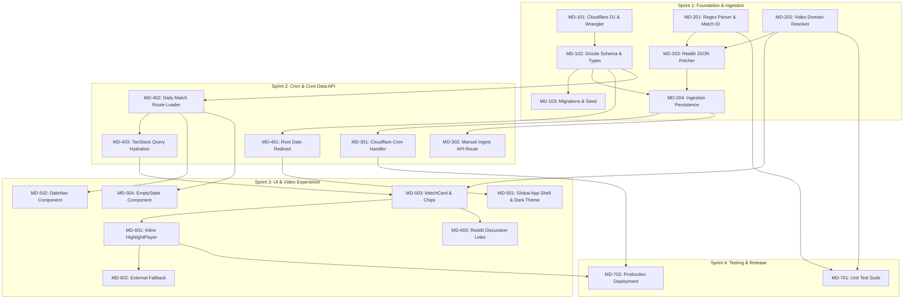

# MatchDay Project Backlog & Epics Overview

Welcome to the **MatchDay** development roadmap and task breakdown. This documentation is organized as Jira-like Epics and User Stories, allowing engineers to pick up tickets, track progress, and implement the product following best practices for TanStack Start, Cloudflare Workers, and strict TypeScript.

---

## 🗺️ Epic Summary Table

| Epic Key                                                     | Epic Title                                    | Target   | Est. SP | Detailed Spec                                            |
| :----------------------------------------------------------- | :-------------------------------------------- | :------- | :------ | :------------------------------------------------------- |
| **[MD-EPIC-1](./epics/MD-EPIC-1-database-layer.md)**         | Database Layer & Cloudflare D1 Architecture   | Sprint 1 | 8 SP    | [View Epic](./epics/MD-EPIC-1-database-layer.md)         |
| **[MD-EPIC-2](./epics/MD-EPIC-2-reddit-ingestion.md)**       | Reddit Ingestion Pipeline & Parsing Engine    | Sprint 1 | 13 SP   | [View Epic](./epics/MD-EPIC-2-reddit-ingestion.md)       |
| **[MD-EPIC-3](./epics/MD-EPIC-3-cron-triggers.md)**          | Scheduled Cron Triggers & Ingestion Execution | Sprint 2 | 5 SP    | [View Epic](./epics/MD-EPIC-3-cron-triggers.md)          |
| **[MD-EPIC-4](./epics/MD-EPIC-4-routing-data-loaders.md)**   | Routing, Server Functions & Data Loaders      | Sprint 2 | 8 SP    | [View Epic](./epics/MD-EPIC-4-routing-data-loaders.md)   |
| **[MD-EPIC-5](./epics/MD-EPIC-5-ui-date-navigation.md)**     | Core UI Shell, Date Navigation & Match Feed   | Sprint 3 | 11 SP   | [View Epic](./epics/MD-EPIC-5-ui-date-navigation.md)     |
| **[MD-EPIC-6](./epics/MD-EPIC-6-media-player-fallbacks.md)** | Inline Media Player & Domain Fallbacks        | Sprint 3 | 8 SP    | [View Epic](./epics/MD-EPIC-6-media-player-fallbacks.md) |
| **[MD-EPIC-7](./epics/MD-EPIC-7-testing-deployment.md)**     | Quality Assurance, Testing & Deployment       | Sprint 4 | 5 SP    | [View Epic](./epics/MD-EPIC-7-testing-deployment.md)     |

**Total Estimated Effort:** 58 Story Points

---

## 🏗️ Architecture & Dependency Flow

---

## 🛠️ Tech Stack Quick Reference

- **Framework:** TanStack Start (`@tanstack/react-start`, `@tanstack/react-router`)
- **Runtime:** Cloudflare Workers via `@cloudflare/vite-plugin` and `wrangler`
- **Database:** Cloudflare D1 (Serverless SQLite) + Drizzle ORM (`drizzle-orm`, `drizzle-kit`)
- **Styling:** Tailwind CSS v4 (`@tailwindcss/vite`, `@tailwindcss/typography`, `tw-animate-css`)
- **Icons & Components:** `lucide-react`, `shadcn/ui` style primitives
- **Validation:** `zod` v4
- **Language / Typing:** Strict TypeScript (`strict: true`, no `any`)
